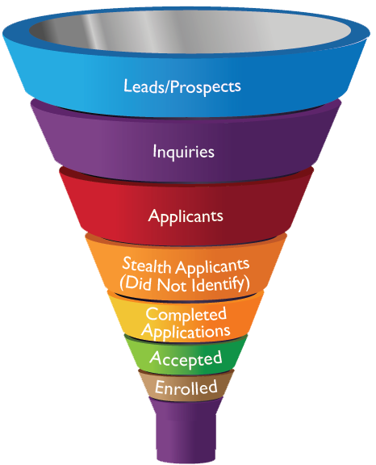

# Motivation
## Analyze recruiting to understand university enrollment priorities

Alternative explanation for access inequality
- University enrollment priorities biased against poor students and/or communities of color

<br>
Why study university recruiting behavior
- Universities expend substantial resources identifying and recruiting prospects `r citep(bib['RN4402'])`
- Internal resource allocation better indicator of organizational priorities than rhetoric, policies
- Knowing which student populations targeted by recruiting efforts indicates enrollment priorities


<br>
Research focus
- Analyze off-campus recruiting visits (e.g., visit to a local high school) by public research universities as a means of gaining insight about university enrollment priorities
- **Research question**
    - What are the similarities and differences in off-campus recruiting patterns across universities?
- **Analytic focus**
    - Income; race; academic achievement; in-state vs. out-of-state


```{r, include=FALSE, eval=FALSE}
- *Commitments to Action on College Opportunity*  `r citep(bib['RN4017'])`
    - Universities pledge "action plans" (e.g., holistic admission, need-based aid, "outreach")
- Applauds public universities for adopting progressive policies to increase access despite the “deficiencies” of student and K-12 schools and despite declines in state funding. 
```

--- &twocol

# Background
## The enrollment management industry

*** =left

**The enrollment funnel**



*** =right

**Interventions along the funnel**
* Identify prospects
    - Buy "student lists" from College Board/ACT
* Recruit prospects remotely
    * Email, mail, text, etc.
* Recruit prospects in-person
    * **Off-campus recruiting visits** (e.g., high
school visits, college fairs)
    * Campus visits
    * Other "outreach"
* Solicit inquiries, stealth applicants
    * Social media, advertising
* Convert admits to enrollees
    * Financial aid leveraging


---

# Literature review
## Scholarship on recruiting

Evaluations of recruiting/outreach interventions `r cite(bib[c('RN4408')])`
- But unclear whether universities substantively adopt "best practices" in less controlled settings

Audits of response to "inquiries" by admissions officers `r cite(bib[c('RN4331','RN4360')])`
- Identifies biases of individual admissions officers

<br>
Off-campus recruiting visits
- Scholarship analyzing college perspective `r citep(bib['RN3519'])`
    - Important for relationships with prospects, counselors at "feeder" schools
- Market research `r citep(bib['RN4402'])`
    - Second highest source of "inquiries"; third highest source of enrollees 
- Scholarship analyzing perspective of high school students `r citep(bib['RN4324'])`
    - Which universities visit affects student decisions; especially first-gen, students of color

<br>
Research gap: we don't know which universities visit which schools, communities
- If schools in low-income communities or communities of color are not receiving visits, "under-matching" may be due to under-recruiting rather than lack of guidance

---

# Theoretical framework
## Enrollment priorities and recruiting behavior

Theoretical motivation for studying recruiting
<br>
- "New" institutional theory `r citep(bib['RN513'])`
    - Organizations have finite resources and cannot pursue multiple goals `r citep(bib['RN531'])`
    -When facing pressure to pursue many goals, organizations: 
      - Substantively adopt some goals (directing resources)
      - Symbolically adopt others (policies, rhetoric)

<br>
- "Iron triangle" of enrollment management (EM)
  - Three broad enrollment goals: **access, academic profile, revenue**
  - Scarce resources; depending on priorities, some goals receive more resources than others
  - Off-campus recruiting is allocation of resources
  - Knowing which populations targeted by recruiting interventions indicate enrollment priorities


---

# Theoretical framework
## Expectations about similarities and differences in recruiting behavior

Resource dependence theory (RDT) `r citep(bib['RN959'])`
- Sensitive to demands from providers of important resources that cannot be obtained elsewhere
- Org strategies when a resouce becomes uncertain/declines or demands become onerous
    - e.g., compliance, avoidance, cooptation, **resource diversification**
- *Universities with weak state funding*
    - More visits to affluent out-of-state, affluent in-state
- *Universities with small/declining "college age" population*
    - More out-of-state visits

<br>
Academic Capitalism (AC) `r citep(bib['RN6061'])` 
- RDT assumes restoring state funding would compel universities to de-emphasize nonresident enrollment/recruiting
- AC suggests pursuit of revenue displaces public-good mission for market logic
- *Recruiting by universities with similar external conditions can differ depending how whether or to what extent "market logic" ideology is adopted*

--- &twocol

# Research methods
## The broader off-campus recruiting research project

*** =left

**Data collection**

* Method
    - Web-scrape admissions websites
    - Public records requests
* Criteria to be included in data collection
    1. Post visits on admissions websites
    2. Organizational type
* Data collection sample (larger project)
    - 54 public research universities
    - 49 private research universities
    - 42 selective private liberal arts
* Data collection period
    - 1/1/2017 to 12/31/2017
    - Ongoing data collection with larger sample
    
*** =right

**Sample data**


---


# Research methods
## Defining events

**"Off-campus recruiting events" defined as off-campus events hosted by paid staff/consultants focused on soliciting applications**

<br>
- Event type
    - Include: college fairs, high school visits, community college visits,
counselor events
    - Exclude: admitted or committed student events, interviews
- Event host
    - Include: paid admissions staff or consultants (e.g. regional recruiters)
    - Exclude: alumni, student volunteers
- Event location
    - Any off-campus location
    - e.g., high school, community college, hotel, convention center, cafe, etc.

---

# Data and Methods
## Summary of Data Collection Sources and Quality Checks Performed
<div class="table-wrapper">
  <div class="scroll-wrapper scroll-wrapper-x">
```{r, echo=FALSE, results='asis', warning=FALSE}
cat(paste0(readLines("assets/tables/data_appendix.html"),collapse=" "))
```
  </div>
</div>

--- 

# Research methods
## Research design and analyses

Quantitative multiple case study research design `r citep(bib['RN4545'])`
- Quantitative data collection and quantitative analyses
- Analyze each case separately, rather than pooling across cases as in large-N, random sample design

<br>
Data analysis `r citep(bib[c('RN4116','RN4391')])`
- "Within-case" analyses of recruiting patterns
    - Broad focus on income, race, achievement (main independent variables of interest)
    - Situate within local context; "deep dive" of in-state, out-of-state, and overall patterns
        - Simple descriptive statistics (e.g., counts), static visualizations, interactive maps
        - Linear probability models controlling for "rational" reasons for visit (e.g., enrollment size, achievement, distance)
    - Identify first-order empirical themes
- "Cross-case" analyses
    - Consolidate first-order findings into broader empirical themes


---

# Research methods
## Analysis sample

<div id="univ-characteristics" class="table-wrapper">
  <div class="scroll-wrapper scroll-wrapper-y">
```{r, echo=FALSE, results='asis', warning=FALSE}
cat(paste0(readLines("assets/tables/univ_characteristics_aera.html"),collapse=" "))
```
  </div>
  <p class="footnote" style="width:1000px;"><strong>Note</strong>: Author calculations based on 2016-2017 IPEDS. Population of universities includes universities categorized as Highest Research Activity by 2015 Carnegie Classification. The University of Alabama is the only institution in the study sample that is not classified as Highest Research Activity.</p>
</div>

    

--- &vertical

# Within-case results
## Click on a university see within-case results

<br>
__N__ refers to total number of off-campus recruiting visits

<!--
select mu.univ_id, muc.univ_name, muc.univ_abbrev, mu.state_code, sd.state_name, muc.metro1, msa1.cbsa_title as metro1_name, muc.metro2, msa2.cbsa_title as metro2_name, muc.metro3, msa3.cbsa_title as metro3_name, (
  select count(*)
  from parsing p
  left join parsing_visiting_univs pvu on pvu.pid = p.pid
  left join univ_canon uc on uc.univ_id = pvu.univ_id and uc.pid = pvu.pid
  left join location_matches lm on lm.pid = p.pid and lm.id_type = 'ncessch'
  left join location_matches lm2 on lm2.pid = p.pid and lm2.id_type = 'ipeds'
  left join meta_high_school_public mpub on mpub.ncessch = lm.location_id
  left join meta_high_school_private mpri on mpri.ncessch = lm.location_id
  left join meta_university imu on imu.univ_id = lm2.location_id
  where pvu.univ_id = if(mu.univ_id not in ('196097', '186380', '201885', '139959', '110653', '166629', '126614', '155317'), mu.univ_id, concat(mu.univ_id, '_req'))
  and event_country = 'US'
  and event_date between '2017-01-01' and '2017-12-31'
  and uc.univ_canonical_pid is null
  and p.include = 1
  and (mpub.ncessch is null or mpub.include_school = 1)
  and (mpri.ncessch is null or mpri.include_school = 1)
  and (lm.location_id is null or lm.location_id != 'indy')
  and (imu.univ_id is null or imu.univ_id != mu.univ_id)
  and coalesce(p.`event_state`, mpub.`state_code`, mpri.`state_code`, imu.`state_code`) is not null
) as count
from meta_university mu
left join state_data sd on sd.state_code = mu.state_code
left join meta_univ_classification muc on muc.univ_id = mu.univ_id
left join msa_metadata msa1 on msa1.cbsa_code = muc.metro1
left join msa_metadata msa2 on msa2.cbsa_code = muc.metro2
left join msa_metadata msa3 on msa3.cbsa_code = muc.metro3
where mu.univ_id in ('100751', '106397', '110635', '110653', '126614', '139959', '155317', '166629', '181464', '186380', '196097', '199193', '201885', '215293', '218663')
order by 2;
-->

<ul id="univ_options">
```{r, echo=FALSE, results='asis'}
univs <- read.csv('./assets/tables/univ_sample.csv', na.strings=c('','NA'))
for (i in 1:nrow(univs)) {
  cat(paste0('<li><a data-univ-id="', univs[i, 'univ_id'], '" data-univ-name="', univs[i, 'univ_name'], '" data-state-name="', univs[i, 'state_name'], '" data-metro1-name="', univs[i, 'metro1_name'], '" data-metro2-name="', univs[i, 'metro2_name'], '" data-metro3-name="', univs[i, 'metro3_name'], '">', univs[i, 'univ_name'], '</a> (N=', format(univs[i, 'count'], big.mark=','), ')</li>'))
}
```
</ul>

*** #toc

# Table of Contents
## &nbsp;

<div class="graphs-set">
  <ul>
    <li><a href="#/`r verticalSlide`/2">National Overview</a></li>
    <li>In-State Results
      <ul>
        <li><a href="#/`r verticalSlide`/3">State (Map)</a></li>
        <li><a href="#/`r verticalSlide`/4">State (Figures)</a></li>
        <li><a href="#/`r verticalSlide`/5">Metro (Map)</a></li>
        <li><a href="#/`r verticalSlide`/6">Metro (Figures)</a></li>
      </ul>
    </li>
    <li>Out-of-State Results
      <ul>
        <li><a href="#/`r verticalSlide`/7">Top Visited Metro Areas</a></li>
        <li><a href="#/`r verticalSlide`/8">Out-of-State (Figures)</a></li>
        <li><a href="#/`r verticalSlide`/9">Metro 1 (Map)</a></li>
        <li><a href="#/`r verticalSlide`/10">Metro 1 (Figures)</a></li>
        <li><a href="#/`r verticalSlide`/11">Metro 2 (Map)</a></li>
        <li><a href="#/`r verticalSlide`/12">Metro 2 (Figures)</a></li>
      </ul>
    </li>
  </ul>
</div>

***

# National Overview
## &nbsp;

<div class="graphs-set">
  <div class="graphs-row">
    
    
  </div>
  <div class="graphs-row">
    
    
  </div>
</div>

***

# In-State Results
## State Map

<iframe id="map-state-in" width=100% height=100% allowtransparency="true"></iframe>

***

# In-State Results
## State Figures

<div id="graph-instate" class="graphs-set graphs-set-wide">
  <div class="graphs-row">
    
    
    
  </div>
  <div class="graphs-row">
    
    
    
  </div>
</div>

***

# In-State Results
## Metro Area Map

<iframe id="map-metro-in" width=100% height=100% allowtransparency="true"></iframe>

***

# In-State Results
## Metro Area Figures

<div id="graph-metro1" class="graphs-set graphs-set-wide">
  <div class="graphs-row">
    
    
    
  </div>
  <div class="graphs-row">
    
    
    
  </div>
</div>

***

# Out-of-State Results
## Top Visited Metro Areas

<div class="table-wrapper">
  <table id="table-metro-count"></table>
</div>

***

# Out-of-State Results
## &nbsp;

<div class="graphs-set">
  <div class="graphs-row">
    
    
  </div>
  <div class="graphs-row">
    
    
  </div>
</div>

***

# Out-of-State Results
## Metro Area Map

<iframe id="map-metro-out-1" width=100% height=100% allowtransparency="true"></iframe>

***

# Out-of-State Results
## Metro Area Figures

<div id="graph-metro2" class="graphs-set graphs-set-wide">
  <div class="graphs-row">
    
    
    
  </div>
  <div class="graphs-row">
    
    
    
  </div>
</div>

***

# Out-of-State Results
## Metro Area Map

<iframe id="map-metro-out-2" width=100% height=100% allowtransparency="true"></iframe>

***

# Out-of-State Results
## Metro Area Figures

<div id="graph-metro3" class="graphs-set graphs-set-wide">
  <div class="graphs-row">
    
    
    
  </div>
  <div class="graphs-row">
    
    
    
  </div>
</div>

---

# Cross-university results
## Number of events by type and in-state, out-of-state

<div class="table-wrapper">
```{r, echo=FALSE, results='asis', warning=FALSE}
cat(paste0(readLines("assets/tables/event_count.html"),collapse=" "))
```
<p class="footnote"><strong>Note</strong>: Totals for schools include multiple visits to unique schools.</p>
</div>
<a class="btn btn-compare" href="#/`r verticalSlide`">Deep-dive results</a>

---

# Cross-university results, out-of-state visits
## Descriptive statistics for public high school visits

<div class="table-wrapper">
  <div class="scroll-wrapper">
```{r, echo=FALSE, results='asis', warning=FALSE}
cat(paste0(readLines("assets/tables/desc_out_pub.html"),collapse=" "))
```
  </div>
  <a class="btn btn-compare" href="#/`r verticalSlide`">Deep-dive results</a>
  <p class="footnote"><strong>Note</strong>: Schools that satisfied the following criteria were included in the sample: offers grades 9-12 and enrolls at least ten students in each grade; located in the 50 U.S. states, the District of Columbia, or land regulated by the Bureau of Indian Affairs; is not a special education school, alternative school, virtual school, or independent school. Non-visited schools include only out-of-state schools in states that received at least one high school visit.</p>
</div>

---

# Cross-university results, out-of-state visits
## Probability of out-of-state public high school receiving a visit

<div class="table-wrapper">
  <div class="scroll-wrapper">
```{r, echo=FALSE, results='asis', warning=FALSE}
cat(paste0(readLines("assets/tables/regression_out.html"),collapse=" "))
```
  </div>
  <a class="btn btn-compare" href="#/`r verticalSlide`">Deep-dive results</a>
  <p class="footnote"><strong>Note</strong>: &ast;p<0.05; &ast;&ast;p<0.01; &ast;&ast;&ast;p<0.001; Dependent Variable: Received a recruiting visit (0/1); Robust standard errors in parentheses; Schools that satisfied the following criteria were included in the sample: offers grades 9-12 and enrolls at least ten students in each grade; located in the 50 U.S. states, the District of Columbia, or land regulated by the Bureau of Indian Affairs; is not a special education school, alternative school, virtual school, or independent school. Non-visited schools include only out-of-state schools in states that received at least one high school visit.</p>
</div>

---

# Cross-university results, out-of-state visits
## Descriptive statistics for private high school visits

<div class="table-wrapper">
  <div class="scroll-wrapper scroll-wrapper-x">
```{r, echo=FALSE, results='asis', warning=FALSE}
cat(paste0(readLines("assets/tables/desc_out_priv.html"),collapse=" "))
```
  </div>
  <a class="btn btn-compare" href="#/`r verticalSlide`">Deep-dive results</a>
  <p class="footnote"><strong>Note</strong>: Schools that satisfied the following criteria were included in the sample: offers grades 9-12 and enrolls at least ten students in each grade; located in the 50 U.S. states, the District of Columbia, or land regulated by the Bureau of Indian Affairs; is not special education school, an alternative school, or a virtual school. Non-visited schools include only out-of-state schools in states that received at least one high school visit.</p>
</div>

---

# Cross-university results, out-of-state visits
## Small multiple map of recruiting visits

<div class="graphs-set graphs-set-all">
  <div class="graphs-row">
```{r, echo=FALSE, results='asis'}
aera_univs <- c(100751, 110635, 110653, 139959, 166629, 181464)
for (i in aera_univs) {
  cat(paste0(''))
  if (i == 110653) {
    cat('</div><div class="graphs-row">')
  }
}
```
  </div>
  <a class="btn btn-compare" href="#/`r verticalSlide`">Deep-dive results</a>
</div>

---

# Cross-university results, in-state visits
## Descriptive statistics for public high school visits

<div class="table-wrapper">
  <div class="scroll-wrapper">
```{r, echo=FALSE, results='asis', warning=FALSE}
cat(paste0(readLines("assets/tables/desc_in_pub.html"),collapse=" "))
```
  </div>
  <a class="btn btn-compare" href="#/`r verticalSlide`">Deep-dive results</a>
  <p class="footnote"><strong>Note</strong>: Schools that satisfied the following criteria were included in the sample: offers grades 9-12 and enrolls at least ten students in each grade; located in the 50 U.S. states, the District of Columbia, or land regulated by the Bureau of Indian Affairs; is not a special education school, alternative school, virtual school, or independent school.</p>
</div>

---

# Cross-university results, in-state visits
## Regression: probability of in-state public high school receiving a visit

<div class="table-wrapper">
  <div class="scroll-wrapper">
```{r, echo=FALSE, results='asis', warning=FALSE}
cat(paste0(readLines("assets/tables/regression_in.html"),collapse=" "))
```
  </div>
  <a class="btn btn-compare" href="#/`r verticalSlide`">Deep-dive results</a>
  <p class="footnote"><strong>Note</strong>: &ast;p<0.05; &ast;&ast;p<0.01; &ast;&ast;&ast;p<0.001; Dependent Variable: Received a recruiting visit (0/1); Robust standard errors in parentheses; Schools that satisfied the following criteria were included in the sample: offers grades 9-12 and enrolls at least ten students in each grade; located in the 50 U.S. states, the District of Columbia, or land regulated by the Bureau of Indian Affairs; is not a special education school, alternative school, virtual school, or independent school.</p>
</div>

---

# Summary
## Summary of results

Out of State Recruiting
- Majority of visits are out-of-state (exceptions: UC Irvine, UC Berkeley); in populous metros
- Income bias; visits concentrated in highly affluent communities, in metropolitan areas
- Racial bias; less likely to visit schools with predominantly Black/Hispanic/Native students
- Disproportionate number of visits to private high schools

In-State Recruiting
- Variation in coverage of public high schools (e.g., Nebraska=88%; Alabama=33%)
- Income bias (most cases, but less than out-of-state) even after controlling for "rational" reasons
- Bias against schools with predominantly Black/Hispanic/Native in some cases (e.g., Alabama)
- Rural bias; in some cases even after controlling for other factors (e.g. UC Irvine)

Recruiting for Resources (RDT) or Recruiting Market Values (AC)
- RDT: focus on out-of-state recruiting is linked to declines in state funding
  - Universities with the worst state funding have the most out-of-state visits (Berkeley vs. Irvine)
- AC: out-of-state recruiting focus and biases are only partly a function of unfavorable environment
  - Cases with relatively more better environmental conditions do not have a lesser focus on out-of-state (e.g., UMass Amherst, Nebraska)

---

# Discussion
## Implications, future research

Implications
- Results suggest dramatic income bias in enrollment priorities of public research universities
    - Evidence of racial bias (especially in out-of-state recruiting), but patterns more nuanced
- Policy discourse should focus on enrollment priorities, rather than student, K-12 deficiencies
    - "Under-recruiting" as an alternative explanation for "under-matching"
    
<br>
Policy + Advocacy Reccomendations: how do we change university enrollment priorities?
- Increasing state appropriations and state need-based grant aid
- Nonresident enrollment caps
- Empower local access advocates 

<br>
Future research
- Manuscript that focuses on spatial discrimination of communities of color
- Collect/analyze data on other means used to identify and target prospects
    - Characteristics universities prioritize when purchasing "prospect lists" from College Board/ACT?
    - Experimental audits of university responses to "inquiries" with different characteristics
    

--- 
# Acknowledgments

<br>
This research was made possible by funding from the following sources:

<br>
- __National Academy of Education/Spencer Foundation__ (Postdoctoral Fellowship)
- __American Educational Research Association__ (Dissertation Grant)
- __UCLA Office of Equity, Diversity, and Inclusion__ (Faculty Career Development Award)
- __Joyce Foundation__ (Research Grant)

--- #references

# References
## &nbsp;

```{r results='asis', echo=FALSE}
knitcitations::bibliography('html')
````
