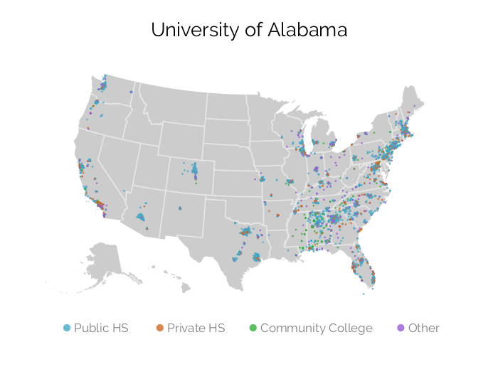
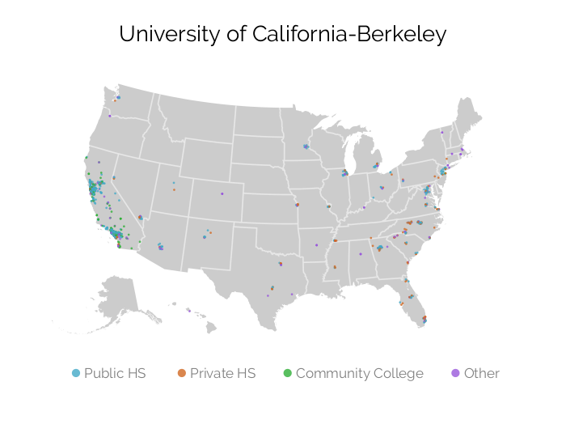
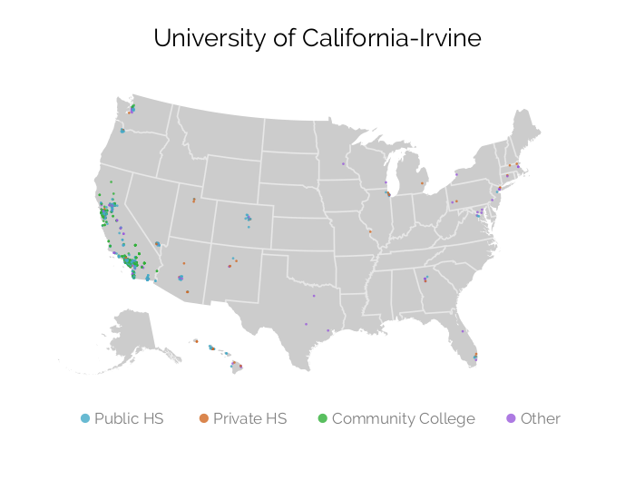
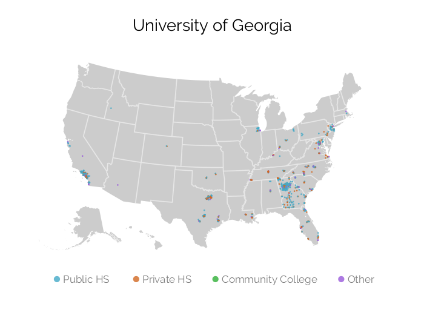
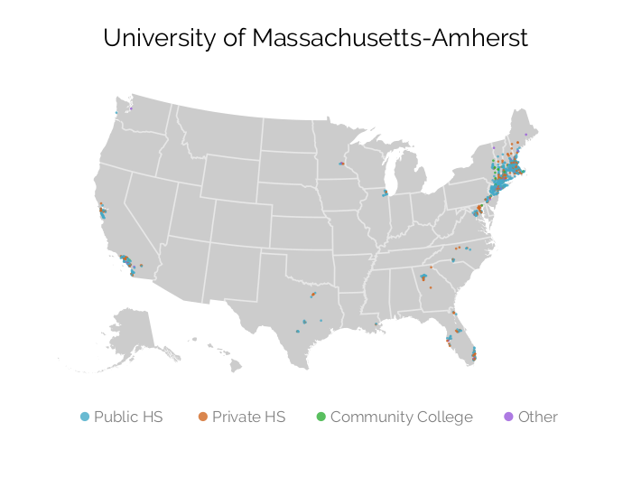
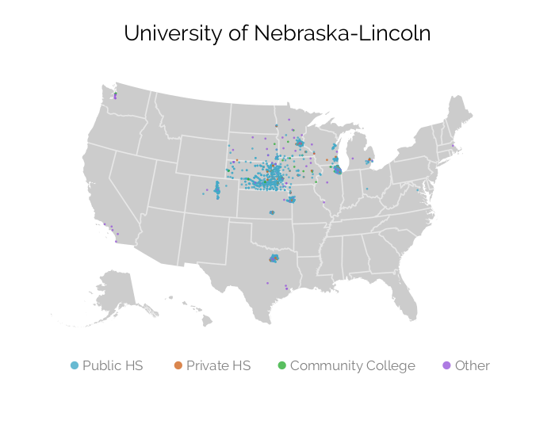

# Recruiting Visits to Tucson
## University of Alabama, University of Colorado Boulder, University of Georgia

<iframe src="assets/maps/tucson.html" width=100% height=100% allowtransparency="true"></iframe>

---
# Motivation
## Policy discourse about access to public research universities

The problem: access to public research universities
- Historical mission of social mobility for state residents
- Concern about growing socioeconomic and racial inequality in access


<br>
Mainstream policy discourse about access inequality 
- "Achievement gap", "under-matching"; place responsibility on students, K-12 schools
- Universities pledge commitment to access via policies and statements (e.g., no-loan financial aid policies)
- Problem with policy discourse: decades of research finds policy adoption a symbolic effort to appease stakeholders (e.g., Davis, 2005)


---

# Motivation
## Analyze recruiting to understand university enrollment priorities

Alternative explanation for access inequality
- University enrollment priorities biased against poor students and/or Communities of Color

<br>
Why study university recruiting behavior
- Universities spend substantial resources identifying and recruiting prospects (Noel-Levitz, 2018)
- Internal resource allocation better indicator of organizational priorities than rhetoric, policies
- Knowing which student populations targeted by recruiting efforts indicates enrollment priorities


<br>
Analyze off-campus recruiting visits (e.g., visit to a high school) as a means of gaining insight about university enrollment priorities
- Two empirical studies:
    - **(1) ¿Suburbios o Barrios? Off-Campus Recruiting by Public Research Universities**
        - Similarities and differences in off-campus recruiting patterns across universities
    - **(2) Sub-Metropolitan Spatial Redlining in Public University Recruitment**
       -  Spatial, in-depth exploration of racial bias in out-of-state recruiting visits


--- &twocol

# Data Collection
## The broader off-campus recruiting research project

*** =left

**Data collection**

* Method
    - Web-scrape admissions websites
    - Public records requests
* Criteria to be included in data collection
    1. Post visits on admissions websites
    2. Organizational type
* Data collection sample (larger project)
    - 54 public research; 49 private; 42 liberal arts
* Data collection period
    - 1/1/2017 to 12/31/2017
    - Ongoing data collection with larger sample
* Secondary Data
    - ACS; NCES; EdFacts; State DOE

    
*** =right

**Sample webpage with travel schedule**


---
# Empirical study #1 
## ¿Suburbios o Barrios? Off-Campus Recruiting by Public Research Universities

Research problem
- Research on recruiting practices can transform access inequality policy discourse
- But few empirical studies analyze recruiting behavior

<br>

Research aim
- Systematically analyze off-campus recruiting visits by public research universities

<br>

Research question
- What are the similarities and differences in off-campus recruiting patterns across universities?

<br>


Analytic focus
- Income, race; academic achievement; in-state vs. out-of-state


---

# Literature review
## Scholarship on recruiting

Scholarship analyzing college perspective (Stevens, 2007)
  - Important for relationships with prospects, counselors at "feeder" schools
  - Focus on visiting affluent schools and private schools
    
<br>
  
Scholarship analyzing perspective of high school students (Holland, 2019)
  - Which universities visit affects student decisions
  - First-gen, students of color swayed to apply and enroll to colleges that make them feel wanted
  - High income students concerned with prestige

<br>
Research gap: we don't know which universities visit which schools, communities


<!-- --- -->

<!-- # Theoretical framework -->
<!-- ## Enrollment priorities and recruiting behavior -->

<!-- Theoretical motivation for studying recruiting -->
<!-- <br> -->
<!-- - "New" institutional theory (Meyer and Rowan, 1977) -->
<!--     - Organizations have finite resources and cannot pursue multiple goals (Thompson, 1967) -->
<!--     -When facing pressure to pursue many goals, organizations:  -->
<!--       - Substantively adopt some goals (directing resources) -->
<!--       - Symbolically adopt others (policies, rhetoric) -->

<!-- <br> -->
<!-- - "Iron triangle" of enrollment management (EM) -->
<!--   - Three broad enrollment goals: **access, academic profile, revenue** -->
<!--   - Scarce resources; depending on priorities, some goals receive more resources than others -->
<!--   - Off-campus recruiting is allocation of resources -->
<!--   - Knowing which populations targeted by recruiting interventions indicate enrollment priorities -->


---

# Theoretical framework
## Expectations about similarities and differences in recruiting behavior

Resource dependence theory (RDT) (Pfeffer and Salancik, 1978)
- Organizations are sensitive to demands from providers of critical resources
- *Universities with weak state funding*
    - More visits to affluent out-of-state, affluent in-state
- *Universities with small/declining "college age" population*
    - More out-of-state visits

<br>
Academic Capitalism (AC) (Slaughter and Rhoades, 2004) 
- RDT assumes restoring state funding would compel universities to de-emphasize nonresident enrollment/recruiting
- AC suggests pursuit of revenue displaces public-good mission for market logic
- *Recruiting by universities with similar external conditions can differ depending to what extent "market logic" ideology is adopted*

<!-- ---  -->


<!-- # Research methods -->
<!-- ## Defining events -->

<!-- **"Off-campus recruiting events" defined as off-campus events hosted by paid staff/consultants focused on soliciting applications** -->

<!-- <br> -->
<!-- - Event type -->
<!--     - Include: college fairs, high school visits, community college visits, -->
<!-- counselor events -->
<!--     - Exclude: admitted or committed student events, interviews -->
<!-- - Event host -->
<!--     - Include: paid admissions staff or consultants (e.g. regional recruiters) -->
<!--     - Exclude: alumni, student volunteers -->
<!-- - Event location -->
<!--     - Any off-campus location -->
<!--     - e.g., high school, community college, hotel, convention center, cafe, etc. -->

<!-- --- -->

<!-- # Data and Methods -->
<!-- ## Summary of Data Collection Sources and Quality Checks Performed -->
<!-- <div class="table-wrapper"> -->
<!--   <div class="scroll-wrapper scroll-wrapper-x"> -->
<!-- ```{r, echo=FALSE, results='asis', warning=FALSE} -->
<!-- cat(paste0(readLines("assets/tables/data_appendix.html"),collapse=" ")) -->
<!-- ``` -->
<!--   </div> -->
<!-- </div> -->

--- 

# Research methods
## Research design and analyses

Quantitative multiple case study research design (Korzilius, 2010)
- Quantitative data collection and quantitative analyses
- Analyze each case separately, rather than pooling across cases as in large-N, random sample design

<br>
Data analysis (Eisenhardt, 1989; Pratt, Rockmann, and Kaufmann, 2006)
- "Within-case" analyses of recruiting patterns
    - Simple descriptive statistics (e.g., counts), static visualizations, interactive maps
    - Linear probability models controlling for other factors impacting probability of receiving visit 
- "Cross-case" analyses
    - Consolidate first-order findings from "within-case" into broader empirical themes


---

# Research methods
## Analysis sample

<div id="univ-characteristics" class="table-wrapper">
  <div class="scroll-wrapper scroll-wrapper-y">
<table>         <thead>             <tr>                 <th class="blank"></th>     <th class="bold">Alabama</th> <th class="bold">UC Berkeley</th> <th class="bold">UC Irvine</th> <th class="bold">Georgia</th> <th class="bold">UMass</th> <th class="bold">Nebraska</th>                  <th><span class="bold">Population</span><br />(N = 80)</th>             </tr>         </thead>         <tbody>     <tr><td class="bold blank">Academic Profile</td><td class="blank"></td><td class="blank"></td><td class="blank"></td><td class="blank"></td><td class="blank"></td><td class="blank"></td><td class="blank"></td></tr> <tr><td class="indent">US News & World Report Ranking</td><td>103</td><td>20</td><td>39</td><td>56</td><td>74</td><td>111</td><td>94</td></tr> <tr><td class="indent">25th Percentile SAT/ACT Score</td><td>1,053</td><td>1,316</td><td>1,078</td><td>1,165</td><td>1,135</td><td>1,027</td><td>1,085</td></tr> <tr><td class="indent">75th Percentile SAT/ACT Score</td><td>1,351</td><td>1,527</td><td>1,334</td><td>1,360</td><td>1,332</td><td>1,262</td><td>1,300</td></tr> <tr><td class="blank"></td><td class="blank"></td><td class="blank"></td><td class="blank"></td><td class="blank"></td><td class="blank"></td><td class="blank"></td><td class="blank"></td></tr> <tr><td class="bold blank">Enrollment</td><td class="blank"></td><td class="blank"></td><td class="blank"></td><td class="blank"></td><td class="blank"></td><td class="blank"></td><td class="blank"></td></tr> <tr><td class="indent">Total Enrolled Freshmen</td><td>7,559</td><td>6,252</td><td>6,551</td><td>5,433</td><td>4,679</td><td>4,860</td><td>4,957</td></tr> <tr><td class="indent">% Out-of-State Freshmen</td><td>68.1%</td><td>24.4%</td><td>25.8%</td><td>12.3%</td><td>26.9%</td><td>29.9%</td><td>25.4%</td></tr> <tr><td class="indent">% Pell Recipients</td><td>17.0%</td><td>19.4%</td><td>37.8%</td><td>20.3%</td><td>21.5%</td><td>23.9%</td><td>24.0%</td></tr> <tr><td class="blank"></td><td class="blank"></td><td class="blank"></td><td class="blank"></td><td class="blank"></td><td class="blank"></td><td class="blank"></td><td class="blank"></td></tr> <tr><td class="bold blank">Tuition and Fees</td><td class="blank"></td><td class="blank"></td><td class="blank"></td><td class="blank"></td><td class="blank"></td><td class="blank"></td><td class="blank"></td></tr> <tr><td class="indent">In-State Tuition + Fees</td><td>$10,701</td><td>$13,807</td><td>$13,654</td><td>$11,890</td><td>$15,301</td><td>$8,725</td><td>$11,026</td></tr> <tr><td class="indent">Out-of-State Tuition + Fees</td><td>$27,544</td><td>$41,076</td><td>$40,924</td><td>$30,502</td><td>$32,914</td><td>$23,558</td><td>$29,441</td></tr> <tr><td class="blank"></td><td class="blank"></td><td class="blank"></td><td class="blank"></td><td class="blank"></td><td class="blank"></td><td class="blank"></td><td class="blank"></td></tr> <tr><td class="bold blank">Revenues</td><td class="blank"></td><td class="blank"></td><td class="blank"></td><td class="blank"></td><td class="blank"></td><td class="blank"></td><td class="blank"></td></tr> <tr><td class="indent">Net Tuition Revenue</td><td>$493,397,152</td><td>$852,825,280</td><td>$534,855,840</td><td>$463,142,400</td><td>$382,249,088</td><td>$227,792,208</td><td>$379,065,984</td></tr> <tr><td class="indent">% Total Revenue from Tuition</td><td>39.0%</td><td>31.2%</td><td>17.5%</td><td>29.6%</td><td>30.6%</td><td>20.3%</td><td>26.3%</td></tr> <tr><td class="indent">Total State Appropriations</td><td>$158,247,648</td><td>$411,178,720</td><td>$329,859,744</td><td>$445,318,208</td><td>$353,021,024</td><td>$286,740,832</td><td>$267,926,000</td></tr> <tr><td class="indent">Appropriation per Student</td><td>$4,450</td><td>$9,992</td><td>$9,548</td><td>$11,879</td><td>$12,578</td><td>$12,561</td><td>$7,903</td></tr> <tr><td class="indent">% Total Revenue from State Appropriations</td><td>12.5%</td><td>15.1%</td><td>10.8%</td><td>28.5%</td><td>28.2%</td><td>25.5%</td><td>16.7%</td></tr> <tr><td class="indent">Total State Revenue</td><td>$190,197,808</td><td>$492,486,464</td><td>$348,427,008</td><td>$479,996,896</td><td>$374,387,616</td><td>$295,350,848</td><td>$290,634,448</td></tr> <tr><td class="indent">State Revenue per Student</td><td>$5,348</td><td>$11,967</td><td>$10,086</td><td>$12,804</td><td>$13,340</td><td>$12,938</td><td>$8,970</td></tr> <tr><td class="indent">% Total Revenue from State (All Sources)</td><td>15.0%</td><td>18.0%</td><td>11.4%</td><td>30.7%</td><td>30.0%</td><td>26.3%</td><td>19.4%</td></tr>          </tbody>     </table>
  </div>
  <p class="footnote" style="width:1000px;"><strong>Note</strong>: Author calculations based on 2016-2017 IPEDS. Population of universities includes universities categorized as Highest Research Activity by 2015 Carnegie Classification. The University of Alabama is the only institution in the study sample that is not classified as Highest Research Activity.</p>
</div>

    

--- &vertical

# Within-case results
## Click on a university to see within-case results

<br>
__N__ refers to total number of off-campus recruiting visits

<!--
select mu.univ_id, muc.univ_name, muc.univ_abbrev, mu.state_code, sd.state_name, muc.metro1, msa1.cbsa_title as metro1_name, muc.metro2, msa2.cbsa_title as metro2_name, muc.metro3, msa3.cbsa_title as metro3_name, (
  select count(*)
  from parsing p
  left join parsing_visiting_univs pvu on pvu.pid = p.pid
  left join univ_canon uc on uc.univ_id = pvu.univ_id and uc.pid = pvu.pid
  left join location_matches lm on lm.pid = p.pid and lm.id_type = 'ncessch'
  left join location_matches lm2 on lm2.pid = p.pid and lm2.id_type = 'ipeds'
  left join meta_high_school_public mpub on mpub.ncessch = lm.location_id
  left join meta_high_school_private mpri on mpri.ncessch = lm.location_id
  left join meta_university imu on imu.univ_id = lm2.location_id
  where pvu.univ_id = if(mu.univ_id not in ('196097', '186380', '201885', '139959', '110653', '166629', '126614', '155317'), mu.univ_id, concat(mu.univ_id, '_req'))
  and event_country = 'US'
  and event_date between '2017-01-01' and '2017-12-31'
  and uc.univ_canonical_pid is null
  and p.include = 1
  and (mpub.ncessch is null or mpub.include_school = 1)
  and (mpri.ncessch is null or mpri.include_school = 1)
  and (lm.location_id is null or lm.location_id != 'indy')
  and (imu.univ_id is null or imu.univ_id != mu.univ_id)
  and coalesce(p.`event_state`, mpub.`state_code`, mpri.`state_code`, imu.`state_code`) is not null
) as count
from meta_university mu
left join state_data sd on sd.state_code = mu.state_code
left join meta_univ_classification muc on muc.univ_id = mu.univ_id
left join msa_metadata msa1 on msa1.cbsa_code = muc.metro1
left join msa_metadata msa2 on msa2.cbsa_code = muc.metro2
left join msa_metadata msa3 on msa3.cbsa_code = muc.metro3
where mu.univ_id in ('100751', '106397', '110635', '110653', '126614', '139959', '155317', '166629', '181464', '186380', '196097', '199193', '201885', '215293', '218663')
order by 2;
-->

<ul id="univ_options">
<li><a data-univ-id="199193" data-univ-name="North Carolina State University" data-state-name="North Carolina" data-metro1-name="Raleigh, NC" data-metro2-name="New York-Newark-Jersey City, NY-NJ-PA" data-metro3-name="Washington-Arlington-Alexandria, DC-VA-MD-WV">North Carolina State University</a> (N=371)</li><li><a data-univ-id="186380" data-univ-name="Rutgers University-New Brunswick" data-state-name="New Jersey" data-metro1-name="New York-Newark-Jersey City, NY-NJ-PA" data-metro2-name="Washington-Arlington-Alexandria, DC-VA-MD-WV" data-metro3-name="San Francisco-Oakland-Hayward, CA">Rutgers University-New Brunswick</a> (N=1,629)</li><li><a data-univ-id="196097" data-univ-name="Stony Brook University" data-state-name="New York" data-metro1-name="New York-Newark-Jersey City, NY-NJ-PA" data-metro2-name="Hartford-West Hartford-East Hartford, CT" data-metro3-name="Philadelphia-Camden-Wilmington, PA-NJ-DE-MD">Stony Brook University</a> (N=1,101)</li><li><a data-univ-id="100751" data-univ-name="University of Alabama" data-state-name="Alabama" data-metro1-name="Birmingham-Hoover, AL" data-metro2-name="Atlanta-Sandy Springs-Roswell, GA" data-metro3-name="Dallas-Fort Worth-Arlington, TX">University of Alabama</a> (N=4,349)</li><li><a data-univ-id="106397" data-univ-name="University of Arkansas" data-state-name="Arkansas" data-metro1-name="Fayetteville-Springdale-Rogers, AR-MO" data-metro2-name="Dallas-Fort Worth-Arlington, TX" data-metro3-name="Chicago-Naperville-Elgin, IL-IN-WI">University of Arkansas</a> (N=1,013)</li><li><a data-univ-id="110635" data-univ-name="University of California-Berkeley" data-state-name="California" data-metro1-name="San Francisco-Oakland-Hayward, CA" data-metro2-name="Washington-Arlington-Alexandria, DC-VA-MD-WV" data-metro3-name="Atlanta-Sandy Springs-Roswell, GA">University of California-Berkeley</a> (N=906)</li><li><a data-univ-id="110653" data-univ-name="University of California-Irvine" data-state-name="California" data-metro1-name="Los Angeles-Long Beach-Anaheim, CA" data-metro2-name="Seattle-Tacoma-Bellevue, WA" data-metro3-name="Urban Honolulu, HI">University of California-Irvine</a> (N=939)</li><li><a data-univ-id="201885" data-univ-name="University of Cincinnati" data-state-name="Ohio" data-metro1-name="Cincinnati, OH-KY-IN" data-metro2-name="Chicago-Naperville-Elgin, IL-IN-WI" data-metro3-name="Washington-Arlington-Alexandria, DC-VA-MD-WV">University of Cincinnati</a> (N=1,369)</li><li><a data-univ-id="126614" data-univ-name="University of Colorado-Boulder" data-state-name="Colorado" data-metro1-name="Denver-Aurora-Lakewood, CO" data-metro2-name="Los Angeles-Long Beach-Anaheim, CA" data-metro3-name="Chicago-Naperville-Elgin, IL-IN-WI">University of Colorado-Boulder</a> (N=1,568)</li><li><a data-univ-id="139959" data-univ-name="University of Georgia" data-state-name="Georgia" data-metro1-name="Atlanta-Sandy Springs-Roswell, GA" data-metro2-name="Los Angeles-Long Beach-Anaheim, CA" data-metro3-name="Dallas-Fort Worth-Arlington, TX">University of Georgia</a> (N=885)</li><li><a data-univ-id="155317" data-univ-name="University of Kansas" data-state-name="Kansas" data-metro1-name="Kansas City, MO-KS" data-metro2-name="Chicago-Naperville-Elgin, IL-IN-WI" data-metro3-name="St. Louis, MO-IL">University of Kansas</a> (N=1,419)</li><li><a data-univ-id="166629" data-univ-name="University of Massachusetts-Amherst" data-state-name="Massachusetts" data-metro1-name="Boston-Cambridge-Newton, MA-NH" data-metro2-name="New York-Newark-Jersey City, NY-NJ-PA" data-metro3-name="Los Angeles-Long Beach-Anaheim, CA">University of Massachusetts-Amherst</a> (N=1,137)</li><li><a data-univ-id="181464" data-univ-name="University of Nebraska-Lincoln" data-state-name="Nebraska" data-metro1-name="Lincoln, NE" data-metro2-name="Chicago-Naperville-Elgin, IL-IN-WI" data-metro3-name="Dallas-Fort Worth-Arlington, TX">University of Nebraska-Lincoln</a> (N=1,421)</li><li><a data-univ-id="215293" data-univ-name="University of Pittsburgh" data-state-name="Pennsylvania" data-metro1-name="Pittsburgh, PA" data-metro2-name="Chicago-Naperville-Elgin, IL-IN-WI" data-metro3-name="Washington-Arlington-Alexandria, DC-VA-MD-WV">University of Pittsburgh</a> (N=1,233)</li><li><a data-univ-id="218663" data-univ-name="University of South Carolina-Columbia" data-state-name="South Carolina" data-metro1-name="Columbia, SC" data-metro2-name="New York-Newark-Jersey City, NY-NJ-PA" data-metro3-name="Chicago-Naperville-Elgin, IL-IN-WI">University of South Carolina-Columbia</a> (N=1,495)</li>
</ul>

*** #toc

# Table of Contents
## &nbsp;

<div class="graphs-set">
  <ul>
    <li><a href="#/10/2">National Overview</a></li>
    <li>In-State Results
      <ul>
        <li><a href="#/10/3">State (Map)</a></li>
        <li><a href="#/10/4">State (Figures)</a></li>
        <li><a href="#/10/5">Metro (Map)</a></li>
        <li><a href="#/10/6">Metro (Figures)</a></li>
      </ul>
    </li>
    <li>Out-of-State Results
      <ul>
        <li><a href="#/10/7">Top Visited Metro Areas</a></li>
        <li><a href="#/10/8">Out-of-State (Figures)</a></li>
        <li><a href="#/10/9">Metro 1 (Map)</a></li>
        <li><a href="#/10/10">Metro 1 (Figures)</a></li>
        <li><a href="#/10/11">Metro 2 (Map)</a></li>
        <li><a href="#/10/12">Metro 2 (Figures)</a></li>
      </ul>
    </li>
  </ul>
</div>

***

# National Overview
## &nbsp;

<div class="graphs-set">
  <div class="graphs-row">
    
    
  </div>
  <div class="graphs-row">
    
    
  </div>
</div>

***

# In-State Results
## State Map

<iframe id="map-state-in" width=100% height=100% allowtransparency="true"></iframe>

***

# In-State Results
## State Figures

<div id="graph-instate" class="graphs-set graphs-set-wide">
  <div class="graphs-row">
    
    
    
  </div>
  <div class="graphs-row">
    
    
    
  </div>
</div>

***

# In-State Results
## Metro Area Map

<iframe id="map-metro-in" width=100% height=100% allowtransparency="true"></iframe>

***

# In-State Results
## Metro Area Figures

<div id="graph-metro1" class="graphs-set graphs-set-wide">
  <div class="graphs-row">
    
    
    
  </div>
  <div class="graphs-row">
    
    
    
  </div>
</div>

***

# Out-of-State Results
## Top Visited Metro Areas

<div class="table-wrapper">
  <table id="table-metro-count"></table>
</div>

***

# Out-of-State Results
## &nbsp;

<div class="graphs-set">
  <div class="graphs-row">
    
    
  </div>
  <div class="graphs-row">
    
    
  </div>
</div>

***

# Out-of-State Results
## Metro Area Map

<iframe id="map-metro-out-1" width=100% height=100% allowtransparency="true"></iframe>

***

# Out-of-State Results
## Metro Area Figures

<div id="graph-metro2" class="graphs-set graphs-set-wide">
  <div class="graphs-row">
    
    
    
  </div>
  <div class="graphs-row">
    
    
    
  </div>
</div>

***

# Out-of-State Results
## Metro Area Map

<iframe id="map-metro-out-2" width=100% height=100% allowtransparency="true"></iframe>

***

# Out-of-State Results
## Metro Area Figures

<div id="graph-metro3" class="graphs-set graphs-set-wide">
  <div class="graphs-row">
    
    
    
  </div>
  <div class="graphs-row">
    
    
    
  </div>
</div>

---

# Cross-university results
## Number of events by type and in-state, out-of-state

<div class="table-wrapper">
  <div class="scroll-wrapper scroll-wrapper-x scroll-wrapper-y">
<table>     <thead>         <tr>             <th class="blank"></th>             <th class="blank"></th>             <th class="blank"></th>             <th colspan="4" class="bold">Out-of-State</th>             <th class="blank"></th>             <th colspan="5" class="bold">In-State</th>         </tr>         <tr>             <th class="blank"></th>             <th style="width:13%" class="bold">Total Events</th>             <th class="blank" style="width:4%"></th>             <th class="bold" style="width:7%">Total</th>             <th style="width:7%">Pub HS</th>             <th style="width:7%">Priv HS</th>             <th style="width:7%">Other</th>             <th class="blank" style="width:4%"></th>             <th class="bold" style="width:7%">Total</th>             <th style="width:7%">Pub HS</th>             <th style="width:7%">Priv HS</th>             <th style="width:7%">CC</th>             <th style="width:7%">Other</th>         </tr>     </thead>     <tbody>          <tr>             <td class="bold">Alabama</td>             <td class="bold">4,349</td>             <td class="blank"></td>             <td class="bold">3,957</td>             <td>2,312</td>             <td>934</td>             <td>711</td>             <td class="blank"></td>             <td class="bold">392</td>             <td>157</td>             <td>54</td>             <td>124</td>             <td>57</td>         </tr>          <tr>             <td class="bold">UC Berkeley</td>             <td class="bold">906</td>             <td class="blank"></td>             <td class="bold">420</td>             <td>188</td>             <td>134</td>             <td>98</td>             <td class="blank"></td>             <td class="bold">486</td>             <td>269</td>             <td>35</td>             <td>121</td>             <td>61</td>         </tr>          <tr>             <td class="bold">UC Irvine</td>             <td class="bold">939</td>             <td class="blank"></td>             <td class="bold">172</td>             <td>77</td>             <td>40</td>             <td>55</td>             <td class="blank"></td>             <td class="bold">767</td>             <td>330</td>             <td>20</td>             <td>322</td>             <td>95</td>         </tr>          <tr>             <td class="bold">Georgia</td>             <td class="bold">885</td>             <td class="blank"></td>             <td class="bold">587</td>             <td>287</td>             <td>233</td>             <td>67</td>             <td class="blank"></td>             <td class="bold">298</td>             <td>203</td>             <td>69</td>             <td>1</td>             <td>25</td>         </tr>          <tr>             <td class="bold">UMass</td>             <td class="bold">1,137</td>             <td class="blank"></td>             <td class="bold">784</td>             <td>504</td>             <td>230</td>             <td>50</td>             <td class="blank"></td>             <td class="bold">353</td>             <td>238</td>             <td>62</td>             <td>36</td>             <td>17</td>         </tr>          <tr>             <td class="bold">Nebraska</td>             <td class="bold">1,421</td>             <td class="blank"></td>             <td class="bold">875</td>             <td>646</td>             <td>104</td>             <td>125</td>             <td class="blank"></td>             <td class="bold">546</td>             <td>445</td>             <td>55</td>             <td>20</td>             <td>26</td>         </tr>     <tr><td class="blank"></td><td class="blank"></td><td class="blank"></td><td class="blank"></td><td class="blank"></td><td class="blank"></td><td class="blank"></td><td class="blank"></td><td class="blank"></td><td class="blank"></td><td class="blank"></td><td class="blank"></td><td class="blank"></td></tr>          <tr>             <td class="bold">NC State</td>             <td class="bold">371</td>             <td class="blank"></td>             <td class="bold">124</td>             <td>72</td>             <td>20</td>             <td>32</td>             <td class="blank"></td>             <td class="bold">247</td>             <td>157</td>             <td>3</td>             <td>55</td>             <td>32</td>         </tr>          <tr>             <td class="bold">Rutgers</td>             <td class="bold">1,629</td>             <td class="blank"></td>             <td class="bold">954</td>             <td>560</td>             <td>231</td>             <td>163</td>             <td class="blank"></td>             <td class="bold">675</td>             <td>477</td>             <td>72</td>             <td>89</td>             <td>37</td>         </tr>          <tr>             <td class="bold">Stony Brook</td>             <td class="bold">1,101</td>             <td class="blank"></td>             <td class="bold">666</td>             <td>496</td>             <td>107</td>             <td>63</td>             <td class="blank"></td>             <td class="bold">435</td>             <td>326</td>             <td>39</td>             <td>33</td>             <td>37</td>         </tr>          <tr>             <td class="bold">Arkansas</td>             <td class="bold">1,013</td>             <td class="blank"></td>             <td class="bold">788</td>             <td>483</td>             <td>204</td>             <td>101</td>             <td class="blank"></td>             <td class="bold">225</td>             <td>162</td>             <td>21</td>             <td>16</td>             <td>26</td>         </tr>          <tr>             <td class="bold">Cincinnati</td>             <td class="bold">1,369</td>             <td class="blank"></td>             <td class="bold">815</td>             <td>491</td>             <td>204</td>             <td>120</td>             <td class="blank"></td>             <td class="bold">554</td>             <td>408</td>             <td>79</td>             <td>22</td>             <td>45</td>         </tr>          <tr>             <td class="bold">CU Boulder</td>             <td class="bold">1,568</td>             <td class="blank"></td>             <td class="bold">1,102</td>             <td>607</td>             <td>362</td>             <td>133</td>             <td class="blank"></td>             <td class="bold">466</td>             <td>256</td>             <td>17</td>             <td>154</td>             <td>39</td>         </tr>          <tr>             <td class="bold">Kansas</td>             <td class="bold">1,419</td>             <td class="blank"></td>             <td class="bold">1,004</td>             <td>613</td>             <td>213</td>             <td>178</td>             <td class="blank"></td>             <td class="bold">415</td>             <td>304</td>             <td>22</td>             <td>28</td>             <td>61</td>         </tr>          <tr>             <td class="bold">Pittsburgh</td>             <td class="bold">1,233</td>             <td class="blank"></td>             <td class="bold">906</td>             <td>559</td>             <td>210</td>             <td>137</td>             <td class="blank"></td>             <td class="bold">327</td>             <td>211</td>             <td>51</td>             <td>37</td>             <td>28</td>         </tr>          <tr>             <td class="bold">S.Carolina</td>             <td class="bold">1,495</td>             <td class="blank"></td>             <td class="bold">1,245</td>             <td>676</td>             <td>328</td>             <td>241</td>             <td class="blank"></td>             <td class="bold">250</td>             <td>197</td>             <td>22</td>             <td>2</td>             <td>29</td>         </tr>      </tbody> </table>
  <p class="footnote"><strong>Note</strong>: Totals for schools include multiple visits to unique schools.</p>
  </div>
</div>
<a class="btn btn-compare" href="#/10">Deep-dive results</a>

---

# Cross-university results, out-of-state visits
## Small multiple map of recruiting visits

<div class="graphs-set graphs-set-all">
  <div class="graphs-row">
</div><div class="graphs-row">
  </div>
  <a class="btn btn-compare" href="#/10">Deep-dive results</a>
</div>

---

# Cross-university results, out-of-state visits
## Descriptive statistics for public high school visits

<div class="table-wrapper">
  <div class="scroll-wrapper">
<table class="desc-table">         <thead>             <tr>                 <th></th>     <th colspan="2" class="bold">Alabama</th> <th colspan="2" class="bold">UC Berkeley</th> <th colspan="2" class="bold">UC Irvine</th> <th colspan="2" class="bold">Georgia</th> <th colspan="2" class="bold">UMass</th> <th colspan="2" class="bold">Nebraska</th> <th colspan="2" class="bold">NC State</th> <th colspan="2" class="bold">Rutgers</th> <th colspan="2" class="bold">Stony Brook</th> <th colspan="2" class="bold">Arkansas</th> <th colspan="2" class="bold">Cincinnati</th> <th colspan="2" class="bold">CU Boulder</th> <th colspan="2" class="bold">Kansas</th> <th colspan="2" class="bold">Pittsburgh</th> <th colspan="2" class="bold">S.Carolina</th>              </tr>             <tr>                 <th></th>                  <th>Visit</th>                 <th>Nonvisit</th>                  <th>Visit</th>                 <th>Nonvisit</th>                  <th>Visit</th>                 <th>Nonvisit</th>                  <th>Visit</th>                 <th>Nonvisit</th>                  <th>Visit</th>                 <th>Nonvisit</th>                  <th>Visit</th>                 <th>Nonvisit</th>                  <th>Visit</th>                 <th>Nonvisit</th>                  <th>Visit</th>                 <th>Nonvisit</th>                  <th>Visit</th>                 <th>Nonvisit</th>                  <th>Visit</th>                 <th>Nonvisit</th>                  <th>Visit</th>                 <th>Nonvisit</th>                  <th>Visit</th>                 <th>Nonvisit</th>                  <th>Visit</th>                 <th>Nonvisit</th>                  <th>Visit</th>                 <th>Nonvisit</th>                  <th>Visit</th>                 <th>Nonvisit</th>              </tr>         </thead>         <tbody>     <tr><td>Number of High Schools</td><td>1,711</td><td>13,255</td><td>178</td><td>10,893</td><td>74</td><td>7,521</td><td>249</td><td>9,333</td><td>496</td><td>8,797</td><td>420</td><td>6,003</td><td>70</td><td>5,185</td><td>445</td><td>6,635</td><td>407</td><td>3,613</td><td>329</td><td>6,301</td><td>401</td><td>8,717</td><td>575</td><td>12,820</td><td>438</td><td>8,090</td><td>433</td><td>7,316</td><td>576</td><td>11,510</td></tr> <tr><td>Miles from University</td><td>831</td><td>836</td><td>1,933</td><td>1,917</td><td>1,155</td><td>1,805</td><td>920</td><td>808</td><td>675</td><td>1,102</td><td>374</td><td>548</td><td>339</td><td>437</td><td>717</td><td>1,003</td><td>196</td><td>506</td><td>406</td><td>630</td><td>406</td><td>720</td><td>1,139</td><td>1,116</td><td>519</td><td>685</td><td>411</td><td>614</td><td>658</td><td>806</td></tr> <tr><td>Grade 12 Enrollment</td><td>384</td><td>169</td><td>459</td><td>183</td><td>471</td><td>191</td><td>490</td><td>201</td><td>380</td><td>208</td><td>391</td><td>144</td><td>403</td><td>201</td><td>428</td><td>214</td><td>332</td><td>215</td><td>427</td><td>186</td><td>430</td><td>199</td><td>431</td><td>186</td><td>458</td><td>172</td><td>406</td><td>188</td><td>431</td><td>192</td></tr> <tr><td>Median Household Income ($000)</td><td>$90</td><td>$60</td><td>$104</td><td>$62</td><td>$93</td><td>$66</td><td>$102</td><td>$62</td><td>$115</td><td>$64</td><td>$85</td><td>$61</td><td>$121</td><td>$67</td><td>$113</td><td>$66</td><td>$110</td><td>$66</td><td>$87</td><td>$59</td><td>$101</td><td>$64</td><td>$115</td><td>$63</td><td>$96</td><td>$62</td><td>$114</td><td>$64</td><td>$105</td><td>$63</td></tr> <tr><td>Percent Free or Reduced Lunch</td><td>30.4</td><td>51.7</td><td>23.1</td><td>49.2</td><td>29.3</td><td>46.9</td><td>22.6</td><td>51.2</td><td>21.4</td><td>51.7</td><td>31.1</td><td>46.6</td><td>21.5</td><td>49.2</td><td>22.9</td><td>52.0</td><td>22.8</td><td>48.8</td><td>31.4</td><td>55.8</td><td>28.3</td><td>50.9</td><td>20.5</td><td>49.5</td><td>26.1</td><td>49.6</td><td>21.0</td><td>50.0</td><td>22.6</td><td>50.5</td></tr> <tr><td class="blank"></td><td class="blank"></td><td class="blank"></td><td class="blank"></td><td class="blank"></td><td class="blank"></td><td class="blank"></td><td class="blank"></td><td class="blank"></td><td class="blank"></td><td class="blank"></td><td class="blank"></td><td class="blank"></td><td class="blank"></td><td class="blank"></td><td class="blank"></td><td class="blank"></td><td class="blank"></td><td class="blank"></td><td class="blank"></td><td class="blank"></td><td class="blank"></td><td class="blank"></td><td class="blank"></td><td class="blank"></td><td class="blank"></td><td class="blank"></td><td class="blank"></td><td class="blank"></td><td class="blank"></td><td class="blank"></td></tr> <tr><td class="blank bold">Percent Enrollment by Race</td><td class="blank"></td><td class="blank"></td><td class="blank"></td><td class="blank"></td><td class="blank"></td><td class="blank"></td><td class="blank"></td><td class="blank"></td><td class="blank"></td><td class="blank"></td><td class="blank"></td><td class="blank"></td><td class="blank"></td><td class="blank"></td><td class="blank"></td><td class="blank"></td><td class="blank"></td><td class="blank"></td><td class="blank"></td><td class="blank"></td><td class="blank"></td><td class="blank"></td><td class="blank"></td><td class="blank"></td><td class="blank"></td><td class="blank"></td><td class="blank"></td><td class="blank"></td><td class="blank"></td><td class="blank"></td></tr> <tr><td class="indent">Black, Latinx, Native American</td><td>30.3</td><td>38.0</td><td>30.4</td><td>37.4</td><td>29.9</td><td>35.5</td><td>29.6</td><td>40.9</td><td>24.5</td><td>43.6</td><td>27.1</td><td>28.8</td><td>28.7</td><td>37.1</td><td>26.2</td><td>45.6</td><td>24.0</td><td>37.0</td><td>32.5</td><td>44.3</td><td>28.9</td><td>40.5</td><td>25.4</td><td>37.6</td><td>25.4</td><td>38.2</td><td>24.3</td><td>39.7</td><td>26.7</td><td>37.9</td></tr> <tr><td class="indent">White</td><td>59.9</td><td>56.8</td><td>51.7</td><td>57.6</td><td>44.5</td><td>58.4</td><td>56.1</td><td>53.4</td><td>61.6</td><td>50.1</td><td>63.9</td><td>67.2</td><td>58.7</td><td>57.2</td><td>57.1</td><td>48.2</td><td>64.7</td><td>58.0</td><td>57.8</td><td>50.1</td><td>57.1</td><td>53.6</td><td>59.2</td><td>56.5</td><td>63.6</td><td>56.1</td><td>61.6</td><td>55.1</td><td>61.9</td><td>56.5</td></tr> <tr><td class="indent">Black</td><td>13.8</td><td>16.3</td><td>15.0</td><td>18.1</td><td>8.1</td><td>15.7</td><td>10.3</td><td>17.1</td><td>8.5</td><td>17.7</td><td>10.2</td><td>11.6</td><td>15.9</td><td>22.1</td><td>10.1</td><td>15.4</td><td>11.8</td><td>22.1</td><td>10.8</td><td>16.4</td><td>14.6</td><td>16.7</td><td>6.6</td><td>14.9</td><td>9.8</td><td>11.7</td><td>10.7</td><td>18.7</td><td>12.0</td><td>16.3</td></tr> <tr><td class="indent">Latinx</td><td>16.1</td><td>20.5</td><td>15.1</td><td>18.1</td><td>21.3</td><td>18.3</td><td>19.0</td><td>22.3</td><td>15.7</td><td>25.0</td><td>16.0</td><td>16.1</td><td>12.6</td><td>14.7</td><td>15.9</td><td>29.6</td><td>12.0</td><td>14.6</td><td>19.2</td><td>26.0</td><td>14.0</td><td>23.2</td><td>18.5</td><td>21.3</td><td>15.0</td><td>24.3</td><td>13.3</td><td>20.4</td><td>14.4</td><td>21.0</td></tr> <tr><td class="indent">Native American</td><td>0.4</td><td>1.2</td><td>0.3</td><td>1.2</td><td>0.5</td><td>1.5</td><td>0.3</td><td>1.5</td><td>0.2</td><td>0.8</td><td>0.9</td><td>1.1</td><td>0.2</td><td>0.3</td><td>0.2</td><td>0.6</td><td>0.2</td><td>0.3</td><td>2.5</td><td>1.9</td><td>0.2</td><td>0.6</td><td>0.3</td><td>1.3</td><td>0.5</td><td>2.2</td><td>0.2</td><td>0.6</td><td>0.3</td><td>0.6</td></tr> <tr><td class="indent">Asian</td><td>6.7</td><td>2.8</td><td>14.1</td><td>2.6</td><td>16.4</td><td>3.4</td><td>11.2</td><td>3.2</td><td>11.5</td><td>3.9</td><td>6.1</td><td>1.7</td><td>9.7</td><td>3.4</td><td>13.7</td><td>3.9</td><td>9.0</td><td>2.8</td><td>6.2</td><td>3.1</td><td>10.8</td><td>3.7</td><td>12.0</td><td>3.3</td><td>7.6</td><td>3.2</td><td>11.4</td><td>2.8</td><td>8.2</td><td>3.3</td></tr> <tr><td class="indent">Other Race</td><td>3.2</td><td>2.4</td><td>3.8</td><td>2.3</td><td>9.1</td><td>2.7</td><td>3.1</td><td>2.6</td><td>2.4</td><td>2.5</td><td>2.9</td><td>2.3</td><td>2.9</td><td>2.3</td><td>3.0</td><td>2.3</td><td>2.3</td><td>2.3</td><td>3.5</td><td>2.4</td><td>3.2</td><td>2.2</td><td>3.4</td><td>2.7</td><td>3.4</td><td>2.5</td><td>2.7</td><td>2.4</td><td>3.1</td><td>2.4</td></tr> <tr><td class="blank"></td><td class="blank"></td><td class="blank"></td><td class="blank"></td><td class="blank"></td><td class="blank"></td><td class="blank"></td><td class="blank"></td><td class="blank"></td><td class="blank"></td><td class="blank"></td><td class="blank"></td><td class="blank"></td><td class="blank"></td><td class="blank"></td><td class="blank"></td><td class="blank"></td><td class="blank"></td><td class="blank"></td><td class="blank"></td><td class="blank"></td><td class="blank"></td><td class="blank"></td><td class="blank"></td><td class="blank"></td><td class="blank"></td><td class="blank"></td><td class="blank"></td><td class="blank"></td><td class="blank"></td><td class="blank"></td></tr> <tr><td class="blank bold">School Type</td><td class="blank"></td><td class="blank"></td><td class="blank"></td><td class="blank"></td><td class="blank"></td><td class="blank"></td><td class="blank"></td><td class="blank"></td><td class="blank"></td><td class="blank"></td><td class="blank"></td><td class="blank"></td><td class="blank"></td><td class="blank"></td><td class="blank"></td><td class="blank"></td><td class="blank"></td><td class="blank"></td><td class="blank"></td><td class="blank"></td><td class="blank"></td><td class="blank"></td><td class="blank"></td><td class="blank"></td><td class="blank"></td><td class="blank"></td><td class="blank"></td><td class="blank"></td><td class="blank"></td><td class="blank"></td></tr> <tr><td class="indent">0/1 is a Charter School</td><td>0.04</td><td>0.11</td><td>0.06</td><td>0.08</td><td>0.03</td><td>0.10</td><td>0.05</td><td>0.10</td><td>0.02</td><td>0.10</td><td>0.02</td><td>0.07</td><td>0.01</td><td>0.07</td><td>0.02</td><td>0.11</td><td>0.02</td><td>0.07</td><td>0.04</td><td>0.10</td><td>0.03</td><td>0.10</td><td>0.03</td><td>0.11</td><td>0.01</td><td>0.12</td><td>0.01</td><td>0.06</td><td>0.03</td><td>0.10</td></tr> <tr><td class="indent">0/1 is a Magnet School</td><td>0.09</td><td>0.05</td><td>0.18</td><td>0.06</td><td>0.14</td><td>0.06</td><td>0.12</td><td>0.06</td><td>0.09</td><td>0.07</td><td>0.03</td><td>0.04</td><td>0.07</td><td>0.06</td><td>0.08</td><td>0.08</td><td>0.07</td><td>0.09</td><td>0.05</td><td>0.05</td><td>0.11</td><td>0.06</td><td>0.09</td><td>0.05</td><td>0.03</td><td>0.03</td><td>0.08</td><td>0.06</td><td>0.10</td><td>0.06</td></tr> <tr><td class="indent">0/1 is a Regular School</td><td>0.88</td><td>0.84</td><td>0.76</td><td>0.86</td><td>0.84</td><td>0.85</td><td>0.83</td><td>0.84</td><td>0.89</td><td>0.84</td><td>0.95</td><td>0.89</td><td>0.91</td><td>0.87</td><td>0.90</td><td>0.81</td><td>0.90</td><td>0.84</td><td>0.91</td><td>0.85</td><td>0.86</td><td>0.85</td><td>0.88</td><td>0.84</td><td>0.95</td><td>0.85</td><td>0.91</td><td>0.87</td><td>0.88</td><td>0.84</td></tr> <tr><td class="blank"></td><td class="blank"></td><td class="blank"></td><td class="blank"></td><td class="blank"></td><td class="blank"></td><td class="blank"></td><td class="blank"></td><td class="blank"></td><td class="blank"></td><td class="blank"></td><td class="blank"></td><td class="blank"></td><td class="blank"></td><td class="blank"></td><td class="blank"></td><td class="blank"></td><td class="blank"></td><td class="blank"></td><td class="blank"></td><td class="blank"></td><td class="blank"></td><td class="blank"></td><td class="blank"></td><td class="blank"></td><td class="blank"></td><td class="blank"></td><td class="blank"></td><td class="blank"></td><td class="blank"></td><td class="blank"></td></tr> <tr><td class="blank bold">Locale</td><td class="blank"></td><td class="blank"></td><td class="blank"></td><td class="blank"></td><td class="blank"></td><td class="blank"></td><td class="blank"></td><td class="blank"></td><td class="blank"></td><td class="blank"></td><td class="blank"></td><td class="blank"></td><td class="blank"></td><td class="blank"></td><td class="blank"></td><td class="blank"></td><td class="blank"></td><td class="blank"></td><td class="blank"></td><td class="blank"></td><td class="blank"></td><td class="blank"></td><td class="blank"></td><td class="blank"></td><td class="blank"></td><td class="blank"></td><td class="blank"></td><td class="blank"></td><td class="blank"></td><td class="blank"></td></tr> <tr><td class="indent">In a City</td><td>0.25</td><td>0.25</td><td>0.45</td><td>0.24</td><td>0.51</td><td>0.25</td><td>0.41</td><td>0.24</td><td>0.22</td><td>0.28</td><td>0.31</td><td>0.18</td><td>0.17</td><td>0.26</td><td>0.29</td><td>0.31</td><td>0.14</td><td>0.22</td><td>0.30</td><td>0.24</td><td>0.25</td><td>0.27</td><td>0.32</td><td>0.25</td><td>0.33</td><td>0.22</td><td>0.19</td><td>0.26</td><td>0.21</td><td>0.26</td></tr> <tr><td class="indent">In a Suburb</td><td>0.58</td><td>0.23</td><td>0.48</td><td>0.26</td><td>0.39</td><td>0.32</td><td>0.52</td><td>0.29</td><td>0.68</td><td>0.28</td><td>0.46</td><td>0.17</td><td>0.64</td><td>0.35</td><td>0.64</td><td>0.31</td><td>0.73</td><td>0.39</td><td>0.49</td><td>0.20</td><td>0.63</td><td>0.28</td><td>0.62</td><td>0.27</td><td>0.56</td><td>0.22</td><td>0.70</td><td>0.28</td><td>0.68</td><td>0.28</td></tr> <tr><td class="indent">In a Town</td><td>0.04</td><td>0.15</td><td>0.02</td><td>0.14</td><td>0.03</td><td>0.13</td><td>0.00</td><td>0.13</td><td>0.02</td><td>0.12</td><td>0.10</td><td>0.17</td><td>0.03</td><td>0.11</td><td>0.01</td><td>0.11</td><td>0.01</td><td>0.12</td><td>0.07</td><td>0.15</td><td>0.03</td><td>0.13</td><td>0.01</td><td>0.14</td><td>0.03</td><td>0.16</td><td>0.02</td><td>0.12</td><td>0.01</td><td>0.13</td></tr> <tr><td class="indent">In a Rural Area</td><td class="col-width">0.13</td><td class="col-width">0.37</td><td class="col-width">0.05</td><td class="col-width">0.36</td><td class="col-width">0.07</td><td class="col-width">0.30</td><td class="col-width">0.07</td><td class="col-width">0.34</td><td class="col-width">0.08</td><td class="col-width">0.31</td><td class="col-width">0.14</td><td class="col-width">0.48</td><td class="col-width">0.16</td><td class="col-width">0.27</td><td class="col-width">0.07</td><td class="col-width">0.28</td><td class="col-width">0.11</td><td class="col-width">0.27</td><td class="col-width">0.14</td><td class="col-width">0.41</td><td class="col-width">0.09</td><td class="col-width">0.32</td><td class="col-width">0.05</td><td class="col-width">0.34</td><td class="col-width">0.08</td><td class="col-width">0.40</td><td class="col-width">0.08</td><td class="col-width">0.33</td><td class="col-width">0.09</td><td class="col-width">0.33</td></tr>          </tbody>     </table>
  </div>
  <a class="btn btn-compare" href="#/10">Deep-dive results</a>
  <p class="footnote"><strong>Note</strong>: Schools that satisfied the following criteria were included in the sample: offers grades 9-12 and enrolls at least ten students in each grade; located in the 50 U.S. states, the District of Columbia, or land regulated by the Bureau of Indian Affairs; is not a special education school, alternative school, virtual school, or independent school. Non-visited schools include only out-of-state schools in states that received at least one high school visit.</p>
</div>

---

# Cross-university results, out-of-state visits
## Probability of out-of-state public high school receiving a visit

<div class="table-wrapper">
  <div class="scroll-wrapper">
<table class="regr-table">         <thead>             <tr>                 <th></th>     <th class="bold">Alabama</th> <th class="bold">UC Berkeley</th> <th class="bold">UC Irvine</th> <th class="bold">Georgia</th> <th class="bold">UMass</th> <th class="bold">Nebraska</th> <th class="bold">NC State</th> <th class="bold">Rutgers</th> <th class="bold">Stony Brook</th> <th class="bold">Arkansas</th> <th class="bold">Cincinnati</th> <th class="bold">CU Boulder</th> <th class="bold">Kansas</th> <th class="bold">Pittsburgh</th> <th class="bold">S.Carolina</th>              </tr>         </thead>         <tbody>     <tr><td class="blank"><span class="bold">Income</span><br>(ref=<$50k)</td><td class="blank"></td><td class="blank"></td><td class="blank"></td><td class="blank"></td><td class="blank"></td><td class="blank"></td><td class="blank"></td><td class="blank"></td><td class="blank"></td><td class="blank"></td><td class="blank"></td><td class="blank"></td><td class="blank"></td><td class="blank"></td><td class="blank"></td></tr> <tr><td class="indent">$50k-$74k</td><td>0.004<br>(0.004)</td><td>-0.003<br>(0.002)</td><td>-0.001<br>(0.002)</td><td>-0.004<br>(0.003)</td><td>-0.011***<br>(0.003)</td><td>0.001<br>(0.005)</td><td>-0.001<br>(0.002)</td><td>-0.011**<br>(0.004)</td><td>-0.020**<br>(0.007)</td><td>0.002<br>(0.004)</td><td>0.001<br>(0.003)</td><td>-0.008***<br>(0.002)</td><td>-0.003<br>(0.004)</td><td>-0.010**<br>(0.003)</td><td>-0.001<br>(0.003)</td></tr> <tr><td class="indent">$75k-$99k</td><td>0.081***<br>(0.009)</td><td>0.006<br>(0.004)</td><td>0.006<br>(0.004)</td><td>0.008<br>(0.006)</td><td>0.022**<br>(0.007)</td><td>0.049***<br>(0.010)</td><td>0.005<br>(0.005)</td><td>0.019*<br>(0.008)</td><td>0.016<br>(0.013)</td><td>0.044***<br>(0.010)</td><td>0.030***<br>(0.007)</td><td>0.024***<br>(0.005)</td><td>0.051***<br>(0.008)</td><td>0.032***<br>(0.008)</td><td>0.031***<br>(0.006)</td></tr> <tr><td class="indent">$100k-$149k</td><td>0.207***<br>(0.014)</td><td>0.060***<br>(0.009)</td><td>0.042***<br>(0.008)</td><td>0.068***<br>(0.011)</td><td>0.178***<br>(0.013)</td><td>0.191***<br>(0.025)</td><td>0.047***<br>(0.009)</td><td>0.173***<br>(0.014)</td><td>0.185***<br>(0.021)</td><td>0.184***<br>(0.023)</td><td>0.115***<br>(0.012)</td><td>0.170***<br>(0.011)</td><td>0.183***<br>(0.017)</td><td>0.153***<br>(0.014)</td><td>0.155***<br>(0.012)</td></tr> <tr><td class="indent">$150k-$199k</td><td>0.415***<br>(0.041)</td><td>0.193***<br>(0.045)</td><td>0.033<br>(0.020)</td><td>0.168***<br>(0.041)</td><td>0.444***<br>(0.049)</td><td>0.225*<br>(0.089)</td><td>0.166***<br>(0.047)</td><td>0.393***<br>(0.050)</td><td>0.433***<br>(0.057)</td><td>0.066<br>(0.047)</td><td>0.276***<br>(0.045)</td><td>0.501***<br>(0.044)</td><td>0.231***<br>(0.051)</td><td>0.480***<br>(0.050)</td><td>0.314***<br>(0.043)</td></tr> <tr><td class="indent">$200k+</td><td>0.481***<br>(0.075)</td><td>0.241**<br>(0.089)</td><td>0.005<br>(0.005)</td><td>0.362***<br>(0.108)</td><td>0.654***<br>(0.078)</td><td>0.084<br>(0.129)</td><td>0.104<br>(0.077)</td><td>0.398***<br>(0.089)</td><td>0.482***<br>(0.120)</td><td>0.398**<br>(0.141)</td><td>0.248***<br>(0.075)</td><td>0.766***<br>(0.066)</td><td>0.385**<br>(0.118)</td><td>0.550***<br>(0.095)</td><td>0.265***<br>(0.079)</td></tr> <tr><td class="blank"></td><td class="blank"></td><td class="blank"></td><td class="blank"></td><td class="blank"></td><td class="blank"></td><td class="blank"></td><td class="blank"></td><td class="blank"></td><td class="blank"></td><td class="blank"></td><td class="blank"></td><td class="blank"></td><td class="blank"></td><td class="blank"></td><td class="blank"></td></tr> <tr><td class="blank"><span class="bold">BL, LX, NA Enrollment</span><br>(ref=<20%)</td><td class="blank"></td><td class="blank"></td><td class="blank"></td><td class="blank"></td><td class="blank"></td><td class="blank"></td><td class="blank"></td><td class="blank"></td><td class="blank"></td><td class="blank"></td><td class="blank"></td><td class="blank"></td><td class="blank"></td><td class="blank"></td><td class="blank"></td></tr> <tr><td class="indent">20-39%</td><td>0.030***<br>(0.008)</td><td>-0.002<br>(0.004)</td><td>-0.004<br>(0.004)</td><td>0.003<br>(0.005)</td><td>-0.016*<br>(0.008)</td><td>0.023*<br>(0.009)</td><td>0.002<br>(0.006)</td><td>0.001<br>(0.010)</td><td>-0.010<br>(0.015)</td><td>0.026**<br>(0.008)</td><td>0.012<br>(0.007)</td><td>0.007<br>(0.005)</td><td>0.028***<br>(0.007)</td><td>-0.001<br>(0.008)</td><td>0.026***<br>(0.007)</td></tr> <tr><td class="indent">40-59%</td><td>-0.011<br>(0.008)</td><td>-0.015***<br>(0.004)</td><td>0.002<br>(0.005)</td><td>-0.011*<br>(0.005)</td><td>-0.030***<br>(0.008)</td><td>0.002<br>(0.011)</td><td>-0.012*<br>(0.005)</td><td>-0.038***<br>(0.010)</td><td>-0.028<br>(0.016)</td><td>-0.00004<br>(0.008)</td><td>0.012<br>(0.008)</td><td>-0.015**<br>(0.006)</td><td>-0.016*<br>(0.007)</td><td>-0.020*<br>(0.009)</td><td>-0.010<br>(0.007)</td></tr> <tr><td class="indent">60-79%</td><td>-0.047***<br>(0.009)</td><td>-0.013**<br>(0.005)</td><td>-0.004<br>(0.005)</td><td>-0.027***<br>(0.005)</td><td>-0.040***<br>(0.008)</td><td>0.011<br>(0.012)</td><td>0.007<br>(0.008)</td><td>-0.048***<br>(0.011)</td><td>-0.054**<br>(0.017)</td><td>-0.007<br>(0.009)</td><td>-0.0004<br>(0.009)</td><td>-0.036***<br>(0.006)</td><td>-0.032***<br>(0.008)</td><td>-0.040***<br>(0.008)</td><td>-0.021**<br>(0.007)</td></tr> <tr><td class="indent">80-89%</td><td>-0.042***<br>(0.011)</td><td>-0.021***<br>(0.005)</td><td>-0.011*<br>(0.005)</td><td>-0.035***<br>(0.006)</td><td>-0.056***<br>(0.008)</td><td>-0.023<br>(0.014)</td><td>0.005<br>(0.009)</td><td>-0.070***<br>(0.011)</td><td>-0.078***<br>(0.020)</td><td>-0.022*<br>(0.009)</td><td>-0.007<br>(0.009)</td><td>-0.052***<br>(0.006)</td><td>-0.034***<br>(0.009)</td><td>-0.042***<br>(0.010)</td><td>-0.028***<br>(0.007)</td></tr> <tr><td class="indent">90%+</td><td>-0.073***<br>(0.008)</td><td>-0.027***<br>(0.004)</td><td>-0.011**<br>(0.004)</td><td>-0.036***<br>(0.005)</td><td>-0.062***<br>(0.007)</td><td>-0.006<br>(0.011)</td><td>-0.0004<br>(0.005)</td><td>-0.075***<br>(0.010)</td><td>-0.087***<br>(0.015)</td><td>-0.026**<br>(0.008)</td><td>-0.012<br>(0.007)</td><td>-0.051***<br>(0.005)</td><td>-0.032***<br>(0.007)</td><td>-0.050***<br>(0.008)</td><td>-0.031***<br>(0.006)</td></tr> <tr><td class="blank"></td><td class="blank"></td><td class="blank"></td><td class="blank"></td><td class="blank"></td><td class="blank"></td><td class="blank"></td><td class="blank"></td><td class="blank"></td><td class="blank"></td><td class="blank"></td><td class="blank"></td><td class="blank"></td><td class="blank"></td><td class="blank"></td><td class="blank"></td></tr> <tr><td class="blank"><span class="bold"># Math Proficient Students</span><br>(ref=<50)</td><td class="blank"></td><td class="blank"></td><td class="blank"></td><td class="blank"></td><td class="blank"></td><td class="blank"></td><td class="blank"></td><td class="blank"></td><td class="blank"></td><td class="blank"></td><td class="blank"></td><td class="blank"></td><td class="blank"></td><td class="blank"></td><td class="blank"></td></tr> <tr><td class="indent">50-99</td><td>-0.004<br>(0.005)</td><td>-0.003<br>(0.002)</td><td>-0.0005<br>(0.003)</td><td>-0.003<br>(0.002)</td><td>0.007<br>(0.005)</td><td>0.061***<br>(0.009)</td><td>-0.004*<br>(0.002)</td><td>-0.012*<br>(0.005)</td><td>0.003<br>(0.013)</td><td>-0.003<br>(0.006)</td><td>-0.006<br>(0.004)</td><td>-0.005<br>(0.003)</td><td>-0.005<br>(0.005)</td><td>-0.004<br>(0.005)</td><td>-0.004<br>(0.003)</td></tr> <tr><td class="indent">100-199</td><td>0.028***<br>(0.008)</td><td>-0.0004<br>(0.004)</td><td>-0.008<br>(0.004)</td><td>0.003<br>(0.004)</td><td>0.001<br>(0.007)</td><td>0.070***<br>(0.013)</td><td>0.0003<br>(0.004)</td><td>-0.004<br>(0.009)</td><td>-0.014<br>(0.014)</td><td>0.018<br>(0.010)</td><td>-0.011<br>(0.007)</td><td>0.0002<br>(0.006)</td><td>-0.014<br>(0.008)</td><td>-0.006<br>(0.007)</td><td>-0.007<br>(0.005)</td></tr> <tr><td class="indent">200-299</td><td>0.056***<br>(0.014)</td><td>0.005<br>(0.007)</td><td>-0.014*<br>(0.007)</td><td>0.022*<br>(0.008)</td><td>0.011<br>(0.011)</td><td>0.078***<br>(0.021)</td><td>0.012<br>(0.007)</td><td>0.019<br>(0.014)</td><td>0.003<br>(0.020)</td><td>0.029<br>(0.018)</td><td>-0.037***<br>(0.011)</td><td>-0.006<br>(0.010)</td><td>-0.015<br>(0.015)</td><td>0.011<br>(0.013)</td><td>-0.011<br>(0.010)</td></tr> <tr><td class="indent">300-399</td><td>0.053**<br>(0.019)</td><td>0.005<br>(0.010)</td><td>-0.017<br>(0.010)</td><td>0.045***<br>(0.013)</td><td>0.032*<br>(0.015)</td><td>-0.013<br>(0.025)</td><td>0.014<br>(0.011)</td><td>-0.022<br>(0.017)</td><td>0.022<br>(0.025)</td><td>0.088***<br>(0.027)</td><td>-0.024<br>(0.016)</td><td>-0.001<br>(0.014)</td><td>-0.028<br>(0.021)</td><td>0.007<br>(0.017)</td><td>0.033*<br>(0.015)</td></tr> <tr><td class="indent">400+</td><td>0.137***<br>(0.020)</td><td>0.011<br>(0.011)</td><td>-0.028**<br>(0.009)</td><td>0.004<br>(0.012)</td><td>0.022<br>(0.013)</td><td>-0.098***<br>(0.023)</td><td>0.030**<br>(0.011)</td><td>-0.001<br>(0.016)</td><td>-0.043*<br>(0.019)</td><td>0.003<br>(0.026)</td><td>-0.011<br>(0.017)</td><td>-0.034**<br>(0.013)</td><td>-0.149***<br>(0.015)</td><td>-0.060***<br>(0.016)</td><td>0.068***<br>(0.016)</td></tr> <tr><td class="blank"></td><td class="blank"></td><td class="blank"></td><td class="blank"></td><td class="blank"></td><td class="blank"></td><td class="blank"></td><td class="blank"></td><td class="blank"></td><td class="blank"></td><td class="blank"></td><td class="blank"></td><td class="blank"></td><td class="blank"></td><td class="blank"></td><td class="blank"></td></tr> <tr><td class="blank"><span class="bold"># G12 Students</span><br>(ref=<50)</td><td class="blank"></td><td class="blank"></td><td class="blank"></td><td class="blank"></td><td class="blank"></td><td class="blank"></td><td class="blank"></td><td class="blank"></td><td class="blank"></td><td class="blank"></td><td class="blank"></td><td class="blank"></td><td class="blank"></td><td class="blank"></td><td class="blank"></td></tr> <tr><td class="indent">50-99</td><td>0.006<br>(0.004)</td><td>0.001<br>(0.002)</td><td>0.006**<br>(0.002)</td><td>-0.001<br>(0.002)</td><td>-0.005<br>(0.004)</td><td>0.006<br>(0.005)</td><td>-0.003<br>(0.002)</td><td>-0.001<br>(0.004)</td><td>0.014<br>(0.009)</td><td>0.014***<br>(0.004)</td><td>0.001<br>(0.003)</td><td>0.004<br>(0.002)</td><td>0.014***<br>(0.003)</td><td>-0.004<br>(0.004)</td><td>0.001<br>(0.002)</td></tr> <tr><td class="indent">100-199</td><td>0.015**<br>(0.005)</td><td>-0.0004<br>(0.002)</td><td>0.009**<br>(0.003)</td><td>-0.002<br>(0.003)</td><td>0.002<br>(0.005)</td><td>0.026**<br>(0.008)</td><td>-0.001<br>(0.004)</td><td>-0.001<br>(0.006)</td><td>0.016<br>(0.011)</td><td>0.032***<br>(0.006)</td><td>0.006<br>(0.005)</td><td>-0.001<br>(0.003)</td><td>0.036***<br>(0.006)</td><td>-0.003<br>(0.006)</td><td>0.001<br>(0.003)</td></tr> <tr><td class="indent">200-299</td><td>0.075***<br>(0.009)</td><td>0.001<br>(0.004)</td><td>0.018***<br>(0.005)</td><td>-0.007<br>(0.004)</td><td>0.017*<br>(0.008)</td><td>0.065***<br>(0.014)</td><td>-0.012*<br>(0.005)</td><td>0.030**<br>(0.010)</td><td>0.065***<br>(0.016)</td><td>0.043***<br>(0.010)</td><td>0.024***<br>(0.007)</td><td>0.012*<br>(0.005)</td><td>0.076***<br>(0.010)</td><td>0.014<br>(0.009)</td><td>0.018**<br>(0.006)</td></tr> <tr><td class="indent">300-399</td><td>0.162***<br>(0.013)</td><td>0.013*<br>(0.007)</td><td>0.031***<br>(0.007)</td><td>0.014<br>(0.008)</td><td>0.019<br>(0.010)</td><td>0.143***<br>(0.020)</td><td>0.010<br>(0.008)</td><td>0.080***<br>(0.014)</td><td>0.085***<br>(0.019)</td><td>0.078***<br>(0.014)</td><td>0.063***<br>(0.010)</td><td>0.042***<br>(0.008)</td><td>0.148***<br>(0.014)</td><td>0.056***<br>(0.013)</td><td>0.049***<br>(0.009)</td></tr> <tr><td class="indent">400-499</td><td>0.198***<br>(0.016)</td><td>0.040***<br>(0.009)</td><td>0.031***<br>(0.009)</td><td>0.046***<br>(0.011)</td><td>0.012<br>(0.012)</td><td>0.190***<br>(0.024)</td><td>0.008<br>(0.011)</td><td>0.086***<br>(0.016)</td><td>0.138***<br>(0.025)</td><td>0.105***<br>(0.018)</td><td>0.135***<br>(0.015)</td><td>0.071***<br>(0.011)</td><td>0.200***<br>(0.017)</td><td>0.096***<br>(0.018)</td><td>0.058***<br>(0.012)</td></tr> <tr><td class="indent">500+</td><td>0.201***<br>(0.017)</td><td>0.059***<br>(0.012)</td><td>0.075***<br>(0.013)</td><td>0.094***<br>(0.012)</td><td>0.048***<br>(0.013)</td><td>0.283***<br>(0.028)</td><td>0.016<br>(0.013)</td><td>0.125***<br>(0.017)</td><td>0.125***<br>(0.026)</td><td>0.124***<br>(0.018)</td><td>0.149***<br>(0.016)</td><td>0.128***<br>(0.013)</td><td>0.249***<br>(0.016)</td><td>0.175***<br>(0.022)</td><td>0.126***<br>(0.015)</td></tr> <tr><td class="blank"></td><td class="blank"></td><td class="blank"></td><td class="blank"></td><td class="blank"></td><td class="blank"></td><td class="blank"></td><td class="blank"></td><td class="blank"></td><td class="blank"></td><td class="blank"></td><td class="blank"></td><td class="blank"></td><td class="blank"></td><td class="blank"></td><td class="blank"></td></tr> <tr><td class="blank"><span class="bold">Locale</span><br>(ref=suburb)</td><td class="blank"></td><td class="blank"></td><td class="blank"></td><td class="blank"></td><td class="blank"></td><td class="blank"></td><td class="blank"></td><td class="blank"></td><td class="blank"></td><td class="blank"></td><td class="blank"></td><td class="blank"></td><td class="blank"></td><td class="blank"></td><td class="blank"></td></tr> <tr><td class="indent">City</td><td>-0.011<br>(0.008)</td><td>0.029***<br>(0.006)</td><td>0.020***<br>(0.005)</td><td>0.035***<br>(0.006)</td><td>-0.007<br>(0.007)</td><td>0.029*<br>(0.014)</td><td>0.003<br>(0.005)</td><td>0.021*<br>(0.009)</td><td>-0.0001<br>(0.013)</td><td>-0.004<br>(0.010)</td><td>-0.006<br>(0.007)</td><td>0.026***<br>(0.006)</td><td>0.019*<br>(0.009)</td><td>0.0003<br>(0.008)</td><td>-0.007<br>(0.006)</td></tr> <tr><td class="indent">Rural</td><td>-0.049***<br>(0.008)</td><td>0.003<br>(0.004)</td><td>0.006*<br>(0.003)</td><td>-0.001<br>(0.004)</td><td>-0.045***<br>(0.007)</td><td>-0.024*<br>(0.010)</td><td>0.007<br>(0.005)</td><td>-0.031***<br>(0.008)</td><td>-0.047***<br>(0.013)</td><td>-0.039***<br>(0.010)</td><td>-0.018**<br>(0.006)</td><td>-0.023***<br>(0.005)</td><td>-0.040***<br>(0.008)</td><td>-0.031***<br>(0.007)</td><td>-0.024***<br>(0.006)</td></tr> <tr><td class="indent">Town</td><td>-0.051***<br>(0.008)</td><td>0.006<br>(0.004)</td><td>0.004<br>(0.003)</td><td>0.001<br>(0.004)</td><td>-0.037***<br>(0.006)</td><td>-0.030**<br>(0.011)</td><td>0.008<br>(0.005)</td><td>-0.021**<br>(0.007)</td><td>-0.048***<br>(0.012)</td><td>-0.031**<br>(0.010)</td><td>-0.013*<br>(0.006)</td><td>-0.015***<br>(0.004)</td><td>-0.040***<br>(0.008)</td><td>-0.020**<br>(0.007)</td><td>-0.024***<br>(0.005)</td></tr> <tr><td class="blank"></td><td class="blank"></td><td class="blank"></td><td class="blank"></td><td class="blank"></td><td class="blank"></td><td class="blank"></td><td class="blank"></td><td class="blank"></td><td class="blank"></td><td class="blank"></td><td class="blank"></td><td class="blank"></td><td class="blank"></td><td class="blank"></td><td class="blank"></td></tr> <tr><td class="blank"><span class="bold">School Type</span><br>(ref=regular school)</td><td class="blank"></td><td class="blank"></td><td class="blank"></td><td class="blank"></td><td class="blank"></td><td class="blank"></td><td class="blank"></td><td class="blank"></td><td class="blank"></td><td class="blank"></td><td class="blank"></td><td class="blank"></td><td class="blank"></td><td class="blank"></td><td class="blank"></td></tr> <tr><td class="indent">Charter</td><td>0.017*<br>(0.007)</td><td>0.006<br>(0.004)</td><td>-0.005<br>(0.003)</td><td>0.004<br>(0.005)</td><td>-0.005<br>(0.005)</td><td>-0.005<br>(0.009)</td><td>-0.001<br>(0.004)</td><td>0.006<br>(0.007)</td><td>0.006<br>(0.015)</td><td>0.044***<br>(0.009)</td><td>0.032***<br>(0.006)</td><td>-0.010*<br>(0.004)</td><td>0.028***<br>(0.006)</td><td>-0.001<br>(0.007)</td><td>0.012*<br>(0.005)</td></tr> <tr><td class="indent">Magnet</td><td>0.014<br>(0.013)</td><td>0.028***<br>(0.008)</td><td>0.014*<br>(0.007)</td><td>-0.0002<br>(0.009)</td><td>0.025*<br>(0.010)</td><td>-0.013<br>(0.015)</td><td>-0.006<br>(0.008)</td><td>-0.011<br>(0.011)</td><td>0.036*<br>(0.017)</td><td>-0.012<br>(0.012)</td><td>0.031**<br>(0.011)</td><td>0.017<br>(0.009)</td><td>-0.024<br>(0.014)</td><td>0.007<br>(0.011)</td><td>0.006<br>(0.009)</td></tr> <tr><td class="blank"></td><td class="blank"></td><td class="blank"></td><td class="blank"></td><td class="blank"></td><td class="blank"></td><td class="blank"></td><td class="blank"></td><td class="blank"></td><td class="blank"></td><td class="blank"></td><td class="blank"></td><td class="blank"></td><td class="blank"></td><td class="blank"></td><td class="blank"></td></tr> <tr><td>Distance (in 10 miles)</td><td>-0.0004***<br>(0.0001)</td><td>-0.0001*<br>(0.00002)</td><td>-0.0001***<br>(0.00003)</td><td>-0.00005<br>(0.00004)</td><td>-0.0002***<br>(0.00003)</td><td>-0.003***<br>(0.0002)</td><td>-0.001***<br>(0.0001)</td><td>-0.0002***<br>(0.00005)</td><td>-0.002***<br>(0.0001)</td><td>-0.001***<br>(0.0001)</td><td>-0.001***<br>(0.00005)</td><td>-0.0003***<br>(0.00004)</td><td>-0.002***<br>(0.0001)</td><td>-0.0004***<br>(0.00005)</td><td>-0.0004***<br>(0.00004)</td></tr> <tr><td class="blank"></td><td class="blank"></td><td class="blank"></td><td class="blank"></td><td class="blank"></td><td class="blank"></td><td class="blank"></td><td class="blank"></td><td class="blank"></td><td class="blank"></td><td class="blank"></td><td class="blank"></td><td class="blank"></td><td class="blank"></td><td class="blank"></td><td class="blank"></td></tr> <tr><td>Constant</td><td>0.073***<br>(0.010)</td><td>0.009<br>(0.007)</td><td>0.011<br>(0.007)</td><td>0.008<br>(0.006)</td><td>0.080***<br>(0.009)</td><td>0.146***<br>(0.014)</td><td>0.020*<br>(0.008)</td><td>0.059***<br>(0.009)</td><td>0.136***<br>(0.016)</td><td>0.080***<br>(0.012)</td><td>0.053***<br>(0.008)</td><td>0.048***<br>(0.007)</td><td>0.108***<br>(0.010)</td><td>0.060***<br>(0.009)</td><td>0.043***<br>(0.007)</td></tr> <tr class="bold"><td>Observations</td><td>14,966</td><td>11,071</td><td>7,595</td><td>9,582</td><td>9,293</td><td>6,423</td><td>5,255</td><td>7,080</td><td>4,020</td><td>6,630</td><td>9,118</td><td>13,395</td><td>8,528</td><td>7,749</td><td>12,086</td></tr> <tr class="bold"><td>Akaike Inf. Crit.</td><td>4,098.966</td><td>-15,443.180</td><td>-14,152.570</td><td>-9,137.670</td><td>-3,464.868</td><td>-1,616.831</td><td>-8,194.420</td><td>-1,519.028</td><td>795.540</td><td>-2,687.272</td><td>-4,444.550</td><td>-8,207.670</td><td>-3,973.770</td><td>-2,627.812</td><td>-5,393.591</td></tr>          </tbody>     </table>
  </div>
  <a class="btn btn-compare" href="#/10">Deep-dive results</a>
  <p class="footnote"><strong>Note</strong>: &ast;p<0.05; &ast;&ast;p<0.01; &ast;&ast;&ast;p<0.001; Dependent Variable: Received a recruiting visit (0/1); Robust standard errors in parentheses; Schools that satisfied the following criteria were included in the sample: offers grades 9-12 and enrolls at least ten students in each grade; located in the 50 U.S. states, the District of Columbia, or land regulated by the Bureau of Indian Affairs; is not a special education school, alternative school, virtual school, or independent school. Non-visited schools include only out-of-state schools in states that received at least one high school visit.</p>
</div>

---

# Cross-university results, out-of-state visits
## Actual versus Proportional Visits to Out-of-State High Schools

<div class="table-wrapper">
  <div class="scroll-wrapper scroll-wrapper-x scroll-wrapper-y">
<table>         <thead>             <tr>                 <th class="blank"></th>                 <th colspan="4" class="bold blank">Number of Visits</th>                 <th class="blank"></th>                 <th colspan="4" class="bold blank">Percentage of Visits</th>             </tr>             <tr>                 <th class="blank"></th>                 <th colspan="2" class="blank" style="font-style:italic;">Actual</th>                 <th colspan="2" class="blank" style="font-style:italic;">Proportional</th>                 <th class="blank"></th>                 <th colspan="2" class="blank" style="font-style:italic;">Actual</th>                 <th colspan="2" class="blank" style="font-style:italic;">Proportional</th>             </tr>             <tr>                 <th class="blank" style="width:16%"></th>                 <th style="width:10%">Public HS</th>                 <th style="width:10%">Private HS</th>                 <th style="width:10%">Public HS</th>                 <th style="width:10%">Private HS</th>                 <th class="blank" style="width:4%"></th>                 <th style="width:10%">Public HS</th>                 <th style="width:10%">Private HS</th>                 <th style="width:10%">Public HS</th>                 <th style="width:10%">Private HS</th>             </tr>         </thead>         <tbody>     <tr><td class="bold">Alabama</td><td>1,711</td><td>681</td><td>1,942</td><td>450</td><td class="blank"></td><td>72%</td><td>28%</td><td>81%</td><td>19%</td></tr> <tr><td class="bold">UC Berkeley</td><td>178</td><td>130</td><td>250</td><td>58</td><td class="blank"></td><td>58%</td><td>42%</td><td>81%</td><td>19%</td></tr> <tr><td class="bold">UC Irvine</td><td>74</td><td>37</td><td>89</td><td>22</td><td class="blank"></td><td>67%</td><td>33%</td><td>80%</td><td>20%</td></tr> <tr><td class="bold">Georgia</td><td>249</td><td>192</td><td>354</td><td>87</td><td class="blank"></td><td>56%</td><td>44%</td><td>80%</td><td>20%</td></tr> <tr><td class="bold">UMass</td><td>496</td><td>218</td><td>564</td><td>150</td><td class="blank"></td><td>69%</td><td>31%</td><td>79%</td><td>21%</td></tr> <tr><td class="bold">Nebraska</td><td>420</td><td>66</td><td>420</td><td>66</td><td class="blank"></td><td>86%</td><td>14%</td><td>86%</td><td>14%</td></tr> <tr><td class="blank"></td><td class="blank"></td><td class="blank"></td><td class="blank"></td><td class="blank"></td><td class="blank"></td><td class="blank"></td><td class="blank"></td><td class="blank"></td><td class="blank"></td></tr> <tr><td class="bold">NC State</td><td>70</td><td>19</td><td>69</td><td>20</td><td class="blank"></td><td>79%</td><td>21%</td><td>77%</td><td>23%</td></tr> <tr><td class="bold">Rutgers</td><td>445</td><td>188</td><td>498</td><td>135</td><td class="blank"></td><td>70%</td><td>30%</td><td>79%</td><td>21%</td></tr> <tr><td class="bold">Stony Brook</td><td>407</td><td>83</td><td>371</td><td>119</td><td class="blank"></td><td>83%</td><td>17%</td><td>76%</td><td>24%</td></tr> <tr><td class="bold">Arkansas</td><td>329</td><td>144</td><td>391</td><td>82</td><td class="blank"></td><td>70%</td><td>30%</td><td>83%</td><td>17%</td></tr> <tr><td class="bold">Cincinnati</td><td>401</td><td>167</td><td>457</td><td>111</td><td class="blank"></td><td>71%</td><td>29%</td><td>80%</td><td>20%</td></tr> <tr><td class="bold">CU Boulder</td><td>575</td><td>327</td><td>732</td><td>170</td><td class="blank"></td><td>64%</td><td>36%</td><td>81%</td><td>19%</td></tr> <tr><td class="bold">Kansas</td><td>438</td><td>150</td><td>497</td><td>91</td><td class="blank"></td><td>74%</td><td>26%</td><td>85%</td><td>15%</td></tr> <tr><td class="bold">Pittsburgh</td><td>433</td><td>172</td><td>481</td><td>124</td><td class="blank"></td><td>72%</td><td>28%</td><td>79%</td><td>21%</td></tr> <tr><td class="bold">S.Carolina</td><td>576</td><td>285</td><td>692</td><td>169</td><td class="blank"></td><td>67%</td><td>33%</td><td>80%</td><td>20%</td></tr>          </tbody>     </table>
  </div>
  <a class="btn btn-compare" href="#/10">Deep-dive results</a>
  <p class="footnote"><strong>Note</strong>: Schools that satisfied the following criteria were included in the sample: offers grades 9-12 and enrolls at least ten students in each grade; located in the 50 U.S. states, the District of Columbia, or land regulated by the Bureau of Indian Affairs; is not special education school, an alternative school, or a virtual school. Non-visited schools include only out-of-state schools in states that received at least one high school visit.</p>
</div>

---

# Cross-university results, out-of-state visits
## Descriptive statistics for private high school visits

<div class="table-wrapper">
  <div class="scroll-wrapper scroll-wrapper-x">
<table class="desc-table">         <thead>             <tr>                 <th></th>     <th colspan="2" class="bold">Alabama</th> <th colspan="2" class="bold">UC Berkeley</th> <th colspan="2" class="bold">UC Irvine</th> <th colspan="2" class="bold">Georgia</th> <th colspan="2" class="bold">UMass</th> <th colspan="2" class="bold">Nebraska</th> <th colspan="2" class="bold">NC State</th> <th colspan="2" class="bold">Rutgers</th> <th colspan="2" class="bold">Stony Brook</th> <th colspan="2" class="bold">Arkansas</th> <th colspan="2" class="bold">Cincinnati</th> <th colspan="2" class="bold">CU Boulder</th> <th colspan="2" class="bold">Kansas</th> <th colspan="2" class="bold">Pittsburgh</th> <th colspan="2" class="bold">S.Carolina</th>              </tr>             <tr>                 <th></th>                  <th>Visit</th>                 <th>Nonvisit</th>                  <th>Visit</th>                 <th>Nonvisit</th>                  <th>Visit</th>                 <th>Nonvisit</th>                  <th>Visit</th>                 <th>Nonvisit</th>                  <th>Visit</th>                 <th>Nonvisit</th>                  <th>Visit</th>                 <th>Nonvisit</th>                  <th>Visit</th>                 <th>Nonvisit</th>                  <th>Visit</th>                 <th>Nonvisit</th>                  <th>Visit</th>                 <th>Nonvisit</th>                  <th>Visit</th>                 <th>Nonvisit</th>                  <th>Visit</th>                 <th>Nonvisit</th>                  <th>Visit</th>                 <th>Nonvisit</th>                  <th>Visit</th>                 <th>Nonvisit</th>                  <th>Visit</th>                 <th>Nonvisit</th>                  <th>Visit</th>                 <th>Nonvisit</th>              </tr>         </thead>         <tbody>     <tr><td>Number of High Schools</td><td>681</td><td>2,788</td><td>130</td><td>2,444</td><td>37</td><td>1,852</td><td>192</td><td>2,152</td><td>218</td><td>2,254</td><td>66</td><td>951</td><td>19</td><td>1,535</td><td>188</td><td>1,723</td><td>83</td><td>1,206</td><td>144</td><td>1,256</td><td>167</td><td>2,059</td><td>327</td><td>2,780</td><td>150</td><td>1,414</td><td>172</td><td>1,828</td><td>285</td><td>2,660</td></tr> <tr><td>Grade 12 Enrollment</td><td>125</td><td>55</td><td>123</td><td>64</td><td>188</td><td>69</td><td>134</td><td>62</td><td>149</td><td>63</td><td>169</td><td>60</td><td>161</td><td>70</td><td>156</td><td>64</td><td>144</td><td>66</td><td>123</td><td>59</td><td>145</td><td>64</td><td>145</td><td>62</td><td>164</td><td>60</td><td>145</td><td>62</td><td>140</td><td>63</td></tr> <tr><td class="blank"></td><td class="blank"></td><td class="blank"></td><td class="blank"></td><td class="blank"></td><td class="blank"></td><td class="blank"></td><td class="blank"></td><td class="blank"></td><td class="blank"></td><td class="blank"></td><td class="blank"></td><td class="blank"></td><td class="blank"></td><td class="blank"></td><td class="blank"></td><td class="blank"></td><td class="blank"></td><td class="blank"></td><td class="blank"></td><td class="blank"></td><td class="blank"></td><td class="blank"></td><td class="blank"></td><td class="blank"></td><td class="blank"></td><td class="blank"></td><td class="blank"></td><td class="blank"></td><td class="blank"></td><td class="blank"></td></tr> <tr><td class="blank bold">Percent Enrollment by Race</td><td class="blank"></td><td class="blank"></td><td class="blank"></td><td class="blank"></td><td class="blank"></td><td class="blank"></td><td class="blank"></td><td class="blank"></td><td class="blank"></td><td class="blank"></td><td class="blank"></td><td class="blank"></td><td class="blank"></td><td class="blank"></td><td class="blank"></td><td class="blank"></td><td class="blank"></td><td class="blank"></td><td class="blank"></td><td class="blank"></td><td class="blank"></td><td class="blank"></td><td class="blank"></td><td class="blank"></td><td class="blank"></td><td class="blank"></td><td class="blank"></td><td class="blank"></td><td class="blank"></td><td class="blank"></td></tr> <tr><td class="indent">Black, Latinx, Native American</td><td>17.0</td><td>21.1</td><td>16.4</td><td>21.0</td><td>16.7</td><td>20.6</td><td>13.5</td><td>22.8</td><td>16.1</td><td>23.0</td><td>14.9</td><td>20.1</td><td>21.1</td><td>22.5</td><td>16.9</td><td>24.8</td><td>17.2</td><td>23.8</td><td>16.6</td><td>22.0</td><td>14.6</td><td>20.8</td><td>17.5</td><td>21.4</td><td>16.1</td><td>21.3</td><td>15.3</td><td>21.9</td><td>15.0</td><td>22.0</td></tr> <tr><td class="indent">White</td><td>71.0</td><td>68.4</td><td>69.8</td><td>70.0</td><td>49.4</td><td>68.7</td><td>74.5</td><td>65.8</td><td>69.4</td><td>65.2</td><td>76.5</td><td>71.2</td><td>69.8</td><td>68.0</td><td>68.2</td><td>62.3</td><td>69.8</td><td>66.2</td><td>73.8</td><td>65.7</td><td>73.9</td><td>67.3</td><td>65.9</td><td>66.8</td><td>73.0</td><td>65.6</td><td>71.9</td><td>68.4</td><td>74.3</td><td>66.7</td></tr> <tr><td class="indent">Black</td><td>7.1</td><td>11.0</td><td>7.8</td><td>11.4</td><td>5.6</td><td>10.8</td><td>5.9</td><td>11.3</td><td>6.6</td><td>11.3</td><td>4.0</td><td>9.6</td><td>15.1</td><td>13.3</td><td>8.9</td><td>10.9</td><td>7.1</td><td>14.3</td><td>7.4</td><td>9.7</td><td>8.3</td><td>10.4</td><td>6.5</td><td>10.7</td><td>6.0</td><td>8.8</td><td>8.1</td><td>11.1</td><td>7.2</td><td>11.1</td></tr> <tr><td class="indent">Latinx</td><td>9.5</td><td>9.6</td><td>8.1</td><td>9.2</td><td>9.6</td><td>9.3</td><td>7.2</td><td>11.2</td><td>9.1</td><td>11.3</td><td>9.1</td><td>10.1</td><td>5.8</td><td>9.0</td><td>7.7</td><td>13.6</td><td>9.8</td><td>9.3</td><td>8.6</td><td>11.8</td><td>6.1</td><td>10.0</td><td>10.5</td><td>10.2</td><td>9.5</td><td>12.0</td><td>6.8</td><td>10.5</td><td>7.4</td><td>10.6</td></tr> <tr><td class="indent">Native American</td><td>0.4</td><td>0.5</td><td>0.6</td><td>0.4</td><td>1.4</td><td>0.6</td><td>0.5</td><td>0.3</td><td>0.4</td><td>0.3</td><td>1.8</td><td>0.4</td><td>0.2</td><td>0.3</td><td>0.4</td><td>0.3</td><td>0.3</td><td>0.3</td><td>0.5</td><td>0.4</td><td>0.2</td><td>0.3</td><td>0.4</td><td>0.5</td><td>0.6</td><td>0.4</td><td>0.4</td><td>0.3</td><td>0.3</td><td>0.3</td></tr> <tr><td class="indent">Asian</td><td>7.2</td><td>6.9</td><td>8.2</td><td>5.7</td><td>15.5</td><td>6.9</td><td>6.8</td><td>7.3</td><td>8.6</td><td>7.7</td><td>5.1</td><td>5.6</td><td>5.4</td><td>5.9</td><td>9.3</td><td>8.5</td><td>9.2</td><td>6.4</td><td>6.0</td><td>8.0</td><td>7.7</td><td>7.7</td><td>9.2</td><td>7.6</td><td>6.0</td><td>8.6</td><td>8.3</td><td>6.2</td><td>6.7</td><td>7.3</td></tr> <tr><td class="indent">Other Race</td><td>4.9</td><td>3.6</td><td>5.6</td><td>3.3</td><td>18.5</td><td>3.8</td><td>5.2</td><td>4.1</td><td>5.9</td><td>4.1</td><td>3.5</td><td>3.1</td><td>3.7</td><td>3.5</td><td>5.6</td><td>4.4</td><td>3.9</td><td>3.6</td><td>3.5</td><td>4.4</td><td>3.8</td><td>4.2</td><td>7.3</td><td>4.1</td><td>4.9</td><td>4.5</td><td>4.6</td><td>3.5</td><td>4.0</td><td>4.0</td></tr> <tr><td class="blank"></td><td class="blank"></td><td class="blank"></td><td class="blank"></td><td class="blank"></td><td class="blank"></td><td class="blank"></td><td class="blank"></td><td class="blank"></td><td class="blank"></td><td class="blank"></td><td class="blank"></td><td class="blank"></td><td class="blank"></td><td class="blank"></td><td class="blank"></td><td class="blank"></td><td class="blank"></td><td class="blank"></td><td class="blank"></td><td class="blank"></td><td class="blank"></td><td class="blank"></td><td class="blank"></td><td class="blank"></td><td class="blank"></td><td class="blank"></td><td class="blank"></td><td class="blank"></td><td class="blank"></td><td class="blank"></td></tr> <tr><td class="blank bold">Locale</td><td class="blank"></td><td class="blank"></td><td class="blank"></td><td class="blank"></td><td class="blank"></td><td class="blank"></td><td class="blank"></td><td class="blank"></td><td class="blank"></td><td class="blank"></td><td class="blank"></td><td class="blank"></td><td class="blank"></td><td class="blank"></td><td class="blank"></td><td class="blank"></td><td class="blank"></td><td class="blank"></td><td class="blank"></td><td class="blank"></td><td class="blank"></td><td class="blank"></td><td class="blank"></td><td class="blank"></td><td class="blank"></td><td class="blank"></td><td class="blank"></td><td class="blank"></td><td class="blank"></td><td class="blank"></td></tr> <tr><td class="indent">In a City</td><td>0.49</td><td>0.38</td><td>0.57</td><td>0.38</td><td>0.54</td><td>0.38</td><td>0.60</td><td>0.38</td><td>0.47</td><td>0.41</td><td>0.62</td><td>0.42</td><td>0.32</td><td>0.37</td><td>0.43</td><td>0.45</td><td>0.25</td><td>0.29</td><td>0.65</td><td>0.44</td><td>0.49</td><td>0.43</td><td>0.52</td><td>0.41</td><td>0.57</td><td>0.41</td><td>0.41</td><td>0.41</td><td>0.47</td><td>0.41</td></tr> <tr><td class="indent">In a Suburb</td><td>0.41</td><td>0.38</td><td>0.36</td><td>0.40</td><td>0.30</td><td>0.45</td><td>0.33</td><td>0.41</td><td>0.42</td><td>0.40</td><td>0.29</td><td>0.33</td><td>0.68</td><td>0.45</td><td>0.50</td><td>0.40</td><td>0.66</td><td>0.49</td><td>0.29</td><td>0.30</td><td>0.44</td><td>0.37</td><td>0.42</td><td>0.39</td><td>0.41</td><td>0.34</td><td>0.52</td><td>0.40</td><td>0.45</td><td>0.40</td></tr> <tr><td class="indent">In a Town</td><td>0.02</td><td>0.07</td><td>0.01</td><td>0.06</td><td>0.03</td><td>0.04</td><td>0.00</td><td>0.06</td><td>0.01</td><td>0.05</td><td>0.02</td><td>0.10</td><td>0.00</td><td>0.04</td><td>0.01</td><td>0.03</td><td>0.00</td><td>0.04</td><td>0.00</td><td>0.08</td><td>0.02</td><td>0.05</td><td>0.01</td><td>0.06</td><td>0.02</td><td>0.09</td><td>0.01</td><td>0.04</td><td>0.01</td><td>0.05</td></tr> <tr><td class="indent">In a Rural Area</td><td class="col-width">0.09</td><td class="col-width">0.17</td><td class="col-width">0.06</td><td class="col-width">0.16</td><td class="col-width">0.14</td><td class="col-width">0.13</td><td class="col-width">0.07</td><td class="col-width">0.15</td><td class="col-width">0.10</td><td class="col-width">0.14</td><td class="col-width">0.08</td><td class="col-width">0.14</td><td class="col-width">0.00</td><td class="col-width">0.13</td><td class="col-width">0.06</td><td class="col-width">0.12</td><td class="col-width">0.08</td><td class="col-width">0.17</td><td class="col-width">0.06</td><td class="col-width">0.18</td><td class="col-width">0.05</td><td class="col-width">0.15</td><td class="col-width">0.06</td><td class="col-width">0.14</td><td class="col-width">0.01</td><td class="col-width">0.16</td><td class="col-width">0.06</td><td class="col-width">0.15</td><td class="col-width">0.07</td><td class="col-width">0.14</td></tr>          </tbody>     </table>
  </div>
  <a class="btn btn-compare" href="#/10">Deep-dive results</a>
  <p class="footnote"><strong>Note</strong>: Schools that satisfied the following criteria were included in the sample: offers grades 9-12 and enrolls at least ten students in each grade; located in the 50 U.S. states, the District of Columbia, or land regulated by the Bureau of Indian Affairs; is not special education school, an alternative school, or a virtual school. Non-visited schools include only out-of-state schools in states that received at least one high school visit.</p>
</div>

---

# Cross-university results, in-state visits
## Descriptive statistics for public high school visits

<div class="table-wrapper">
  <div class="scroll-wrapper">
<table class="desc-table">         <thead>             <tr>                 <th></th>     <th colspan="2" class="bold">Alabama</th> <th colspan="2" class="bold">UC Berkeley</th> <th colspan="2" class="bold">UC Irvine</th> <th colspan="2" class="bold">Georgia</th> <th colspan="2" class="bold">UMass</th> <th colspan="2" class="bold">Nebraska</th> <th colspan="2" class="bold">NC State</th> <th colspan="2" class="bold">Rutgers</th> <th colspan="2" class="bold">Stony Brook</th> <th colspan="2" class="bold">Arkansas</th> <th colspan="2" class="bold">Cincinnati</th> <th colspan="2" class="bold">CU Boulder</th> <th colspan="2" class="bold">Kansas</th> <th colspan="2" class="bold">Pittsburgh</th> <th colspan="2" class="bold">S.Carolina</th>              </tr>             <tr>                 <th></th>                  <th>Visit</th>                 <th>Nonvisit</th>                  <th>Visit</th>                 <th>Nonvisit</th>                  <th>Visit</th>                 <th>Nonvisit</th>                  <th>Visit</th>                 <th>Nonvisit</th>                  <th>Visit</th>                 <th>Nonvisit</th>                  <th>Visit</th>                 <th>Nonvisit</th>                  <th>Visit</th>                 <th>Nonvisit</th>                  <th>Visit</th>                 <th>Nonvisit</th>                  <th>Visit</th>                 <th>Nonvisit</th>                  <th>Visit</th>                 <th>Nonvisit</th>                  <th>Visit</th>                 <th>Nonvisit</th>                  <th>Visit</th>                 <th>Nonvisit</th>                  <th>Visit</th>                 <th>Nonvisit</th>                  <th>Visit</th>                 <th>Nonvisit</th>                  <th>Visit</th>                 <th>Nonvisit</th>              </tr>         </thead>         <tbody>     <tr><td>Number of High Schools</td><td>113</td><td>228</td><td>244</td><td>1,160</td><td>232</td><td>1,172</td><td>173</td><td>245</td><td>216</td><td>132</td><td>217</td><td>30</td><td>143</td><td>361</td><td>253</td><td>147</td><td>229</td><td>927</td><td>124</td><td>113</td><td>353</td><td>464</td><td>181</td><td>132</td><td>209</td><td>108</td><td>185</td><td>467</td><td>119</td><td>90</td></tr> <tr><td>Percent of High Schools</td><td>33.1</td><td>66.9</td><td>17.4</td><td>82.6</td><td>16.5</td><td>83.5</td><td>41.4</td><td>58.6</td><td>62.1</td><td>37.9</td><td>87.9</td><td>12.1</td><td>28.4</td><td>71.6</td><td>63.2</td><td>36.8</td><td>19.8</td><td>80.2</td><td>52.3</td><td>47.7</td><td>43.2</td><td>56.8</td><td>57.8</td><td>42.2</td><td>65.9</td><td>34.1</td><td>28.4</td><td>71.6</td><td>56.9</td><td>43.1</td></tr> <tr><td>Miles from University</td><td>98</td><td>101</td><td>171</td><td>250</td><td>131</td><td>216</td><td>85</td><td>98</td><td>61</td><td>65</td><td>112</td><td>149</td><td>87</td><td>103</td><td>31</td><td>35</td><td>35</td><td>144</td><td>131</td><td>137</td><td>119</td><td>157</td><td>61</td><td>108</td><td>118</td><td>168</td><td>131</td><td>155</td><td>65</td><td>80</td></tr> <tr><td>Grade 12 Enrollment</td><td>204</td><td>97</td><td>446</td><td>272</td><td>467</td><td>269</td><td>313</td><td>207</td><td>214</td><td>158</td><td>101</td><td>27</td><td>239</td><td>169</td><td>259</td><td>186</td><td>318</td><td>118</td><td>132</td><td>66</td><td>199</td><td>83</td><td>257</td><td>53</td><td>135</td><td>31</td><td>288</td><td>134</td><td>264</td><td>127</td></tr> <tr><td>Number Proficient-Math</td><td>53</td><td>14</td><td>143</td><td>74</td><td>129</td><td>77</td><td>141</td><td>71</td><td>179</td><td>116</td><td>58</td><td>14</td><td>109</td><td>76</td><td>105</td><td>59</td><td>303</td><td>103</td><td>51</td><td>20</td><td>183</td><td>80</td><td>91</td><td>16</td><td>36</td><td>6</td><td>205</td><td>76</td><td>226</td><td>112</td></tr> <tr><td>Median Household Income ($000)</td><td>$54</td><td>$44</td><td>$86</td><td>$67</td><td>$69</td><td>$71</td><td>$61</td><td>$50</td><td>$95</td><td>$82</td><td>$63</td><td>$62</td><td>$52</td><td>$53</td><td>$95</td><td>$86</td><td>$103</td><td>$64</td><td>$46</td><td>$45</td><td>$67</td><td>$53</td><td>$75</td><td>$61</td><td>$65</td><td>$57</td><td>$79</td><td>$59</td><td>$53</td><td>$45</td></tr> <tr><td>Percent Free or Reduced Lunch</td><td>44.3</td><td>60.3</td><td>50.6</td><td>58.4</td><td>61.6</td><td>56.2</td><td>55.5</td><td>68.0</td><td>32.9</td><td>48.2</td><td>37.3</td><td>44.2</td><td>53.3</td><td>50.9</td><td>35.1</td><td>34.0</td><td>37.3</td><td>55.6</td><td>59.2</td><td>65.6</td><td>40.1</td><td>53.6</td><td>36.8</td><td>46.1</td><td>42.9</td><td>47.5</td><td>31.5</td><td>51.8</td><td>49.8</td><td>65.7</td></tr> <tr><td class="blank"></td><td class="blank"></td><td class="blank"></td><td class="blank"></td><td class="blank"></td><td class="blank"></td><td class="blank"></td><td class="blank"></td><td class="blank"></td><td class="blank"></td><td class="blank"></td><td class="blank"></td><td class="blank"></td><td class="blank"></td><td class="blank"></td><td class="blank"></td><td class="blank"></td><td class="blank"></td><td class="blank"></td><td class="blank"></td><td class="blank"></td><td class="blank"></td><td class="blank"></td><td class="blank"></td><td class="blank"></td><td class="blank"></td><td class="blank"></td><td class="blank"></td><td class="blank"></td><td class="blank"></td><td class="blank"></td></tr> <tr><td class="blank bold">Percent Enrollment by Race</td><td class="blank"></td><td class="blank"></td><td class="blank"></td><td class="blank"></td><td class="blank"></td><td class="blank"></td><td class="blank"></td><td class="blank"></td><td class="blank"></td><td class="blank"></td><td class="blank"></td><td class="blank"></td><td class="blank"></td><td class="blank"></td><td class="blank"></td><td class="blank"></td><td class="blank"></td><td class="blank"></td><td class="blank"></td><td class="blank"></td><td class="blank"></td><td class="blank"></td><td class="blank"></td><td class="blank"></td><td class="blank"></td><td class="blank"></td><td class="blank"></td><td class="blank"></td><td class="blank"></td><td class="blank"></td></tr> <tr><td class="indent">Black, Latinx, Native American</td><td>33.0</td><td>38.8</td><td>54.9</td><td>59.7</td><td>68.4</td><td>56.9</td><td>50.1</td><td>52.2</td><td>21.8</td><td>33.6</td><td>13.8</td><td>15.6</td><td>38.8</td><td>41.6</td><td>42.6</td><td>40.5</td><td>37.7</td><td>45.0</td><td>24.7</td><td>26.8</td><td>22.0</td><td>21.1</td><td>37.7</td><td>34.6</td><td>17.5</td><td>14.2</td><td>15.7</td><td>25.6</td><td>42.1</td><td>52.5</td></tr> <tr><td class="indent">White</td><td>64.3</td><td>59.8</td><td>25.6</td><td>28.9</td><td>17.5</td><td>30.5</td><td>43.1</td><td>43.7</td><td>70.4</td><td>60.9</td><td>83.4</td><td>82.0</td><td>55.9</td><td>52.6</td><td>46.7</td><td>53.2</td><td>48.7</td><td>50.0</td><td>72.5</td><td>71.1</td><td>72.4</td><td>75.0</td><td>56.1</td><td>61.7</td><td>77.4</td><td>82.6</td><td>78.3</td><td>71.0</td><td>54.1</td><td>44.8</td></tr> <tr><td class="indent">Black</td><td>27.2</td><td>33.4</td><td>6.1</td><td>6.5</td><td>8.6</td><td>6.0</td><td>40.3</td><td>42.2</td><td>8.6</td><td>12.4</td><td>2.1</td><td>3.8</td><td>24.4</td><td>27.8</td><td>19.5</td><td>17.9</td><td>13.9</td><td>21.8</td><td>16.9</td><td>21.1</td><td>18.4</td><td>17.2</td><td>4.3</td><td>2.9</td><td>4.2</td><td>2.6</td><td>11.4</td><td>17.7</td><td>36.1</td><td>47.4</td></tr> <tr><td class="indent">Latinx</td><td>4.7</td><td>4.2</td><td>48.2</td><td>51.9</td><td>59.2</td><td>49.7</td><td>9.6</td><td>9.7</td><td>13.0</td><td>20.9</td><td>9.6</td><td>7.8</td><td>11.8</td><td>12.7</td><td>22.9</td><td>22.4</td><td>23.5</td><td>22.5</td><td>7.0</td><td>5.0</td><td>3.4</td><td>3.7</td><td>32.5</td><td>30.9</td><td>12.1</td><td>10.2</td><td>4.2</td><td>7.8</td><td>5.7</td><td>4.9</td></tr> <tr><td class="indent">Native American</td><td>1.2</td><td>1.3</td><td>0.6</td><td>1.2</td><td>0.6</td><td>1.2</td><td>0.2</td><td>0.2</td><td>0.2</td><td>0.3</td><td>2.1</td><td>4.0</td><td>2.7</td><td>1.1</td><td>0.1</td><td>0.1</td><td>0.4</td><td>0.7</td><td>0.8</td><td>0.6</td><td>0.1</td><td>0.1</td><td>1.0</td><td>0.8</td><td>1.2</td><td>1.4</td><td>0.1</td><td>0.1</td><td>0.3</td><td>0.3</td></tr> <tr><td class="indent">Asian</td><td>1.4</td><td>0.4</td><td>15.3</td><td>8.0</td><td>11.1</td><td>8.9</td><td>4.0</td><td>1.5</td><td>5.4</td><td>2.9</td><td>1.0</td><td>0.5</td><td>1.9</td><td>2.4</td><td>9.7</td><td>5.2</td><td>12.4</td><td>3.9</td><td>1.2</td><td>0.9</td><td>2.0</td><td>0.7</td><td>2.9</td><td>1.2</td><td>1.5</td><td>0.5</td><td>4.0</td><td>1.7</td><td>1.3</td><td>0.7</td></tr> <tr><td class="indent">Other Race</td><td>1.2</td><td>1.0</td><td>4.2</td><td>3.4</td><td>3.0</td><td>3.7</td><td>2.8</td><td>2.6</td><td>2.4</td><td>2.5</td><td>1.7</td><td>1.9</td><td>3.4</td><td>3.4</td><td>1.0</td><td>1.1</td><td>1.2</td><td>1.2</td><td>1.6</td><td>1.3</td><td>3.7</td><td>3.2</td><td>3.2</td><td>2.5</td><td>3.6</td><td>2.7</td><td>2.0</td><td>1.7</td><td>2.5</td><td>2.0</td></tr> <tr><td class="blank"></td><td class="blank"></td><td class="blank"></td><td class="blank"></td><td class="blank"></td><td class="blank"></td><td class="blank"></td><td class="blank"></td><td class="blank"></td><td class="blank"></td><td class="blank"></td><td class="blank"></td><td class="blank"></td><td class="blank"></td><td class="blank"></td><td class="blank"></td><td class="blank"></td><td class="blank"></td><td class="blank"></td><td class="blank"></td><td class="blank"></td><td class="blank"></td><td class="blank"></td><td class="blank"></td><td class="blank"></td><td class="blank"></td><td class="blank"></td><td class="blank"></td><td class="blank"></td><td class="blank"></td><td class="blank"></td></tr> <tr><td class="blank bold">School Type</td><td class="blank"></td><td class="blank"></td><td class="blank"></td><td class="blank"></td><td class="blank"></td><td class="blank"></td><td class="blank"></td><td class="blank"></td><td class="blank"></td><td class="blank"></td><td class="blank"></td><td class="blank"></td><td class="blank"></td><td class="blank"></td><td class="blank"></td><td class="blank"></td><td class="blank"></td><td class="blank"></td><td class="blank"></td><td class="blank"></td><td class="blank"></td><td class="blank"></td><td class="blank"></td><td class="blank"></td><td class="blank"></td><td class="blank"></td><td class="blank"></td><td class="blank"></td><td class="blank"></td><td class="blank"></td></tr> <tr><td class="indent">0/1 is a Charter School</td><td>0.00</td><td>0.00</td><td>0.07</td><td>0.31</td><td>0.06</td><td>0.31</td><td>0.05</td><td>0.04</td><td>0.10</td><td>0.09</td><td>0.00</td><td>0.00</td><td>0.02</td><td>0.08</td><td>0.04</td><td>0.06</td><td>0.00</td><td>0.04</td><td>0.06</td><td>0.04</td><td>0.02</td><td>0.18</td><td>0.08</td><td>0.19</td><td>0.00</td><td>0.01</td><td>0.02</td><td>0.13</td><td>0.05</td><td>0.10</td></tr> <tr><td class="indent">0/1 is a Magnet School</td><td>0.04</td><td>0.03</td><td>0.12</td><td>0.09</td><td>0.15</td><td>0.09</td><td>0.09</td><td>0.08</td><td>0.00</td><td>0.00</td><td>0.00</td><td>0.00</td><td>0.02</td><td>0.04</td><td>0.00</td><td>0.00</td><td>0.03</td><td>0.01</td><td>0.01</td><td>0.02</td><td>0.00</td><td>0.00</td><td>0.01</td><td>0.01</td><td>0.01</td><td>0.00</td><td>0.01</td><td>0.00</td><td>0.19</td><td>0.14</td></tr> <tr><td class="indent">0/1 is a Regular School</td><td>0.96</td><td>0.97</td><td>0.81</td><td>0.60</td><td>0.78</td><td>0.60</td><td>0.86</td><td>0.88</td><td>0.90</td><td>0.91</td><td>1.00</td><td>1.00</td><td>0.96</td><td>0.88</td><td>0.96</td><td>0.94</td><td>0.96</td><td>0.94</td><td>0.93</td><td>0.94</td><td>0.98</td><td>0.82</td><td>0.91</td><td>0.80</td><td>0.99</td><td>0.99</td><td>0.97</td><td>0.87</td><td>0.76</td><td>0.77</td></tr> <tr><td class="blank"></td><td class="blank"></td><td class="blank"></td><td class="blank"></td><td class="blank"></td><td class="blank"></td><td class="blank"></td><td class="blank"></td><td class="blank"></td><td class="blank"></td><td class="blank"></td><td class="blank"></td><td class="blank"></td><td class="blank"></td><td class="blank"></td><td class="blank"></td><td class="blank"></td><td class="blank"></td><td class="blank"></td><td class="blank"></td><td class="blank"></td><td class="blank"></td><td class="blank"></td><td class="blank"></td><td class="blank"></td><td class="blank"></td><td class="blank"></td><td class="blank"></td><td class="blank"></td><td class="blank"></td><td class="blank"></td></tr> <tr><td class="blank bold">Locale</td><td class="blank"></td><td class="blank"></td><td class="blank"></td><td class="blank"></td><td class="blank"></td><td class="blank"></td><td class="blank"></td><td class="blank"></td><td class="blank"></td><td class="blank"></td><td class="blank"></td><td class="blank"></td><td class="blank"></td><td class="blank"></td><td class="blank"></td><td class="blank"></td><td class="blank"></td><td class="blank"></td><td class="blank"></td><td class="blank"></td><td class="blank"></td><td class="blank"></td><td class="blank"></td><td class="blank"></td><td class="blank"></td><td class="blank"></td><td class="blank"></td><td class="blank"></td><td class="blank"></td><td class="blank"></td></tr> <tr><td class="indent">In a City</td><td>0.19</td><td>0.10</td><td>0.46</td><td>0.41</td><td>0.44</td><td>0.41</td><td>0.16</td><td>0.20</td><td>0.15</td><td>0.20</td><td>0.08</td><td>0.07</td><td>0.13</td><td>0.28</td><td>0.13</td><td>0.08</td><td>0.31</td><td>0.47</td><td>0.08</td><td>0.11</td><td>0.18</td><td>0.22</td><td>0.36</td><td>0.20</td><td>0.13</td><td>0.06</td><td>0.12</td><td>0.23</td><td>0.15</td><td>0.13</td></tr> <tr><td class="indent">In a Suburb</td><td>0.19</td><td>0.06</td><td>0.47</td><td>0.36</td><td>0.50</td><td>0.36</td><td>0.42</td><td>0.27</td><td>0.67</td><td>0.64</td><td>0.04</td><td>0.00</td><td>0.16</td><td>0.19</td><td>0.78</td><td>0.76</td><td>0.62</td><td>0.12</td><td>0.08</td><td>0.04</td><td>0.43</td><td>0.18</td><td>0.31</td><td>0.11</td><td>0.07</td><td>0.01</td><td>0.66</td><td>0.27</td><td>0.35</td><td>0.20</td></tr> <tr><td class="indent">In a Town</td><td>0.14</td><td>0.13</td><td>0.04</td><td>0.10</td><td>0.03</td><td>0.11</td><td>0.17</td><td>0.16</td><td>0.02</td><td>0.04</td><td>0.17</td><td>0.07</td><td>0.17</td><td>0.11</td><td>0.01</td><td>0.04</td><td>0.02</td><td>0.10</td><td>0.33</td><td>0.07</td><td>0.14</td><td>0.17</td><td>0.15</td><td>0.11</td><td>0.26</td><td>0.10</td><td>0.11</td><td>0.14</td><td>0.13</td><td>0.14</td></tr> <tr><td class="indent">In a Rural Area</td><td class="col-width">0.49</td><td class="col-width">0.72</td><td class="col-width">0.03</td><td class="col-width">0.13</td><td class="col-width">0.03</td><td class="col-width">0.13</td><td class="col-width">0.25</td><td class="col-width">0.36</td><td class="col-width">0.16</td><td class="col-width">0.12</td><td class="col-width">0.71</td><td class="col-width">0.87</td><td class="col-width">0.54</td><td class="col-width">0.41</td><td class="col-width">0.08</td><td class="col-width">0.12</td><td class="col-width">0.05</td><td class="col-width">0.31</td><td class="col-width">0.51</td><td class="col-width">0.78</td><td class="col-width">0.25</td><td class="col-width">0.42</td><td class="col-width">0.18</td><td class="col-width">0.59</td><td class="col-width">0.54</td><td class="col-width">0.83</td><td class="col-width">0.10</td><td class="col-width">0.36</td><td class="col-width">0.37</td><td class="col-width">0.52</td></tr>          </tbody>     </table>
  </div>
  <a class="btn btn-compare" href="#/10">Deep-dive results</a>
  <p class="footnote"><strong>Note</strong>: Schools that satisfied the following criteria were included in the sample: offers grades 9-12 and enrolls at least ten students in each grade; located in the 50 U.S. states, the District of Columbia, or land regulated by the Bureau of Indian Affairs; is not a special education school, alternative school, virtual school, or independent school.</p>
</div>

---

# Cross-university results, in-state visits
## Regression: probability of in-state public high school receiving a visit

<div class="table-wrapper">
  <div class="scroll-wrapper">
<table class="regr-table">         <thead>             <tr>                 <th></th>     <th class="bold">Alabama</th> <th class="bold">UC Berkeley</th> <th class="bold">UC Irvine</th> <th class="bold">Georgia</th> <th class="bold">UMass</th> <th class="bold">Nebraska</th> <th class="bold">NC State</th> <th class="bold">Rutgers</th> <th class="bold">Stony Brook</th> <th class="bold">Arkansas</th> <th class="bold">Cincinnati</th> <th class="bold">CU Boulder</th> <th class="bold">Kansas</th> <th class="bold">Pittsburgh</th> <th class="bold">S.Carolina</th>              </tr>         </thead>         <tbody>     <tr><td class="blank"><span class="bold">Income</span><br>(ref=<$50k)</td><td class="blank"></td><td class="blank"></td><td class="blank"></td><td class="blank"></td><td class="blank"></td><td class="blank"></td><td class="blank"></td><td class="blank"></td><td class="blank"></td><td class="blank"></td><td class="blank"></td><td class="blank"></td><td class="blank"></td><td class="blank"></td><td class="blank"></td></tr> <tr><td class="indent">$50k-$74k</td><td>-0.043<br>(0.057)</td><td>0.079***<br>(0.021)</td><td>-0.056*<br>(0.024)</td><td>-0.058<br>(0.062)</td><td>0.181<br>(0.103)</td><td>-0.020<br>(0.076)</td><td>-0.131**<br>(0.042)</td><td>-0.153<br>(0.106)</td><td>-0.025<br>(0.021)</td><td>0.038<br>(0.078)</td><td>0.090*<br>(0.035)</td><td>0.147*<br>(0.060)</td><td>0.079<br>(0.070)</td><td>0.007<br>(0.034)</td><td>0.019<br>(0.076)</td></tr> <tr><td class="indent">$75k-$99k</td><td>0.016<br>(0.117)</td><td>0.114***<br>(0.029)</td><td>-0.059*<br>(0.030)</td><td>-0.010<br>(0.115)</td><td>0.114<br>(0.111)</td><td>-0.115<br>(0.107)</td><td>0.081<br>(0.102)</td><td>-0.140<br>(0.114)</td><td>-0.023<br>(0.035)</td><td>0.144<br>(0.274)</td><td>0.319***<br>(0.051)</td><td>0.164*<br>(0.077)</td><td>0.254***<br>(0.073)</td><td>0.203***<br>(0.056)</td><td>0.177<br>(0.125)</td></tr> <tr><td class="indent">$100k-$149k</td><td><br></td><td>0.097*<br>(0.042)</td><td>-0.092*<br>(0.041)</td><td>0.096<br>(0.133)</td><td>0.206<br>(0.112)</td><td>-0.049<br>(0.104)</td><td>-0.145<br>(0.135)</td><td>-0.067<br>(0.121)</td><td>0.112***<br>(0.031)</td><td><br></td><td>0.419***<br>(0.064)</td><td>0.129<br>(0.085)</td><td>0.264**<br>(0.093)</td><td>0.323***<br>(0.074)</td><td>0.270<br>(0.142)</td></tr> <tr><td class="indent">$150k-$199k</td><td><br></td><td>0.352***<br>(0.097)</td><td>-0.251***<br>(0.062)</td><td>0.431***<br>(0.118)</td><td>0.288*<br>(0.141)</td><td><br></td><td><br></td><td>0.131<br>(0.146)</td><td>0.347***<br>(0.087)</td><td><br></td><td><br></td><td><br></td><td><br></td><td>0.422***<br>(0.126)</td><td><br></td></tr> <tr><td class="indent">$200k+</td><td><br></td><td>-0.099<br>(0.131)</td><td>-0.292***<br>(0.056)</td><td><br></td><td>-0.625***<br>(0.137)</td><td><br></td><td><br></td><td>0.192<br>(0.156)</td><td>-0.009<br>(0.175)</td><td><br></td><td><br></td><td><br></td><td><br></td><td><br></td><td><br></td></tr> <tr><td class="blank"></td><td class="blank"></td><td class="blank"></td><td class="blank"></td><td class="blank"></td><td class="blank"></td><td class="blank"></td><td class="blank"></td><td class="blank"></td><td class="blank"></td><td class="blank"></td><td class="blank"></td><td class="blank"></td><td class="blank"></td><td class="blank"></td><td class="blank"></td></tr> <tr><td class="blank"><span class="bold">BL, LX, NA Enrollment</span><br>(ref=<20%)</td><td class="blank"></td><td class="blank"></td><td class="blank"></td><td class="blank"></td><td class="blank"></td><td class="blank"></td><td class="blank"></td><td class="blank"></td><td class="blank"></td><td class="blank"></td><td class="blank"></td><td class="blank"></td><td class="blank"></td><td class="blank"></td><td class="blank"></td></tr> <tr><td class="indent">20-39%</td><td>-0.046<br>(0.061)</td><td>0.005<br>(0.044)</td><td>0.020<br>(0.032)</td><td>0.045<br>(0.078)</td><td>0.024<br>(0.085)</td><td>0.052<br>(0.056)</td><td>-0.157**<br>(0.059)</td><td>0.079<br>(0.072)</td><td>0.165***<br>(0.038)</td><td>-0.157<br>(0.084)</td><td>0.089<br>(0.058)</td><td>-0.021<br>(0.052)</td><td>0.016<br>(0.070)</td><td>0.034<br>(0.062)</td><td>0.227*<br>(0.104)</td></tr> <tr><td class="indent">40-59%</td><td>-0.089<br>(0.084)</td><td>0.069<br>(0.046)</td><td>0.087*<br>(0.034)</td><td>0.062<br>(0.083)</td><td>0.033<br>(0.119)</td><td>-0.172<br>(0.133)</td><td>-0.064<br>(0.073)</td><td>0.189*<br>(0.093)</td><td>0.143*<br>(0.055)</td><td>-0.123<br>(0.110)</td><td>0.054<br>(0.072)</td><td>0.051<br>(0.076)</td><td>-0.009<br>(0.107)</td><td>-0.043<br>(0.073)</td><td>-0.002<br>(0.103)</td></tr> <tr><td class="indent">60-79%</td><td>0.078<br>(0.103)</td><td>0.046<br>(0.046)</td><td>0.118**<br>(0.038)</td><td>0.132<br>(0.098)</td><td>0.053<br>(0.132)</td><td>-0.136<br>(0.200)</td><td>-0.068<br>(0.077)</td><td>0.252**<br>(0.087)</td><td>0.063<br>(0.061)</td><td>-0.041<br>(0.191)</td><td>0.016<br>(0.082)</td><td>-0.032<br>(0.079)</td><td>-0.003<br>(0.116)</td><td>-0.179*<br>(0.085)</td><td>-0.012<br>(0.130)</td></tr> <tr><td class="indent">80-89%</td><td>0.051<br>(0.131)</td><td>0.069<br>(0.049)</td><td>0.124**<br>(0.047)</td><td>-0.070<br>(0.111)</td><td>-0.088<br>(0.146)</td><td>-0.272<br>(0.144)</td><td>-0.117<br>(0.107)</td><td>0.073<br>(0.154)</td><td>-0.009<br>(0.060)</td><td>-0.320<br>(0.171)</td><td>0.035<br>(0.079)</td><td>0.130<br>(0.108)</td><td>0.132<br>(0.097)</td><td>-0.107<br>(0.082)</td><td>0.230<br>(0.130)</td></tr> <tr><td class="indent">90%+</td><td>-0.241***<br>(0.065)</td><td>0.166***<br>(0.049)</td><td>0.192***<br>(0.043)</td><td>0.250*<br>(0.103)</td><td>-0.172<br>(0.152)</td><td>-0.217<br>(0.298)</td><td>-0.108<br>(0.086)</td><td>0.100<br>(0.113)</td><td>-0.116*<br>(0.055)</td><td>-0.136<br>(0.168)</td><td>0.244***<br>(0.074)</td><td>-0.054<br>(0.103)</td><td><br></td><td>0.003<br>(0.067)</td><td>-0.102<br>(0.119)</td></tr> <tr><td class="blank"></td><td class="blank"></td><td class="blank"></td><td class="blank"></td><td class="blank"></td><td class="blank"></td><td class="blank"></td><td class="blank"></td><td class="blank"></td><td class="blank"></td><td class="blank"></td><td class="blank"></td><td class="blank"></td><td class="blank"></td><td class="blank"></td><td class="blank"></td></tr> <tr><td class="blank"><span class="bold"># Math Proficient Students</span><br>(ref=<50)</td><td class="blank"></td><td class="blank"></td><td class="blank"></td><td class="blank"></td><td class="blank"></td><td class="blank"></td><td class="blank"></td><td class="blank"></td><td class="blank"></td><td class="blank"></td><td class="blank"></td><td class="blank"></td><td class="blank"></td><td class="blank"></td><td class="blank"></td></tr> <tr><td class="indent">50-99</td><td>0.093<br>(0.100)</td><td>0.006<br>(0.032)</td><td>0.045<br>(0.036)</td><td>0.153<br>(0.079)</td><td>0.171<br>(0.102)</td><td>0.064<br>(0.069)</td><td>0.006<br>(0.061)</td><td>0.112<br>(0.067)</td><td>0.043*<br>(0.018)</td><td>0.222<br>(0.122)</td><td>0.106*<br>(0.053)</td><td>0.118<br>(0.072)</td><td>-0.068<br>(0.049)</td><td>0.006<br>(0.037)</td><td>-0.150<br>(0.134)</td></tr> <tr><td class="indent">100-199</td><td>0.382**<br>(0.119)</td><td>0.081<br>(0.042)</td><td>0.037<br>(0.045)</td><td>0.278**<br>(0.098)</td><td>0.317*<br>(0.138)</td><td>0.001<br>(0.111)</td><td>0.071<br>(0.093)</td><td>0.156*<br>(0.077)</td><td>0.134***<br>(0.039)</td><td>-0.004<br>(0.196)</td><td>0.066<br>(0.071)</td><td>0.153*<br>(0.065)</td><td>-0.179*<br>(0.071)</td><td>0.213***<br>(0.056)</td><td>-0.340<br>(0.228)</td></tr> <tr><td class="indent">200-299</td><td>0.243<br>(0.169)</td><td>0.129*<br>(0.059)</td><td>0.125*<br>(0.062)</td><td>0.319*<br>(0.141)</td><td>0.335<br>(0.179)</td><td>0.001<br>(0.173)</td><td>0.097<br>(0.148)</td><td>0.308***<br>(0.085)</td><td>0.182*<br>(0.089)</td><td>0.354<br>(0.199)</td><td>-0.024<br>(0.108)</td><td>0.097<br>(0.087)</td><td>-0.236*<br>(0.095)</td><td>0.369***<br>(0.089)</td><td>-0.395<br>(0.261)</td></tr> <tr><td class="indent">300-399</td><td><br></td><td>0.049<br>(0.088)</td><td>0.172<br>(0.093)</td><td>0.489**<br>(0.182)</td><td>0.528*<br>(0.212)</td><td>-0.096<br>(0.184)</td><td>0.017<br>(0.197)</td><td>0.230<br>(0.179)</td><td>0.357**<br>(0.116)</td><td>0.126<br>(0.300)</td><td>-0.060<br>(0.130)</td><td>0.093<br>(0.075)</td><td><br></td><td>0.487***<br>(0.131)</td><td>-0.522<br>(0.305)</td></tr> <tr><td class="indent">400+</td><td><br></td><td>0.109<br>(0.140)</td><td>0.231<br>(0.124)</td><td>0.352<br>(0.220)</td><td>0.618*<br>(0.251)</td><td>-0.135<br>(0.227)</td><td>0.611<br>(0.391)</td><td>0.410***<br>(0.124)</td><td>0.599***<br>(0.157)</td><td>0.367<br>(0.343)</td><td>-0.099<br>(0.135)</td><td>0.088<br>(0.072)</td><td><br></td><td>0.548**<br>(0.177)</td><td>-0.849*<br>(0.374)</td></tr> <tr><td class="blank"></td><td class="blank"></td><td class="blank"></td><td class="blank"></td><td class="blank"></td><td class="blank"></td><td class="blank"></td><td class="blank"></td><td class="blank"></td><td class="blank"></td><td class="blank"></td><td class="blank"></td><td class="blank"></td><td class="blank"></td><td class="blank"></td><td class="blank"></td></tr> <tr><td class="blank"><span class="bold"># G12 Students</span><br>(ref=<50)</td><td class="blank"></td><td class="blank"></td><td class="blank"></td><td class="blank"></td><td class="blank"></td><td class="blank"></td><td class="blank"></td><td class="blank"></td><td class="blank"></td><td class="blank"></td><td class="blank"></td><td class="blank"></td><td class="blank"></td><td class="blank"></td><td class="blank"></td></tr> <tr><td class="indent">50-99</td><td>0.165**<br>(0.056)</td><td>-0.014<br>(0.019)</td><td>-0.009<br>(0.019)</td><td>0.207**<br>(0.077)</td><td>0.150<br>(0.117)</td><td>0.107<br>(0.087)</td><td>0.189**<br>(0.058)</td><td>0.087<br>(0.119)</td><td>-0.029<br>(0.019)</td><td>0.218**<br>(0.080)</td><td>0.115*<br>(0.050)</td><td>0.290***<br>(0.080)</td><td>0.163<br>(0.084)</td><td>0.058<br>(0.035)</td><td>0.279*<br>(0.132)</td></tr> <tr><td class="indent">100-199</td><td>0.272***<br>(0.064)</td><td>0.015<br>(0.021)</td><td>-0.009<br>(0.022)</td><td>0.191**<br>(0.072)</td><td>0.059<br>(0.135)</td><td>0.217<br>(0.118)</td><td>0.308***<br>(0.057)</td><td>0.229*<br>(0.113)</td><td>-0.045<br>(0.035)</td><td>0.252*<br>(0.116)</td><td>0.336***<br>(0.071)</td><td>0.436***<br>(0.098)</td><td>0.391***<br>(0.071)</td><td>0.068<br>(0.047)</td><td>0.774***<br>(0.213)</td></tr> <tr><td class="indent">200-299</td><td>0.686***<br>(0.104)</td><td>0.083**<br>(0.032)</td><td>0.046<br>(0.033)</td><td>0.293***<br>(0.088)</td><td>-0.043<br>(0.163)</td><td>0.391*<br>(0.168)</td><td>0.328***<br>(0.080)</td><td>0.240*<br>(0.122)</td><td>0.022<br>(0.080)</td><td>0.325<br>(0.166)</td><td>0.460***<br>(0.097)</td><td>0.534***<br>(0.100)</td><td>0.461***<br>(0.081)</td><td>0.110<br>(0.068)</td><td>1.011***<br>(0.239)</td></tr> <tr><td class="indent">300-399</td><td>0.435***<br>(0.131)</td><td>0.180***<br>(0.039)</td><td>0.121**<br>(0.042)</td><td>0.401***<br>(0.104)</td><td>0.061<br>(0.191)</td><td>0.409*<br>(0.190)</td><td>0.398***<br>(0.105)</td><td>0.291*<br>(0.119)</td><td>-0.083<br>(0.103)</td><td><br></td><td>0.611***<br>(0.119)</td><td>0.554***<br>(0.092)</td><td>0.554***<br>(0.088)</td><td>0.142<br>(0.091)</td><td>1.025***<br>(0.272)</td></tr> <tr><td class="indent">400-499</td><td>0.480**<br>(0.168)</td><td>0.120**<br>(0.041)</td><td>0.112*<br>(0.044)</td><td>0.369**<br>(0.130)</td><td>0.050<br>(0.219)</td><td>0.451*<br>(0.186)</td><td>0.277<br>(0.143)</td><td>0.243<br>(0.136)</td><td>-0.279<br>(0.150)</td><td>0.635**<br>(0.195)</td><td>0.717***<br>(0.128)</td><td>0.552***<br>(0.099)</td><td>0.597***<br>(0.098)</td><td>0.105<br>(0.140)</td><td>1.336***<br>(0.299)</td></tr> <tr><td class="indent">500+</td><td>0.760***<br>(0.168)</td><td>0.195***<br>(0.041)</td><td>0.185***<br>(0.046)</td><td>0.265<br>(0.146)</td><td>-0.117<br>(0.320)</td><td>0.589*<br>(0.233)</td><td>0.299<br>(0.207)</td><td>0.276<br>(0.143)</td><td>-0.129<br>(0.168)</td><td>0.602*<br>(0.273)</td><td>0.455**<br>(0.163)</td><td>0.498***<br>(0.115)</td><td>0.665***<br>(0.129)</td><td>0.268<br>(0.166)</td><td>1.674***<br>(0.383)</td></tr> <tr><td class="blank"></td><td class="blank"></td><td class="blank"></td><td class="blank"></td><td class="blank"></td><td class="blank"></td><td class="blank"></td><td class="blank"></td><td class="blank"></td><td class="blank"></td><td class="blank"></td><td class="blank"></td><td class="blank"></td><td class="blank"></td><td class="blank"></td><td class="blank"></td></tr> <tr><td class="blank"><span class="bold">Locale</span><br>(ref=suburb)</td><td class="blank"></td><td class="blank"></td><td class="blank"></td><td class="blank"></td><td class="blank"></td><td class="blank"></td><td class="blank"></td><td class="blank"></td><td class="blank"></td><td class="blank"></td><td class="blank"></td><td class="blank"></td><td class="blank"></td><td class="blank"></td><td class="blank"></td></tr> <tr><td class="indent">City</td><td>-0.209*<br>(0.095)</td><td>0.006<br>(0.022)</td><td>-0.037<br>(0.024)</td><td>-0.058<br>(0.075)</td><td>0.033<br>(0.085)</td><td>-0.020<br>(0.071)</td><td>-0.070<br>(0.063)</td><td>0.122<br>(0.097)</td><td>-0.218***<br>(0.049)</td><td>-0.301<br>(0.193)</td><td>0.023<br>(0.059)</td><td>0.087<br>(0.061)</td><td>0.075<br>(0.069)</td><td>0.049<br>(0.056)</td><td>0.055<br>(0.092)</td></tr> <tr><td class="indent">Rural</td><td>-0.163<br>(0.093)</td><td>-0.041<br>(0.029)</td><td>-0.072*<br>(0.031)</td><td>-0.008<br>(0.071)</td><td>0.034<br>(0.080)</td><td>0.273*<br>(0.126)</td><td>0.114*<br>(0.056)</td><td>-0.125<br>(0.081)</td><td>-0.090*<br>(0.039)</td><td>-0.044<br>(0.174)</td><td>-0.129**<br>(0.044)</td><td>-0.130<br>(0.072)</td><td>0.142*<br>(0.067)</td><td>-0.173***<br>(0.045)</td><td>0.007<br>(0.087)</td></tr> <tr><td class="indent">Town</td><td>-0.213*<br>(0.105)</td><td>-0.042<br>(0.032)</td><td>-0.083**<br>(0.032)</td><td>0.124<br>(0.087)</td><td>-0.130<br>(0.182)</td><td>0.214<br>(0.128)</td><td>0.162*<br>(0.073)</td><td>-0.205<br>(0.151)</td><td>-0.119**<br>(0.039)</td><td>0.233<br>(0.165)</td><td>-0.027<br>(0.050)</td><td>0.036<br>(0.091)</td><td>0.229**<br>(0.074)</td><td>-0.036<br>(0.058)</td><td>-0.009<br>(0.116)</td></tr> <tr><td class="blank"></td><td class="blank"></td><td class="blank"></td><td class="blank"></td><td class="blank"></td><td class="blank"></td><td class="blank"></td><td class="blank"></td><td class="blank"></td><td class="blank"></td><td class="blank"></td><td class="blank"></td><td class="blank"></td><td class="blank"></td><td class="blank"></td><td class="blank"></td></tr> <tr><td class="blank"><span class="bold">School Type</span><br>(ref=regular school)</td><td class="blank"></td><td class="blank"></td><td class="blank"></td><td class="blank"></td><td class="blank"></td><td class="blank"></td><td class="blank"></td><td class="blank"></td><td class="blank"></td><td class="blank"></td><td class="blank"></td><td class="blank"></td><td class="blank"></td><td class="blank"></td><td class="blank"></td></tr> <tr><td class="indent">Charter</td><td><br></td><td>-0.047*<br>(0.020)</td><td>-0.071**<br>(0.024)</td><td>0.135<br>(0.116)</td><td>0.217*<br>(0.094)</td><td><br></td><td>-0.071<br>(0.069)</td><td>-0.063<br>(0.122)</td><td>0.051<br>(0.034)</td><td>0.250<br>(0.161)</td><td>-0.180***<br>(0.052)</td><td>-0.169<br>(0.094)</td><td>-0.401***<br>(0.114)</td><td>-0.072<br>(0.046)</td><td>0.196<br>(0.130)</td></tr> <tr><td class="indent">Magnet</td><td>0.099<br>(0.129)</td><td>-0.008<br>(0.036)</td><td>-0.006<br>(0.040)</td><td>0.024<br>(0.090)</td><td><br></td><td><br></td><td>-0.055<br>(0.092)</td><td><br></td><td>0.217**<br>(0.072)</td><td>0.042<br>(0.292)</td><td><br></td><td>0.354<br>(0.197)</td><td>0.141<br>(0.140)</td><td>0.376<br>(0.255)</td><td>0.048<br>(0.089)</td></tr> <tr><td class="blank"></td><td class="blank"></td><td class="blank"></td><td class="blank"></td><td class="blank"></td><td class="blank"></td><td class="blank"></td><td class="blank"></td><td class="blank"></td><td class="blank"></td><td class="blank"></td><td class="blank"></td><td class="blank"></td><td class="blank"></td><td class="blank"></td><td class="blank"></td></tr> <tr><td>Distance (in 10 miles)</td><td>-0.004<br>(0.005)</td><td>-0.007***<br>(0.001)</td><td>-0.0001<br>(0.001)</td><td>-0.002<br>(0.005)</td><td>-0.013<br>(0.010)</td><td>-0.005<br>(0.003)</td><td>-0.010**<br>(0.004)</td><td>-0.006<br>(0.014)</td><td>-0.016***<br>(0.001)</td><td>0.004<br>(0.006)</td><td>-0.018***<br>(0.002)</td><td>-0.002<br>(0.005)</td><td>-0.005<br>(0.003)</td><td>-0.013***<br>(0.002)</td><td>-0.036***<br>(0.009)</td></tr> <tr><td class="blank"></td><td class="blank"></td><td class="blank"></td><td class="blank"></td><td class="blank"></td><td class="blank"></td><td class="blank"></td><td class="blank"></td><td class="blank"></td><td class="blank"></td><td class="blank"></td><td class="blank"></td><td class="blank"></td><td class="blank"></td><td class="blank"></td><td class="blank"></td></tr> <tr><td>Constant</td><td>0.314**<br>(0.117)</td><td>0.092<br>(0.052)</td><td>0.062<br>(0.053)</td><td>-0.067<br>(0.125)</td><td>0.227<br>(0.157)</td><td>0.657***<br>(0.164)</td><td>0.195<br>(0.100)</td><td>0.352<br>(0.181)</td><td>0.423***<br>(0.045)</td><td>0.336<br>(0.193)</td><td>0.343***<br>(0.065)</td><td>0.183<br>(0.107)</td><td>0.349***<br>(0.099)</td><td>0.276***<br>(0.058)</td><td>0.282<br>(0.158)</td></tr> <tr class="bold"><td>Observations</td><td>341</td><td>1,404</td><td>1,404</td><td>418</td><td>348</td><td>247</td><td>504</td><td>400</td><td>1,156</td><td>237</td><td>817</td><td>313</td><td>317</td><td>652</td><td>209</td></tr> <tr class="bold"><td>Akaike Inf. Crit.</td><td>364.784</td><td>994.316</td><td>1,033.760</td><td>563.412</td><td>475.712</td><td>166.755</td><td>575.111</td><td>541.538</td><td>309.406</td><td>328.378</td><td>798.974</td><td>252.223</td><td>373.616</td><td>480.002</td><td>250.649</td></tr>          </tbody>     </table>
  </div>
  <a class="btn btn-compare" href="#/10">Deep-dive results</a>
  <p class="footnote"><strong>Note</strong>: &ast;p<0.05; &ast;&ast;p<0.01; &ast;&ast;&ast;p<0.001; Dependent Variable: Received a recruiting visit (0/1); Robust standard errors in parentheses; Schools that satisfied the following criteria were included in the sample: offers grades 9-12 and enrolls at least ten students in each grade; located in the 50 U.S. states, the District of Columbia, or land regulated by the Bureau of Indian Affairs; is not a special education school, alternative school, virtual school, or independent school.</p>
</div>

---
# Summary of results
## ¿Suburbios o Barrios? Off-Campus Recruiting by Public Research Universities

Out of State Recruiting
- Majority of visits are out-of-state (exceptions: UC Irvine, UC Berkeley); in populous metros
- Income bias; visits concentrated in highly affluent communities, in metropolitan areas
- Racial bias; less likely to visit schools with predominantly Black/Hispanic/Native students
- Disproportionate number of visits to private high schools

<br>

In-State Recruiting
- Variation in coverage of public high schools (e.g., Nebraska=88%; Alabama=33%)
- Income bias (most cases, but less than out-of-state) even after controlling for other factors
- Bias against schools with predominantly Black/Hispanic/Native in some cases (e.g., Alabama)
- Rural bias; in some cases even after controlling for other factors (e.g., UC Irvine)

<br> 

Recruiting for Resources (RDT) or Recruiting Market Values (AC)
- RDT: Universities with the worst state funding have the most out-of-state visits (Berkeley vs. Irvine)
- AC: Cases with relatively more better environmental conditions do not have a lesser focus on out-of-state (e.g., UMass Amherst, Nebraska)
  
  

<!-- --- -->

<!-- # Discussion -->
<!-- ## Implications, future research -->

<!-- Implications -->
<!-- - Results suggest dramatic income bias in enrollment priorities of public research universities -->
<!--     - Evidence of racial bias (especially in out-of-state recruiting), but patterns more nuanced -->
<!-- - Policy discourse should focus on enrollment priorities, rather than student, K-12 deficiencies -->
<!--     - "Under-recruiting" as an alternative explanation for "under-matching" -->

<!-- <br> -->
<!-- Policy + Advocacy Reccomendations: how do we change university enrollment priorities? -->
<!-- - Increasing state appropriations and state need-based grant aid -->
<!-- - Nonresident enrollment caps -->
<!-- - Empower local access advocates  -->

<!-- <br> -->
<!-- Future research -->
<!-- - Manuscript that focuses on spatial discrimination of communities of color -->
<!-- - Collect/analyze data on other means used to identify and target prospects -->
<!--     - Characteristics universities prioritize when purchasing "prospect lists" from College Board/ACT? -->
<!--     - Experimental audits of university responses to "inquiries" with different characteristics -->

---
# Empirical study #2
## Sub-Metropolitan Spatial Redlining in Public University Recruitment

Racial inequality is grounded in the governing of space and its impact on where People of Color live (Hardy, Logan, and Parman, 2018; Rothstein, 2018; Squires, 2004)
  - Forced migration of indigenous people and seizure of their ancestral lands
  - Plessy v. Ferguson 
  - Policies and court decisions abetted "de facto" segregation after Brown v. Board of Education 
  - Federal and state regulatory tolerance of "reverse redlining" (i.e., predatory lending) 

<br> 

Geography of Opportunity (Galster and Killen, 1995)
  - Communities of Color, particularly low-income communities, are likely to live in areas with limited access to critical resources needed for collective wealth and power 
    - e.g., fair housing, jobs, health facilities

<br> 

Geography of *College* Opportunity (Hillman, 2016)
- *Geography* reinforces access inequality
- Communities of Color have the fewest four-year colleges nearby; many options are for-profit colleges (Dache-Gerbino, Kiyama, and Sapp, 2018)

---
# Motivation
## Do recruiting visits reinforce the geography of unequal college opportunity?
But how does the *behavior* of universities *reinforce* the geography of *unequal* college opportunity?
  - Racial access inequality is grounded in the governing of (admissions) space(s) 
    - e.g, HBCUs, out-of-state tuition and non-resident enrollment caps, SAT/ACT (e.g., Freedle, 2003; Santelices, Wilson, 2010)


<br>  

Students' college opportunities are also shaped by the (enrollment management) choices of universities (Rhoades, 2014)
  - Universities are not immobile in their efforts to provide access 
  - Chapter 3 finds schools with greater proportions of Students of Color are less likely to get a visit
    - Schools are not randomly geographically scattered; clustered within segregated Communities of Color
  - Spatial discrimination linked to perpetual racial disparities in the geography of opportunity

<br>

RQ: Do recruiting efforts by public universities spatially discriminate against Communities of Color?
  - Spatial distribution of recruiting visits within the Los Angeles and Dallas MSAs
  - Spatial relationships between race, income, and academic achievement


<!-- --- -->
<!-- # Literature review -->
<!-- ## Geography of College Opportunity -->

<!-- Number of nearby colleges and universities impacts college-going behavior (López Turley, 2009) -->
<!--   - Each additional college in proximity to home increases odds of applying to (any) college -->
<!--   - But proximity to local colleges varied widely -->

<!-- <br> -->
<!-- "College Deserts" and "College Oases" (Dache-Gerbino, 2018) -->
<!--   - Communities of color and communities with low educational attainment  -->
<!--     - More likely to live in areas with fewer 4-year colleges (Hillman, 2016) -->
<!--     - More likely to live in urban areas with more 2-year public and for-profit colleges (Dache-Gerbino, Kiyama, and Sapp, 2018) -->
<!--   - White communities and communities with higher educational attainment -->
<!--     - More likely to live in suburban areas with more 4-year colleges (Dache-Gerbino, 2018) -->

<!-- <br> -->
<!-- Recruiting can circumvent the geography of *unequal* college opportunity; but all literature focuses on analyzing location -->
<!--   - Universities are not passive actors fixed to their physical campuses -->
<!--   - Considerable resources are spent on identifying and recruiting prospective students -->
<!--   - Do recruiting practices circumvent or reinforce the geography of *unequal* college opportunity? -->

<!-- --- -->

<!-- # Enrollment Management -->
<!-- ## Neutralized and deracialized practices  -->
<!-- Iron triangle of EM -->
<!-- - EM as neutral, rational, and efficiency maximizing  -->

<!-- <br> -->

<!-- Academic Capitalism -->
<!-- - Universities are not neutral in targeting students for the extraction of revenue -->
<!-- - Race effects within EM practices are due to differential distribution of wealth among racial groups -->

<!-- <br> -->

<!-- Universities and EM practices are not race-neutral (Ray, 2019) -->
<!-- - Schemas: unconscious, cognitive assumptions as templates for organizational practices -->
<!--   - e.g., gender inequality is reproduced via gendered schemas of the "ideal worker" (Acker, 1990) -->
<!-- - Racial access inequality is reproduced via racialized schemas of the "ideal college student"  -->
<!--   - e.g., high SAT/ACT scores, no need for financial aid, enrolls full-time, few obligations besides college classes, lives on campus, ready to begin college-level courses (Deil-Amen, 2015)  -->


---
# Conceptual Framework
## Place-based whiteness as property

Whiteness as property (Harris, 1993)
- Law grants holders of whiteness the same privileges granted to holders of other types of property
- Reputation and Status property: 

<br>

Place-based whiteness as property
- Connections between race and place
  - "The inner city" vs "suburbs" or "urban schools" vs "suburban schools"
- Racial inequality and white privilege are not simply reflected in space
- Racialized and discriminatory practices are enacted through the use of place

<br>

Recruiting as a raced practice enacted via place
- Are Communities of Color equally as likely to receive a recruiting visit as white communities with comparable income and achievement characteristics? 

---

# Methods
## Data analyss and case selection

Data analysis
- Sub-metropolitan created from pooled census tracts with similar racial and income characteristics
  - (1) High, (2) Middle, (3) Low income POC and (4)High (5) Middle (6) Low income white sub-metropolitan areas
- Descriptive statistics and geospatial visualizations 

<br>

Metropolitan Statistical Area (MSA) and university case selection based on purposeful sampling
- Los Angeles MSA
  - University of Colorado Boulder (CU Boulder) and University of Massachusetts Amherst (UMass Amherst)
- Dallas MSA
  - University of Kansas (KU) and University of Georgia (UGA)
  

--- &vertical2

# Metro area results
## Click on a university to see results


Los Angeles MSA

<ul>
  <li><a href="#/24/1">MSA Overview</a></li>
  <li>University of Colorado-Boulder
    <ul>
      <li><a href="#/24/3">Figures</a></li>
      <li><a href="#/24/4">Map</a></li>
    </ul>
  </li>
  <li>University of Massachusetts-Amherst
    <ul>
      <li><a href="#/24/5">Figures</a></li>
      <li><a href="#/24/6">Map</a></li>
    </ul>
  </li>
</ul>

Dallas MSA

<ul>
  <li><a href="#/24/7">MSA Overview</a></li>
  <li>University of Kansas
    <ul>
      <li><a href="#/24/9">Figures</a></li>
      <li><a href="#/24/10">Map</a></li>
    </ul>
  </li>
  <li>University of Georgia
    <ul>
      <li><a href="#/24/11">Figures</a></li>
      <li><a href="#/24/12">Map</a></li>
    </ul>
  </li>
</ul>

*** .la-metro

# MSA Overview
## Distribution of People and Public High Schools by Sub-Metropolitan Areas

<div class="table-wrapper">
  <div class="scroll-wrapper scroll-wrapper-y">
<table>     <thead>         <tr>             <th class="blank" style="width:22%"></th>             <th class="bold" style="width:13%">High-Income,<br>POC</th>             <th class="bold" style="width:13%">Mid-Income,<br>POC</th>             <th class="bold" style="width:13%">Low-Income,<br>POC</th>             <th class="bold" style="width:13%">High-Income,<br>White</th>             <th class="bold" style="width:13%">Mid-Income,<br>White</th>             <th class="bold" style="width:13%">Low-Income,<br>White</th>         </tr>     </thead>     <tbody>         <tr><td class="blank bold" style="font-style:italic;">People</td><td class="blank"></td><td class="blank"></td><td class="blank"></td><td class="blank"></td><td class="blank"></td><td class="blank"></td></tr>         <tr><td class="indent"># of Pooled Census Tracts</td><td>199</td><td>1,005</td><td>867</td><td>491</td><td>286</td><td>39</td></tr>         <tr><td class="indent">Total Residents</td><td>987,993</td><td>4,882,855</td><td>3,805,029</td><td>2,139,478</td><td>1,246,627</td><td>162,573</td></tr>         <tr><td class="blank"></td><td class="blank"></td><td class="blank"></td><td class="blank"></td><td class="blank"></td><td class="blank"></td><td class="blank"></td></tr>         <tr><td class="blank" style="font-style:italic;">Race/Ethnicity *</td><td class="blank"></td><td class="blank"></td><td class="blank"></td><td class="blank"></td><td class="blank"></td><td class="blank"></td></tr>         <tr><td class="indent">% Asian</td><td>32</td><td>19</td><td>10</td><td>12</td><td>10</td><td>12</td></tr>         <tr><td class="indent">% Black</td><td>5</td><td>7</td><td>10</td><td>2</td><td>3</td><td>4</td></tr>         <tr><td class="indent">% Latinx</td><td>26</td><td>52</td><td>69</td><td>14</td><td>17</td><td>18</td></tr>         <tr><td class="indent">% Native American</td><td>0.2</td><td>0.2</td><td>0.2</td><td>0.2</td><td>0.2</td><td>0.2</td></tr>         <tr><td class="indent">% Multiracial</td><td>3</td><td>3</td><td>1</td><td>4</td><td>4</td><td>3</td></tr>         <tr><td class="indent">% White</td><td>32</td><td>20</td><td>8</td><td>68</td><td>64</td><td>63</td></tr>         <tr><td class="blank"></td><td class="blank"></td><td class="blank"></td><td class="blank"></td><td class="blank"></td><td class="blank"></td><td class="blank"></td></tr>         <tr><td>Median Household Income ($000) *</td><td>$105</td><td>$66</td><td>$38</td><td>$123</td><td>$74</td><td>$39</td></tr>         <tr><td class="blank"></td><td class="blank"></td><td class="blank"></td><td class="blank"></td><td class="blank"></td><td class="blank"></td><td class="blank"></td></tr>         <tr><td class="blank bold" style="font-style:italic;">Public High Schools *</td><td class="blank"></td><td class="blank"></td><td class="blank"></td><td class="blank"></td><td class="blank"></td><td class="blank"></td></tr>         <tr><td class="indent"># of Schools</td><td>34</td><td>142</td><td>152</td><td>52</td><td>24</td><td>1</td></tr>         <tr><td class="indent">Total Enrollment</td><td>1,753</td><td>1,716</td><td>1,084</td><td>2,005</td><td>2,007</td><td>1,552</td></tr>         <tr><td class="indent">Grade 12 Enrollment</td><td>435</td><td>384</td><td>235</td><td>463</td><td>431</td><td>286</td></tr>         <tr><td class="indent"># Meeting College Ready SAT Benchmark</td><td>169</td><td>92</td><td>39</td><td>166</td><td>124</td><td>54</td></tr>         <tr><td class="indent">% Free Reduced Lunch</td><td>39</td><td>69</td><td>81</td><td>31</td><td>42</td><td>77</td></tr>         <tr><td class="blank"></td><td class="blank"></td><td class="blank"></td><td class="blank"></td><td class="blank"></td><td class="blank"></td><td class="blank"></td></tr>         <tr><td class="blank" style="font-style:italic;">Race/Ethnicity</td><td class="blank"></td><td class="blank"></td><td class="blank"></td><td class="blank"></td><td class="blank"></td><td class="blank"></td></tr>         <tr><td class="indent">% Asian</td><td>25</td><td>12</td><td>4</td><td>12</td><td>11</td><td>6</td></tr>         <tr><td class="indent">% Black</td><td>7</td><td>7</td><td>9</td><td>6</td><td>7</td><td>10</td></tr>         <tr><td class="indent">% Latinx</td><td>43</td><td>70</td><td>81</td><td>31</td><td>42</td><td>70</td></tr>         <tr><td class="indent">% Native American</td><td>0.3</td><td>0.3</td><td>0.2</td><td>0.7</td><td>0.5</td><td>0.2</td></tr>         <tr><td class="indent">% White</td><td>22</td><td>9</td><td>4</td><td>47</td><td>36</td><td>13</td></tr>         <tr><td class="blank"></td><td class="blank"></td><td class="blank"></td><td class="blank"></td><td class="blank"></td><td class="blank"></td><td class="blank"></td></tr>         <tr><td class="blank" style="font-style:italic;">School Type</td><td class="blank"></td><td class="blank"></td><td class="blank"></td><td class="blank"></td><td class="blank"></td><td class="blank"></td></tr>         <tr><td class="indent">0/1 is a Regular School</td><td>0.59</td><td>0.60</td><td>0.52</td><td>0.60</td><td>0.63</td><td>0.00</td></tr>         <tr><td class="indent">0/1 is a Magnet School</td><td>0.15</td><td>0.20</td><td>0.13</td><td>0.21</td><td>0.29</td><td>1.00</td></tr>         <tr><td class="indent">0/1 is a Charter School</td><td>0.27</td><td>0.20</td><td>0.36</td><td>0.20</td><td>0.08</td><td>0.00</td></tr>     </tbody> </table>
  </div>
  <p class="footnote footnote-alt"><strong>Note</strong>: * indicated means across people or schools within each sub-metropolitan area. Schools that satisfied the following criteria were included in the sample: offers grades 9-12 and enrolls at least ten students in each grade; is not a special education school, alternative school, virtual school, or independent school; is an open status school and reports enrollment to the Federal Department of Education. Non-visited schools include only out-of-state schools in states that received at least one high school visit.</p>
</div>

*** .la-metro

# MSA Overview
## Public High School Recruiting Visits by Sub-Metropolitan Areas

<div class="table-wrapper">
  <div class="scroll-wrapper scroll-wrapper-x scroll-wrapper-y">
<table>     <thead>         <tr>             <th class="blank" style="width:23%"></th>             <th class="bold" style="width:11%">Total</th>             <th class="bold" style="width:11%">High-Income,<br>POC</th>             <th class="bold" style="width:11%">Mid-Income,<br>POC</th>             <th class="bold" style="width:11%">Low-Income,<br>POC</th>             <th class="bold" style="width:11%">High-Income,<br>White</th>             <th class="bold" style="width:11%">Mid-Income,<br>White</th>             <th class="bold" style="width:11%">Low-Income,<br>White</th>         </tr>     </thead>     <tbody>         <tr><td class="blank bold">University of Colorado-Boulder</td><td class="blank"></td><td class="blank"></td><td class="blank"></td><td class="blank"></td><td class="blank"></td><td class="blank"></td><td class="blank"></td></tr>         <tr><td class="indent"># of public high schools visited<br>% of total visited schools</td><td>60</td><td>10<br>17%</td><td>13<br>22%</td><td>2<br>3%</td><td>29<br>48%</td><td>6<br>10%</td><td>0<br>0%</td></tr>         <tr><td class="blank"></td><td class="blank"></td><td class="blank"></td><td class="blank"></td><td class="blank"></td><td class="blank"></td><td class="blank"></td><td class="blank"></td></tr>         <tr><td class="indent"># of public high school visits *<br>% of total public high school visits *</td><td>72</td><td>10<br>14%</td><td>15<br>21%</td><td>2<br>3%</td><td>35<br>49%</td><td>10<br>14%</td><td>0<br>0%</td></tr>         <tr><td class="blank"></td><td class="blank"></td><td class="blank"></td><td class="blank"></td><td class="blank"></td><td class="blank"></td><td class="blank"></td><td class="blank"></td></tr>         <tr><td class="blank bold">University of Massachusetts-Amherst</td><td class="blank"></td><td class="blank"></td><td class="blank"></td><td class="blank"></td><td class="blank"></td><td class="blank"></td><td class="blank"></td></tr>         <tr><td class="indent"># of public high schools visited<br>% of total visited schools</td><td>39</td><td>5<br>13%</td><td>8<br>21%</td><td>1<br>3%</td><td>17<br>44%</td><td>7<br>18%</td><td>1<br>3%</td></tr>         <tr><td class="blank"></td><td class="blank"></td><td class="blank"></td><td class="blank"></td><td class="blank"></td><td class="blank"></td><td class="blank"></td><td class="blank"></td></tr>         <tr><td class="indent"># of public high school visits *<br>% of total public high school visits *</td><td>-</td><td>-<br>-</td><td>-<br>-</td><td>-<br>-</td><td>-<br>-</td><td>-<br>-</td><td>-<br>-</td></tr>     </tbody> </table>
  </div>
  <p class="footnote"><strong>Note</strong>: * includes multiple visits to unique schools</p>
</div>

*** .la-metro

# University of Colorado-Boulder
## Descriptive Statistics for Public High Schools Visited and Not Visited

<div class="table-wrapper">
  <div class="scroll-wrapper scroll-wrapper-y scroll-wrapper-x">
<table class="metro-desc">     <thead>         <tr>             <th class="blank" style="width:10%"></th>             <th colspan="2" class="bold blank" style="width:15%">High-Income,<br>POC</th>             <th colspan="2" class="bold blank" style="width:15%">Mid-Income,<br>POC</th>             <th colspan="2" class="bold blank" style="width:15%">Low-Income,<br>POC</th>             <th colspan="2" class="bold blank" style="width:15%">High-Income,<br>White</th>             <th colspan="2" class="bold blank" style="width:15%">Mid-Income,<br>White</th>             <th colspan="2" class="bold blank" style="width:15%">Low-Income,<br>White</th>         </tr>         <tr>             <th class="blank"></th>             <th>Visit</th>             <th>Nonvisit</th>             <th>Visit</th>             <th>Nonvisit</th>             <th>Visit</th>             <th>Nonvisit</th>             <th>Visit</th>             <th>Nonvisit</th>             <th>Visit</th>             <th>Nonvisit</th>             <th>Visit</th>             <th>Nonvisit</th>         </tr>     </thead>     <tbody>         <tr><td># of Schools</td><td>10</td><td>24</td><td>13</td><td>129</td><td>2</td><td>150</td><td>29</td><td>24</td><td>6</td><td>18</td><td>0</td><td>1</td></tr>         <tr><td>Grade 12 Enrollment</td><td>443</td><td>412</td><td>549</td><td>374</td><td>316</td><td>236</td><td>557</td><td>377</td><td>606</td><td>398</td><td>-</td><td>341</td></tr>         <tr><td># Meeting SAT Benchmark</td><td>197</td><td>155</td><td>189</td><td>82</td><td>102</td><td>39</td><td>208</td><td>109</td><td>214</td><td>93</td><td>-</td><td>54</td></tr>         <tr><td>Median Household Income ($000)</td><td>$114</td><td>$104</td><td>$75</td><td>$66</td><td>$41</td><td>$37</td><td>$123</td><td>$108</td><td>$81</td><td>$74</td><td>-</td><td>$42</td></tr>         <tr><td>% Free Reduced Lunch</td><td>28</td><td>44</td><td>47</td><td>72</td><td>38</td><td>82</td><td>19</td><td>45</td><td>15</td><td>51</td><td>-</td><td>77</td></tr>         <tr><td class="blank"></td><td class="blank"></td><td class="blank"></td><td class="blank"></td><td class="blank"></td><td class="blank"></td><td class="blank"></td><td class="blank"></td><td class="blank"></td><td class="blank"></td><td class="blank"></td><td class="blank"></td><td class="blank"></td></tr>         <tr><td class="blank" style="font-style:italic;">Enrollment by Race/Ethnicity</td><td class="blank"></td><td class="blank"></td><td class="blank"></td><td class="blank"></td><td class="blank"></td><td class="blank"></td><td class="blank"></td><td class="blank"></td><td class="blank"></td><td class="blank"></td><td class="blank"></td><td class="blank"></td></tr>         <tr><td class="indent">% Asian</td><td>33</td><td>21</td><td>23</td><td>10</td><td>9</td><td>4</td><td>14</td><td>10</td><td>16</td><td>10</td><td>-</td><td>6</td></tr>         <tr><td class="indent">% Black</td><td>2</td><td>9</td><td>4</td><td>8</td><td>26</td><td>9</td><td>4</td><td>7</td><td>3</td><td>8</td><td>-</td><td>10</td></tr>         <tr><td class="indent">% Latinx</td><td>31</td><td>48</td><td>46</td><td>72</td><td>34</td><td>82</td><td>24</td><td>40</td><td>17</td><td>51</td><td>-</td><td>70</td></tr>         <tr><td class="indent">% Native American</td><td>0.2</td><td>0.4</td><td>0.4</td><td>0.3</td><td>0.2</td><td>0.3</td><td>0.3</td><td>1</td><td>0.9</td><td>0.4</td><td>-</td><td>0.2</td></tr>         <tr><td class="indent">% White</td><td>31</td><td>18</td><td>23</td><td>7</td><td>25</td><td>4</td><td>54</td><td>38</td><td>58</td><td>28</td><td>-</td><td>13</td></tr>         <tr><td class="blank"></td><td class="blank"></td><td class="blank"></td><td class="blank"></td><td class="blank"></td><td class="blank"></td><td class="blank"></td><td class="blank"></td><td class="blank"></td><td class="blank"></td><td class="blank"></td><td class="blank"></td><td class="blank"></td></tr>         <tr><td class="blank" style="font-style:italic;">School Type</td><td class="blank"></td><td class="blank"></td><td class="blank"></td><td class="blank"></td><td class="blank"></td><td class="blank"></td><td class="blank"></td><td class="blank"></td><td class="blank"></td><td class="blank"></td><td class="blank"></td><td class="blank"></td></tr>         <tr><td class="indent">0/1 is a Regular School</td><td>0.70</td><td>0.54</td><td>0.88</td><td>0.58</td><td>0.00</td><td>0.52</td><td>0.70</td><td>0.42</td><td>1.00</td><td>0.50</td><td>-</td><td>0.00</td></tr>         <tr><td class="indent">0/1 is a Magnet School</td><td>0.10</td><td>0.17</td><td>0.06</td><td>0.21</td><td>0.50</td><td>0.12</td><td>0.23</td><td>0.21</td><td>0.00</td><td>0.39</td><td>-</td><td>1.00</td></tr>         <tr><td class="indent">0/1 is a Charter School</td><td>0.20</td><td>0.29</td><td>0.06</td><td>0.21</td><td>0.50</td><td>0.35</td><td>0.07</td><td>0.38</td><td>0.00</td><td>0.11</td><td>-</td><td>0.00</td></tr>     </tbody> </table>
  </div>
  <p class="footnote footnote-alt" style="margin-top: 10px;"><strong>Note</strong>: Totals are for unique school visits and will not match multiple visit totals in metro overview. Schools that satisfied the following criteria were included in the sample: offers grades 9-12 and enrolls at least ten students in each grade; is not a special education school, alternative school, virtual school, or independent school; is an open status school and reports enrollment to the Federal Department of Education.</p>
</div>

*** .la-metro

# University of Colorado-Boulder
## Map

<iframe src="assets/maps/la_cuboulder.html" width=100% height=100% allowtransparency="true"></iframe>

*** .la-metro

# University of Massachusetts-Amherst
## Descriptive Statistics for Public High Schools Visited and Not Visited

<div class="table-wrapper">
  <div class="scroll-wrapper scroll-wrapper-y scroll-wrapper-x">
<table class="metro-desc">     <thead>         <tr>             <th class="blank" style="width:10%"></th>             <th colspan="2" class="bold blank" style="width:15%">High-Income,<br>POC</th>             <th colspan="2" class="bold blank" style="width:15%">Mid-Income,<br>POC</th>             <th colspan="2" class="bold blank" style="width:15%">Low-Income,<br>POC</th>             <th colspan="2" class="bold blank" style="width:15%">High-Income,<br>White</th>             <th colspan="2" class="bold blank" style="width:15%">Mid-Income,<br>White</th>             <th colspan="2" class="bold blank" style="width:15%">Low-Income,<br>White</th>         </tr>         <tr>             <th class="blank"></th>             <th>Visit</th>             <th>Nonvisit</th>             <th>Visit</th>             <th>Nonvisit</th>             <th>Visit</th>             <th>Nonvisit</th>             <th>Visit</th>             <th>Nonvisit</th>             <th>Visit</th>             <th>Nonvisit</th>             <th>Visit</th>             <th>Nonvisit</th>         </tr>     </thead>     <tbody>         <tr><td># of Schools</td><td>5</td><td>29</td><td>8</td><td>134</td><td>1</td><td>151</td><td>17</td><td>36</td><td>7</td><td>17</td><td>1</td><td>0</td></tr>         <tr><td>Grade 12 Enrollment</td><td>483</td><td>401</td><td>689</td><td>372</td><td>640</td><td>234</td><td>541</td><td>445</td><td>617</td><td>381</td><td>341</td><td>-</td></tr>         <tr><td># Meeting SAT Benchmark</td><td>272</td><td>149</td><td>289</td><td>80</td><td>202</td><td>38</td><td>204</td><td>146</td><td>209</td><td>89</td><td>54</td><td>-</td></tr>         <tr><td>Median Household Income ($000)</td><td>$117</td><td>$105</td><td>$77</td><td>$66</td><td>$46</td><td>$37</td><td>$127</td><td>$111</td><td>$76</td><td>$75</td><td>$42</td><td>-</td></tr>         <tr><td>% Free Reduced Lunch</td><td>11</td><td>44</td><td>33</td><td>72</td><td>72</td><td>81</td><td>13</td><td>39</td><td>24</td><td>50</td><td>77</td><td>-</td></tr>         <tr><td class="blank"></td><td class="blank"></td><td class="blank"></td><td class="blank"></td><td class="blank"></td><td class="blank"></td><td class="blank"></td><td class="blank"></td><td class="blank"></td><td class="blank"></td><td class="blank"></td><td class="blank"></td><td class="blank"></td></tr>         <tr><td class="blank" style="font-style:italic;">Enrollment by Race/Ethnicity</td><td class="blank"></td><td class="blank"></td><td class="blank"></td><td class="blank"></td><td class="blank"></td><td class="blank"></td><td class="blank"></td><td class="blank"></td><td class="blank"></td><td class="blank"></td><td class="blank"></td><td class="blank"></td></tr>         <tr><td class="indent">% Asian</td><td>55</td><td>19</td><td>30</td><td>11</td><td>44</td><td>4</td><td>16</td><td>10</td><td>10</td><td>12</td><td>6</td><td>-</td></tr>         <tr><td class="indent">% Black</td><td>2</td><td>8</td><td>6</td><td>7</td><td>0.7</td><td>9</td><td>4</td><td>6</td><td>3</td><td>8</td><td>10</td><td>-</td></tr>         <tr><td class="indent">% Latinx</td><td>13</td><td>48</td><td>32</td><td>72</td><td>51</td><td>82</td><td>18</td><td>38</td><td>29</td><td>48</td><td>70</td><td>-</td></tr>         <tr><td class="indent">% Native American</td><td>0.3</td><td>0.4</td><td>0.3</td><td>0.3</td><td>0.2</td><td>0.3</td><td>0.3</td><td>0.8</td><td>0.7</td><td>0.5</td><td>0.2</td><td>-</td></tr>         <tr><td class="indent">% White</td><td>26</td><td>21</td><td>29</td><td>8</td><td>3</td><td>4</td><td>58</td><td>41</td><td>53</td><td>28</td><td>13</td><td>-</td></tr>         <tr><td class="blank"></td><td class="blank"></td><td class="blank"></td><td class="blank"></td><td class="blank"></td><td class="blank"></td><td class="blank"></td><td class="blank"></td><td class="blank"></td><td class="blank"></td><td class="blank"></td><td class="blank"></td><td class="blank"></td></tr>         <tr><td class="blank" style="font-style:italic;">School Type</td><td class="blank"></td><td class="blank"></td><td class="blank"></td><td class="blank"></td><td class="blank"></td><td class="blank"></td><td class="blank"></td><td class="blank"></td><td class="blank"></td><td class="blank"></td><td class="blank"></td><td class="blank"></td></tr>         <tr><td class="indent">0/1 is a Regular School</td><td>1.00</td><td>0.52</td><td>0.50</td><td>0.60</td><td>1.00</td><td>0.52</td><td>0.70</td><td>0.53</td><td>0.86</td><td>0.53</td><td>0.00</td><td>-</td></tr>         <tr><td class="indent">0/1 is a Magnet School</td><td>0.00</td><td>0.17</td><td>0.38</td><td>0.19</td><td>0.00</td><td>0.13</td><td>0.24</td><td>0.22</td><td>0.14</td><td>0.35</td><td>1.00</td><td>-</td></tr>         <tr><td class="indent">0/1 is a Charter School</td><td>0.00</td><td>0.31</td><td>0.13</td><td>0.20</td><td>0.00</td><td>0.36</td><td>0.06</td><td>0.25</td><td>0.00</td><td>0.12</td><td>0.00</td><td>-</td></tr>     </tbody> </table>
  </div>
  <p class="footnote footnote-alt" style="margin-top: 10px;"><strong>Note</strong>: Totals are for unique school visits and will not match multiple visit totals in metro overview. Schools that satisfied the following criteria were included in the sample: offers grades 9-12 and enrolls at least ten students in each grade; is not a special education school, alternative school, virtual school, or independent school; is an open status school and reports enrollment to the Federal Department of Education.</p>
</div>

*** .la-metro

# University of Massachusetts-Amherst
## Map

<iframe src="assets/maps/la_umassamherst.html" width=100% height=100% allowtransparency="true"></iframe>

*** .dallas-metro

# MSA Overview
## Distribution of People and Public High Schools by Sub-Metropolitan Areas

<div class="table-wrapper">
  <div class="scroll-wrapper scroll-wrapper-y">
<table>     <thead>         <tr>             <th class="blank" style="width:22%"></th>             <th class="bold" style="width:13%">High-Income,<br>POC</th>             <th class="bold" style="width:13%">Mid-Income,<br>POC</th>             <th class="bold" style="width:13%">Low-Income,<br>POC</th>             <th class="bold" style="width:13%">High-Income,<br>White</th>             <th class="bold" style="width:13%">Mid-Income,<br>White</th>             <th class="bold" style="width:13%">Low-Income,<br>White</th>         </tr>     </thead>     <tbody>         <tr><td class="blank bold" style="font-style:italic;">People</td><td class="blank"></td><td class="blank"></td><td class="blank"></td><td class="blank"></td><td class="blank"></td><td class="blank"></td></tr>         <tr><td class="indent"># of Pooled Census Tracts</td><td>31</td><td>239</td><td>401</td><td>270</td><td>331</td><td>48</td></tr>         <tr><td class="indent">Total Residents</td><td>191,408</td><td>1,343,093</td><td>1,943,555</td><td>1,598,398</td><td>1,808,725</td><td>217,014</td></tr>         <tr><td class="blank"></td><td class="blank"></td><td class="blank"></td><td class="blank"></td><td class="blank"></td><td class="blank"></td><td class="blank"></td></tr>         <tr><td class="blank" style="font-style:italic;">Race/Ethnicity *</td><td class="blank"></td><td class="blank"></td><td class="blank"></td><td class="blank"></td><td class="blank"></td><td class="blank"></td></tr>         <tr><td class="indent">% Asian</td><td>31</td><td>9</td><td>3</td><td>8</td><td>4</td><td>3</td></tr>         <tr><td class="indent">% Black</td><td>16</td><td>21</td><td>26</td><td>6</td><td>7</td><td>8</td></tr>         <tr><td class="indent">% Latinx</td><td>13</td><td>34</td><td>51</td><td>10</td><td>18</td><td>20</td></tr>         <tr><td class="indent">% Native American</td><td>0.3</td><td>0.2</td><td>0.2</td><td>0.3</td><td>0.4</td><td>0.5</td></tr>         <tr><td class="indent">% Multiracial</td><td>3</td><td>3</td><td>1</td><td>2</td><td>2</td><td>2</td></tr>         <tr><td class="indent">% White</td><td>37</td><td>33</td><td>18</td><td>73</td><td>69</td><td>66</td></tr>         <tr><td class="blank"></td><td class="blank"></td><td class="blank"></td><td class="blank"></td><td class="blank"></td><td class="blank"></td><td class="blank"></td></tr>         <tr><td>Median Household Income ($000) *</td><td>$113</td><td>$63</td><td>$38</td><td>$125</td><td>$69</td><td>$41</td></tr>         <tr><td class="blank"></td><td class="blank"></td><td class="blank"></td><td class="blank"></td><td class="blank"></td><td class="blank"></td><td class="blank"></td></tr>         <tr><td class="blank bold" style="font-style:italic;">Public High Schools *</td><td class="blank"></td><td class="blank"></td><td class="blank"></td><td class="blank"></td><td class="blank"></td><td class="blank"></td></tr>         <tr><td class="indent"># of Schools</td><td>4</td><td>39</td><td>58</td><td>46</td><td>78</td><td>21</td></tr>         <tr><td class="indent">Total Enrollment</td><td>1,568</td><td>1,850</td><td>1,145</td><td>1,905</td><td>983</td><td>1,035</td></tr>         <tr><td class="indent">Grade 12 Enrollment</td><td>393</td><td>394</td><td>217</td><td>446</td><td>211</td><td>217</td></tr>         <tr><td class="indent"># Meeting College Ready SAT Benchmark</td><td>154</td><td>57</td><td>39</td><td>171</td><td>57</td><td>43</td></tr>         <tr><td class="indent">% Free Reduced Lunch</td><td>34</td><td>59</td><td>74</td><td>26</td><td>38</td><td>47</td></tr>         <tr><td class="blank"></td><td class="blank"></td><td class="blank"></td><td class="blank"></td><td class="blank"></td><td class="blank"></td><td class="blank"></td></tr>         <tr><td class="blank" style="font-style:italic;">Race/Ethnicity</td><td class="blank"></td><td class="blank"></td><td class="blank"></td><td class="blank"></td><td class="blank"></td><td class="blank"></td></tr>         <tr><td class="indent">% Asian</td><td>25</td><td>5</td><td>3</td><td>8</td><td>2</td><td>1</td></tr>         <tr><td class="indent">% Black</td><td>28</td><td>25</td><td>32</td><td>11</td><td>7</td><td>11</td></tr>         <tr><td class="indent">% Latinx</td><td>24</td><td>49</td><td>55</td><td>26</td><td>25</td><td>31</td></tr>         <tr><td class="indent">% Native American</td><td>0.5</td><td>0.5</td><td>0.4</td><td>0.6</td><td>0.9</td><td>0.6</td></tr>         <tr><td class="indent">% White</td><td>23</td><td>18</td><td>9</td><td>53</td><td>63</td><td>54</td></tr>         <tr><td class="blank"></td><td class="blank"></td><td class="blank"></td><td class="blank"></td><td class="blank"></td><td class="blank"></td><td class="blank"></td></tr>         <tr><td class="blank" style="font-style:italic;">School Type</td><td class="blank"></td><td class="blank"></td><td class="blank"></td><td class="blank"></td><td class="blank"></td><td class="blank"></td></tr>         <tr><td class="indent">0/1 is a Regular School</td><td>0.75</td><td>0.82</td><td>0.62</td><td>0.91</td><td>0.95</td><td>0.91</td></tr>         <tr><td class="indent">0/1 is a Magnet School</td><td>0.00</td><td>0.05</td><td>0.17</td><td>0.00</td><td>0.00</td><td>0.05</td></tr>         <tr><td class="indent">0/1 is a Charter School</td><td>0.25</td><td>0.13</td><td>0.21</td><td>0.09</td><td>0.05</td><td>0.04</td></tr>     </tbody> </table>
  </div>
  <p class="footnote footnote-alt"><strong>Note</strong>: * indicated means across people or schools within each sub-metropolitan area. Schools that satisfied the following criteria were included in the sample: offers grades 9-12 and enrolls at least ten students in each grade; is not a special education school, alternative school, virtual school, or independent school; is an open status school and reports enrollment to the Federal Department of Education. Non-visited schools include only out-of-state schools in states that received at least one high school visit.</p>
</div>

*** .dallas-metro

# MSA Overview
## Public High School Recruiting Visits by Sub-Metropolitan Areas

<div class="table-wrapper">
  <div class="scroll-wrapper scroll-wrapper-x scroll-wrapper-y">
<table>     <thead>         <tr>             <th class="blank" style="width:23%"></th>             <th class="bold" style="width:11%">Total</th>             <th class="bold" style="width:11%">High-Income,<br>POC</th>             <th class="bold" style="width:11%">Mid-Income,<br>POC</th>             <th class="bold" style="width:11%">Low-Income,<br>POC</th>             <th class="bold" style="width:11%">High-Income,<br>White</th>             <th class="bold" style="width:11%">Mid-Income,<br>White</th>             <th class="bold" style="width:11%">Low-Income,<br>White</th>         </tr>     </thead>     <tbody>         <tr><td class="blank bold">University of Kansas</td><td class="blank"></td><td class="blank"></td><td class="blank"></td><td class="blank"></td><td class="blank"></td><td class="blank"></td><td class="blank"></td></tr>         <tr><td class="indent"># of public high schools visited<br>% of total visited schools</td><td>32</td><td>1<br>3%</td><td>4<br>13%</td><td>0<br>0%</td><td>23<br>72%</td><td>4<br>13%</td><td>0<br>0%</td></tr>         <tr><td class="blank"></td><td class="blank"></td><td class="blank"></td><td class="blank"></td><td class="blank"></td><td class="blank"></td><td class="blank"></td><td class="blank"></td></tr>         <tr><td class="indent"># of public high school visits *<br>% of total public high school visits *</td><td>48</td><td>2<br>4%</td><td>4<br>8%</td><td>0<br>0%</td><td>36<br>75%</td><td>6<br>13%</td><td>0<br>0%</td></tr>         <tr><td class="blank"></td><td class="blank"></td><td class="blank"></td><td class="blank"></td><td class="blank"></td><td class="blank"></td><td class="blank"></td><td class="blank"></td></tr>         <tr><td class="blank bold">University of Georgia</td><td class="blank"></td><td class="blank"></td><td class="blank"></td><td class="blank"></td><td class="blank"></td><td class="blank"></td><td class="blank"></td></tr>         <tr><td class="indent"># of public high schools visited<br>% of total visited schools</td><td>15</td><td>1<br>7%</td><td>1<br>7%</td><td>0<br>0%</td><td>11<br>73%</td><td>1<br>7%</td><td>1<br>7%</td></tr>         <tr><td class="blank"></td><td class="blank"></td><td class="blank"></td><td class="blank"></td><td class="blank"></td><td class="blank"></td><td class="blank"></td><td class="blank"></td></tr>         <tr><td class="indent"># of public high school visits *<br>% of total public high school visits *</td><td>26</td><td>1<br>4%</td><td>1<br>4%</td><td>0<br>0%</td><td>18<br>70%</td><td>4<br>15%</td><td>2<br>8%</td></tr>     </tbody> </table>
  </div>
  <p class="footnote"><strong>Note</strong>: * includes multiple visits to unique schools</p>
</div>

*** .dallas-metro

# University of Kansas
## Descriptive Statistics for Public High Schools Visited and Not Visited

<div class="table-wrapper">
  <div class="scroll-wrapper scroll-wrapper-y scroll-wrapper-x">
<table class="metro-desc">     <thead>         <tr>             <th class="blank" style="width:10%"></th>             <th colspan="2" class="bold blank" style="width:15%">High-Income,<br>POC</th>             <th colspan="2" class="bold blank" style="width:15%">Mid-Income,<br>POC</th>             <th colspan="2" class="bold blank" style="width:15%">Low-Income,<br>POC</th>             <th colspan="2" class="bold blank" style="width:15%">High-Income,<br>White</th>             <th colspan="2" class="bold blank" style="width:15%">Mid-Income,<br>White</th>             <th colspan="2" class="bold blank" style="width:15%">Low-Income,<br>White</th>         </tr>         <tr>             <th class="blank"></th>             <th>Visit</th>             <th>Nonvisit</th>             <th>Visit</th>             <th>Nonvisit</th>             <th>Visit</th>             <th>Nonvisit</th>             <th>Visit</th>             <th>Nonvisit</th>             <th>Visit</th>             <th>Nonvisit</th>             <th>Visit</th>             <th>Nonvisit</th>         </tr>     </thead>     <tbody>         <tr><td># of Schools</td><td>1</td><td>3</td><td>4</td><td>35</td><td>0</td><td>58</td><td>23</td><td>23</td><td>4</td><td>74</td><td>0</td><td>21</td></tr>         <tr><td>Grade 12 Enrollment</td><td>741</td><td>277</td><td>479</td><td>384</td><td>-</td><td>217</td><td>540</td><td>352</td><td>183</td><td>734</td><td>-</td><td>217</td></tr>         <tr><td># Meeting SAT Benchmark</td><td>370</td><td>47</td><td>157</td><td>45</td><td>-</td><td>39</td><td>233</td><td>106</td><td>334</td><td>41</td><td>-</td><td>43</td></tr>         <tr><td>Median Household Income ($000)</td><td>$138</td><td>$104</td><td>$62</td><td>$66</td><td>-</td><td>$34</td><td>$121</td><td>$114</td><td>$63</td><td>$69</td><td>-</td><td>$45</td></tr>         <tr><td>% Free Reduced Lunch</td><td>17</td><td>39</td><td>44</td><td>61</td><td>-</td><td>74</td><td>23</td><td>29</td><td>21</td><td>39</td><td>-</td><td>47</td></tr>         <tr><td class="blank"></td><td class="blank"></td><td class="blank"></td><td class="blank"></td><td class="blank"></td><td class="blank"></td><td class="blank"></td><td class="blank"></td><td class="blank"></td><td class="blank"></td><td class="blank"></td><td class="blank"></td><td class="blank"></td></tr>         <tr><td class="blank" style="font-style:italic;">Enrollment by Race/Ethnicity</td><td class="blank"></td><td class="blank"></td><td class="blank"></td><td class="blank"></td><td class="blank"></td><td class="blank"></td><td class="blank"></td><td class="blank"></td><td class="blank"></td><td class="blank"></td><td class="blank"></td><td class="blank"></td></tr>         <tr><td class="indent">% Asian</td><td>26</td><td>25</td><td>9</td><td>5</td><td>-</td><td>3</td><td>9</td><td>7</td><td>7</td><td>1</td><td>-</td><td>1</td></tr>         <tr><td class="indent">% Black</td><td>12</td><td>33</td><td>17</td><td>26</td><td>-</td><td>32</td><td>8</td><td>13</td><td>10</td><td>7</td><td>-</td><td>11</td></tr>         <tr><td class="indent">% Latinx</td><td>18</td><td>22</td><td>40</td><td>50</td><td>-</td><td>55</td><td>25</td><td>26</td><td>22</td><td>25</td><td>-</td><td>31</td></tr>         <tr><td class="indent">% Native American</td><td>0.2</td><td>0.5</td><td>0.4</td><td>0.5</td><td>-</td><td>0.4</td><td>0.5</td><td>0.6</td><td>0.5</td><td>0.9</td><td>-</td><td>0.6</td></tr>         <tr><td class="indent">% White</td><td>41</td><td>17</td><td>32</td><td>18</td><td>-</td><td>9</td><td>55</td><td>50</td><td>58</td><td>64</td><td>-</td><td>54</td></tr>         <tr><td class="blank"></td><td class="blank"></td><td class="blank"></td><td class="blank"></td><td class="blank"></td><td class="blank"></td><td class="blank"></td><td class="blank"></td><td class="blank"></td><td class="blank"></td><td class="blank"></td><td class="blank"></td><td class="blank"></td></tr>         <tr><td class="blank" style="font-style:italic;">School Type</td><td class="blank"></td><td class="blank"></td><td class="blank"></td><td class="blank"></td><td class="blank"></td><td class="blank"></td><td class="blank"></td><td class="blank"></td><td class="blank"></td><td class="blank"></td><td class="blank"></td><td class="blank"></td></tr>         <tr><td class="indent">0/1 is a Regular School</td><td>1.00</td><td>0.67</td><td>1.00</td><td>0.80</td><td>-</td><td>0.62</td><td>1.00</td><td>0.83</td><td>1.00</td><td>0.95</td><td>-</td><td>0.91</td></tr>         <tr><td class="indent">0/1 is a Magnet School</td><td>0.00</td><td>0.00</td><td>0.00</td><td>0.06</td><td>-</td><td>0.17</td><td>0.00</td><td>0.00</td><td>0.00</td><td>0.00</td><td>-</td><td>0.05</td></tr>         <tr><td class="indent">0/1 is a Charter School</td><td>0.00</td><td>0.33</td><td>0.00</td><td>0.14</td><td>-</td><td>0.21</td><td>0.00</td><td>0.17</td><td>0.00</td><td>0.05</td><td>-</td><td>0.05</td></tr>     </tbody> </table>
  </div>
  <p class="footnote footnote-alt" style="margin-top: 10px;"><strong>Note</strong>: Totals are for unique school visits and will not match multiple visit totals in metro overview. Schools that satisfied the following criteria were included in the sample: offers grades 9-12 and enrolls at least ten students in each grade; is not a special education school, alternative school, virtual school, or independent school; is an open status school and reports enrollment to the Federal Department of Education.</p>
</div>

*** .dallas-metro

# University of Kansas
## Map

<iframe src="assets/maps/dallas_kansas.html" width=100% height=100% allowtransparency="true"></iframe>

*** .dallas-metro

# University of Georgia
## Descriptive Statistics for Public High Schools Visited and Not Visited

<div class="table-wrapper">
  <div class="scroll-wrapper scroll-wrapper-y scroll-wrapper-x">
<table class="metro-desc">     <thead>         <tr>             <th class="blank" style="width:10%"></th>             <th colspan="2" class="bold blank" style="width:15%">High-Income,<br>POC</th>             <th colspan="2" class="bold blank" style="width:15%">Mid-Income,<br>POC</th>             <th colspan="2" class="bold blank" style="width:15%">Low-Income,<br>POC</th>             <th colspan="2" class="bold blank" style="width:15%">High-Income,<br>White</th>             <th colspan="2" class="bold blank" style="width:15%">Mid-Income,<br>White</th>             <th colspan="2" class="bold blank" style="width:15%">Low-Income,<br>White</th>         </tr>         <tr>             <th class="blank"></th>             <th>Visit</th>             <th>Nonvisit</th>             <th>Visit</th>             <th>Nonvisit</th>             <th>Visit</th>             <th>Nonvisit</th>             <th>Visit</th>             <th>Nonvisit</th>             <th>Visit</th>             <th>Nonvisit</th>             <th>Visit</th>             <th>Nonvisit</th>         </tr>     </thead>     <tbody>         <tr><td># of Schools</td><td>1</td><td>3</td><td>1</td><td>38</td><td>0</td><td>58</td><td>11</td><td>35</td><td>1</td><td>76</td><td>1</td><td>20</td></tr>         <tr><td>Grade 12 Enrollment</td><td>113</td><td>486</td><td>557</td><td>389</td><td>-</td><td>217</td><td>486</td><td>433</td><td>1,401</td><td>196</td><td>582</td><td>199</td></tr>         <tr><td># Meeting SAT Benchmark</td><td>N/A*</td><td>154</td><td>202</td><td>53</td><td>-</td><td>39</td><td>235</td><td>150</td><td>700</td><td>48</td><td>149</td><td>38</td></tr>         <tr><td>Median Household Income ($000)</td><td>$103</td><td>$122</td><td>$68</td><td>$66</td><td>-</td><td>$34</td><td>$126</td><td>$115</td><td>$62</td><td>$69</td><td>$43</td><td>$45</td></tr>         <tr><td>% Free Reduced Lunch</td><td>15</td><td>40</td><td>49</td><td>59</td><td>-</td><td>74</td><td>18</td><td>29</td><td>14</td><td>38</td><td>41</td><td>47</td></tr>         <tr><td class="blank"></td><td class="blank"></td><td class="blank"></td><td class="blank"></td><td class="blank"></td><td class="blank"></td><td class="blank"></td><td class="blank"></td><td class="blank"></td><td class="blank"></td><td class="blank"></td><td class="blank"></td><td class="blank"></td></tr>         <tr><td class="blank" style="font-style:italic;">Enrollment by Race/Ethnicity</td><td class="blank"></td><td class="blank"></td><td class="blank"></td><td class="blank"></td><td class="blank"></td><td class="blank"></td><td class="blank"></td><td class="blank"></td><td class="blank"></td><td class="blank"></td><td class="blank"></td><td class="blank"></td></tr>         <tr><td class="indent">% Asian</td><td>51</td><td>17</td><td>8</td><td>5</td><td>-</td><td>3</td><td>8</td><td>8</td><td>13</td><td>1</td><td>3</td><td>2</td></tr>         <tr><td class="indent">% Black</td><td>7</td><td>34</td><td>20</td><td>25</td><td>-</td><td>32</td><td>7</td><td>12</td><td>12</td><td>7</td><td>7</td><td>11</td></tr>         <tr><td class="indent">% Latinx</td><td>22</td><td>21</td><td>41</td><td>49</td><td>-</td><td>55</td><td>21</td><td>27</td><td>14</td><td>25</td><td>60</td><td>29</td></tr>         <tr><td class="indent">% Native American</td><td>0.2</td><td>0.5</td><td>0.5</td><td>0.5</td><td>-</td><td>0.4</td><td>0.5</td><td>0.6</td><td>0.6</td><td>0.9</td><td>0.4</td><td>0.6</td></tr>         <tr><td class="indent">% White</td><td>18</td><td>25</td><td>27</td><td>18</td><td>-</td><td>9</td><td>60</td><td>50</td><td>57</td><td>63</td><td>28</td><td>55</td></tr>         <tr><td class="blank"></td><td class="blank"></td><td class="blank"></td><td class="blank"></td><td class="blank"></td><td class="blank"></td><td class="blank"></td><td class="blank"></td><td class="blank"></td><td class="blank"></td><td class="blank"></td><td class="blank"></td><td class="blank"></td></tr>         <tr><td class="blank" style="font-style:italic;">School Type</td><td class="blank"></td><td class="blank"></td><td class="blank"></td><td class="blank"></td><td class="blank"></td><td class="blank"></td><td class="blank"></td><td class="blank"></td><td class="blank"></td><td class="blank"></td><td class="blank"></td><td class="blank"></td></tr>         <tr><td class="indent">0/1 is a Regular School</td><td>0.00</td><td>1.00</td><td>1.00</td><td>0.82</td><td>-</td><td>0.62</td><td>1.00</td><td>0.91</td><td>1.00</td><td>0.95</td><td>1.00</td><td>0.90</td></tr>         <tr><td class="indent">0/1 is a Magnet School</td><td>0.00</td><td>0.00</td><td>0.00</td><td>0.05</td><td>-</td><td>0.17</td><td>0.00</td><td>0.00</td><td>0.00</td><td>0.00</td><td>0.00</td><td>0.05</td></tr>         <tr><td class="indent">0/1 is a Charter School</td><td>1.00</td><td>0.00</td><td>0.00</td><td>0.13</td><td>-</td><td>0.21</td><td>0.00</td><td>0.09</td><td>0.00</td><td>0.05</td><td>0.00</td><td>0.05</td></tr>     </tbody> </table>
  </div>
  <p class="footnote footnote-alt" style="margin-top: 10px;"><strong>Note</strong>: Totals are for unique school visits and will not match multiple visit totals in metro overview. Schools that satisfied the following criteria were included in the sample: offers grades 9-12 and enrolls at least ten students in each grade; is not a special education school, alternative school, virtual school, or independent school; is an open status school and reports enrollment to the Federal Department of Education.</p>
</div>

*** .dallas-metro

# University of Georgia
## Map

<iframe src="assets/maps/dallas_uga.html" width=100% height=100% allowtransparency="true"></iframe>

--- 
# Summary of findings
## Sub-Metropolitan Spatial Redlining in Public University Recruitment

Schools within white communities are more likely to receive a recruiting visit than schools within Communities of Color
- Across high, mid, low income levels 
- Exception: mid income communities in LA (although not proportional)

<br>

Racial biases intensify with multiple visits
- Schools within white communities are more likely to receive multiple visits and visits from multiple universities

<br>

Recruiting reinforces the geography of *unequal* college opportunity
- Visits are clustered in predominantly high and mid income White suburbs (i.e., "College Oases")
- Spatial redlining of Latinx and Black communities within MSA centers across income levels (i.e., "College Deserts")


---
# Implications
## Policy, practice, and advocacy

Policy: Greater consideration of (critical) "supply side" scholarship in policy discourse
- Scholarship aimed at changing the behavior of students has dominated policy discourse
- Example: information asymmetries
  - Scaled "under-matching" study found null effects
  - Study on financial aid "shopping sheets" found null effects


<br>

Practice: recruiting can circumvent geography of unequal college opportunity but...
- Current efforts are based on college going process of highly affluent white students 
  - e.g., large college fairs, blocked-out visits, evening events, "coffee chats"
- Administrators and practitioners need to enact practices that are created to mitigate barriers to reaching and connecting with low-income students and Students of Color

<br>

Advocacy
- Under-visited high schools can reshape and demand new recruiting practices by universities
  - Leverage the strengths of communities (talent, funds of knowledge, culture, family, local, loyalty, service)
- University professionals and faculty can hold universities accountable 


--- #references

# References
## &nbsp;

<p><a id='bib-RN2539'></a><a href="#cite-RN2539">[1]</a><cite>
J. Acker.
&ldquo;Hierarchies, Jobs, Bodies: A Theory of Gendered Organizations&rdquo;.
In: <em>Gender &amp; Society</em> 4.2 (1990), pp. 139&ndash;158.</cite></p>

<p><a id='bib-RN5095'></a><a href="#cite-RN5095">[2]</a><cite>
Dache-Gerbino.
&ldquo;College Desert and Oasis: A Critical Geographic Analysis of Local College Access&rdquo;.
In: <em>Journal of Diversity in Higher Education</em> 11.2 (2018), pp. 97&ndash;116.</cite></p>

<p><a id='bib-RN4446'></a><a href="#cite-RN4446">[3]</a><cite>
Dache-Gerbino, J. M. Kiyama and V. T. Sapp.
&ldquo;The Dangling Carrot: Proprietary institutions and the mirage of college choice for Latina students&rdquo;.
In: <em>Review of Higher Education</em> 42.1 (2018), pp. 29-60.
ISSN: 0162-5748.</cite></p>

<p><a id='bib-RN2436'></a><a href="#cite-RN2436">[4]</a><cite>
G. F. Davis.
&ldquo;Firms and environments&rdquo;.
In: 
<em>The handbook of economic sociology</em>.
Ed. by N. J. Smelser and R. Swedberg.
New York: Russell Sage Foundation, 2005, pp. 478-502.
ISBN: 0691034486 (alk. paper).</cite></p>

<p><a id='bib-RN5089'></a><a href="#cite-RN5089">[5]</a><cite>
R. Deil-Amen.
&ldquo;The &quot;Traditional&quot; College Student: A Smaller and Smaller Minority and Its Implications for Diversity and Access Institutions&rdquo;.
In: 
<em>Remaking College: the changing ecology of higher education</em>.
Ed. by M. W. Kirst and M. L. Stevens.
Stanford University Press, 2015. Chap. The &lsquo;Traditional&rsquo; College Student: A Smaller and Smaller Minority and Its Implications for Diversity and Access Institutions.
ISBN: 9780804791670 0804791678 9780804793292 0804793298.</cite></p>

<p><a id='bib-RN4116'></a><a href="#cite-RN4116">[6]</a><cite>
K. M. Eisenhardt.
&ldquo;Building theories from case study research&rdquo;.
In: <em>Academy of Management Review</em> 14.4 (1989), pp. 532-550.
ISSN: 0363-7425.</cite></p>

<p><a id='bib-RN6012'></a><a href="#cite-RN6012">[7]</a><cite>
R. Freedle.
&ldquo;Correcting the SAT's ethnic and social-class bias: A method for reestimating SAT scores&rdquo;.
In: <em>Harvard Educational Review</em> 73.1 (2003), pp. 1&ndash;43.</cite></p>

<p><a id='bib-RN6067'></a><a href="#cite-RN6067">[8]</a><cite>
G. C. Galster and S. P. Killen.
&ldquo;The geography of metropolitan opportunity: A reconnaissance and conceptual framework&rdquo;.
In: <em>Housing Policy Debate Housing Policy Debate</em> 6.1 (1995), pp. 7&ndash;43.</cite></p>

<p><a id='bib-RN2038'></a><a href="#cite-RN2038">[9]</a><cite>
B. L. Hardy, T. D. Logan and J. Parman.
<em>The Historical Role of Race and Policy for Regional Inequality</em>.
Tech. rep.
The Hamilton Project, 2018.</cite></p>

<p><a id='bib-RN2526'></a><a href="#cite-RN2526">[10]</a><cite>
C. I. Harris.
&ldquo;Whiteness as Property&rdquo;.
In: <em>Harvard Law Review</em> 106.8 (1993), pp. 1707&ndash;1791.</cite></p>

<p><a id='bib-RN6064'></a><a href="#cite-RN6064">[11]</a><cite>
N. W. Hillman.
&ldquo;Geography of College Opportunity: The Case of Education Deserts&rdquo;.
In: <em>American Educational Research Journal</em> 53.4 (2016), pp. 987&ndash;1021.</cite></p>

<p><a id='bib-RN4324'></a><a href="#cite-RN4324">[12]</a><cite>
M. M. Holland.
<em>Divergent paths to college: Race, class, and inequality in high schools</em>.
New Brunswick, NJ: Rutgers University Press, 2019.</cite></p>

<p><a id='bib-RN4545'></a><a href="#cite-RN4545">[13]</a><cite>
H. Korzilius.
&ldquo;Quantitative Analysis in Case Study&rdquo;.
In: 
<em>Encyclopedia of case study research</em>.
Ed. by A. J. Mills, G. Durepos and E. Wiebe.
Thousand Oaks: SAGE Publications, Inc., 2010, pp. 760-764.</cite></p>

<p><a id='bib-RN6065'></a><a href="#cite-RN6065">[14]</a><cite>
R. N. López Turley.
&ldquo;College Proximity: Mapping Access to Opportunity&rdquo;.
In: <em>Sociology of Education</em> 82.2 (2009), pp. 126&ndash;146.</cite></p>

<p><a id='bib-RN513'></a><a href="#cite-RN513">[15]</a><cite>
J. W. Meyer and B. Rowan.
&ldquo;Institutionalized organizations: formal structure as myth and ceremony&rdquo;.
In: <em>The American Journal of Sociology</em> 83.2 (1977), pp. 340-363.</cite></p>

<p><a id='bib-RN4402'></a><a href="#cite-RN4402">[16]</a><cite>
R. Noel-Levitz.
<em>2018 marketing and student recruitment report of effective practices</em>.
Tech. rep.
Ruffalo Noel-Levitz, 2018.
URL: <a href="http://learn.ruffalonl.com/rs/395-EOG-977/images/RNL_2018_Student_Recruitment_Marketing_Report_EM-19.pdf">http://learn.ruffalonl.com/rs/395-EOG-977/images/RNL_2018_Student_Recruitment_Marketing_Report_EM-19.pdf</a>.</cite></p>

<p><a id='bib-RN959'></a><a href="#cite-RN959">[17]</a><cite>
J. Pfeffer and G. R. Salancik.
<em>The external control of organizations: A resource dependence perspective</em>.
New York: Harper &amp; Row, 1978.</cite></p>

<p><a id='bib-RN4391'></a><a href="#cite-RN4391">[18]</a><cite>
M. G. Pratt, K. W. Rockmann and J. B. Kaufmann.
&ldquo;Constructing professional identity: The role of work and identity learning cycles in the customization of identity among medical residents&rdquo;.
In: <em>Academy of Management Journal</em> 49.2 (2006), pp. 235-262.
ISSN: 0001-4273.</cite></p>

<p><a id='bib-RN2525'></a><a href="#cite-RN2525">[19]</a><cite>
V. Ray.
&ldquo;A Theory of Racialized Organizations&rdquo;.
In: <em>American Sociological Review</em> 84.1 (2019), pp. 26&ndash;53.
DOI: <a href="https://doi.org/10.1177/">10.1177/</a>.</cite></p>

<p><a id='bib-RN6068'></a><a href="#cite-RN6068">[20]</a><cite>
G. Rhoades.
&ldquo;The Higher Education We Choose, Collectively: Reembodying and Repoliticizing Choice&rdquo;.
In: <em>The Journal of Higher Education</em> 85.6 (2014), pp. 917&ndash;930.</cite></p>

<p><a id='bib-RN2547'></a><a href="#cite-RN2547">[21]</a><cite>
R. Rothstein.
<em>The color of law: a forgotten history of how our government segregated America</em>.
New York, NY: Liveright Publishing Corporation, 2018.
ISBN: 9781631494536 1631494538.</cite></p>

<p><a id='bib-RN6011'></a><a href="#cite-RN6011">[22]</a><cite>
M. V. Santelices and M. Wilson.
&ldquo;Unfair Treatment? the case of freedle, the SAT, and the standardization approach to differential item functioning&rdquo;.
In: <em>Harvard Educational Review</em> 80.1 (2010), pp. 106&ndash;133.</cite></p>

<p><a id='bib-RN6061'></a><a href="#cite-RN6061">[23]</a><cite>
S. Slaughter and G. Rhoades.
<em>Academic capitalism and the new economy : markets, state, and higher education</em>.
Baltimore: Johns Hopkins University Press, 2004.
ISBN: 0801879493 9780801879494 0801892333 9780801892332.</cite></p>

<p><a id='bib-RN5070'></a><a href="#cite-RN5070">[24]</a><cite>
G. D. Squires.
<em>Why the poor pay more: how to stop predatory lending</em>.
Westport, CT: Praeger Publishers, 2004.
ISBN: 027598186X 9780275981860.</cite></p>

<p><a id='bib-RN3519'></a><a href="#cite-RN3519">[25]</a><cite>
M. L. Stevens.
<em>Creating a class: College admissions and the education of elites</em>.
Cambridge, MA: Harvard University Press, 2007.
ISBN: 9780674026735 (alk. paper) 067402673X (alk. paper).</cite></p>

<p><a id='bib-RN531'></a><a href="#cite-RN531">[26]</a><cite>
J. Thompson.
<em>Organizations in action</em>.
New York: McGraw Hill, 1967.</cite></p>
